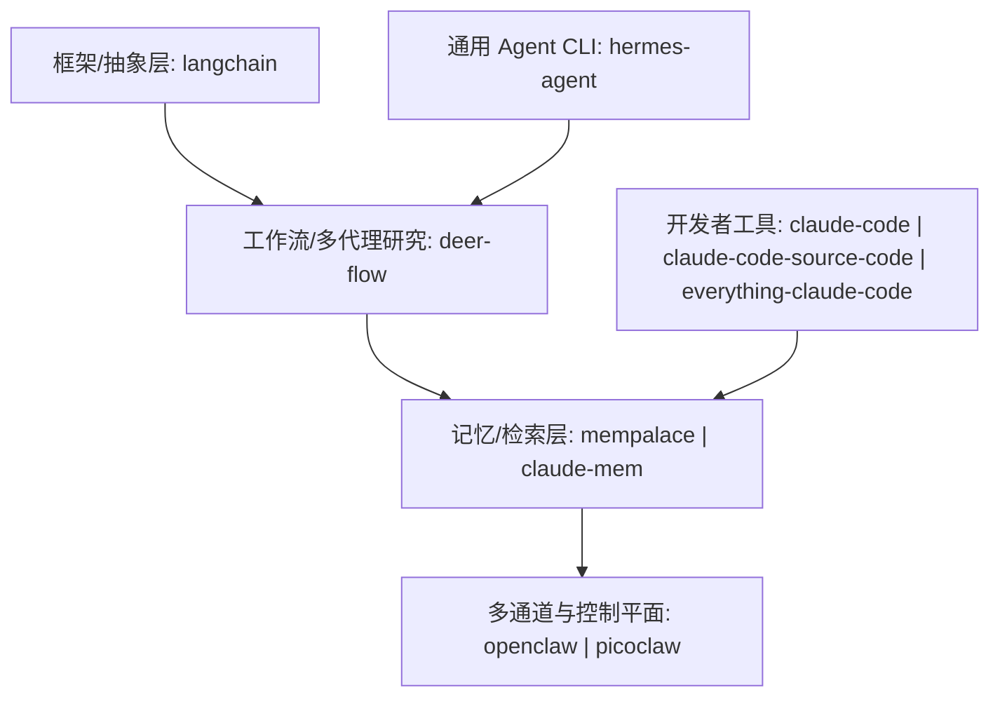

# AI 相关项目商业分析报告（基于 ash_repwiki）

> 说明：本报告**以本仓库的 repowiki 文档为唯一证据来源**（即 `AI/*/repowiki/zh/content/**`）。`ash_repwiki` 本身是“源码研读导航仓库”，多数内容为**对上游项目的架构与代码阅读笔记**，并非这些项目的可运行源码。

## 1. 执行摘要（给管理层/投资）

### 1.1 一句话结论
- **“框架 + 工作流 + 记忆 + 多通道网关”是本仓库 AI 项目组合的主线**：`langchain`（框架抽象）→ `deer-flow`（研究/内容工作流）→ `mempalace`/`claude-mem`（记忆与检索）→ `openclaw`/`picoclaw`（多通道触达与控制平面）。
- **商业化更清晰、可形成产品闭环的方向**：`deer-flow`（研究/内容生产）与 `openclaw/picoclaw`（个人助理+渠道）更像“产品”；`mempalace/claude-mem`更像“基础设施/增值插件”；`langchain`更像“生态型平台”；`claude-code`系更像“开发者工具”。

### 1.2 推荐优先级（组合视角）
- **优先级 A（可直接产品化/做解决方案）**：`deer-flow`、`openclaw`、`picoclaw`
- **优先级 B（作为护城河/增值能力）**：`mempalace`、`claude-mem`
- **优先级 C（生态位/赋能型）**：`langchain`、`hermes-agent`
- **优先级 D（更像上游产品说明/学习材料）**：`claude-code`、`claude-code-source-code`、`everything-claude-code`
- **需谨慎（文档一致性风险）**：`goclaw`（见“风险与数据质量”）

## 2. 报告方法（给技术/产品/管理层共用）

### 2.1 证据范围
- **项目清单来源**：`README.md` 的 AI 项目列表  
  - 路径：`c:\Go_Work\src\ash_repwiki\README.md`（仓库定位为 repowiki 导航，列出 11 个 AI 项目）
- **每个项目的主要入口证据**：
  - `快速开始.md`（11/11 均有）
  - `项目概述/项目介绍.md`（5/11 有：`mempalace`、`deer-flow`、`openclaw`、`picoclaw`、`goclaw`）

### 2.2 统一能力标签（用于横向对比）
- **LLM 接入**：OpenAI 兼容/Anthropic/Gemini/OpenRouter/本地（Ollama 等）
- **Agent/工具调用**：多代理编排、工具注册/权限模型、任务分解
- **检索/记忆**：RAG、向量库、混合检索（BM25/FTS + 向量）
- **MCP**：Model Context Protocol 工具/服务器集成
- **输出形态**：CLI、Web UI、TUI、网关/多通道、插件/钩子/规则
- **部署运维**：Docker/Compose/K8s/Cloud Run/守护进程 systemd/launchd

## 3. 分层分类（全景地图）

## 4. 能力矩阵（11 项目一览）

> 说明：该矩阵来自各项目“快速开始/项目介绍”与配置/架构章节的描述性证据，属于“能力边界”判断，不等价于对上游代码的运行验证。

| 项目 | 类型定位 | LLM | Agent/工具 | RAG/向量 | 记忆 | MCP | UI/形态 | 部署/运维 |
|---|---|---:|---:|---:|---:|---:|---|---|
| `langchain` | 框架/生态 | ✅ | ✅ | ✅ | ◻️ | ◻️ | SDK | 文档/CI 为主 |
| `deer-flow` | 研究/内容工作流产品 | ✅ | ✅✅ | ✅✅ | ◻️ | ✅✅ | CLI + Web | Docker/Compose/K8s（文档） |
| `mempalace` | 本地优先记忆系统 | ◻️(可选) | ✅ | ✅✅(混合) | ✅✅ | ✅ | CLI + MCP | 本地为主 |
| `claude-mem` | 为 Claude Code 的持久化记忆插件 | ✅ | ✅(hook) | ✅(FTS+向量) | ✅✅ | ✅ | Worker + Web Viewer | 本地/容器（文档） |
| `openclaw` | 个人助手 + 网关控制平面 | ✅ | ✅✅ | ◻️ | ✅(记忆模块) | ◻️ | 多通道 + Web/CLI | install 脚本/守护进程 |
| `picoclaw` | 轻量个人助手（Go） | ✅ | ✅✅ | ◻️ | ◻️ | ✅ | CLI + Web Launcher + TUI | Docker/Compose |
| `hermes-agent` | 通用 Agent CLI（配置驱动） | ✅✅ | ✅✅ | ◻️ | ◻️ | ✅ | TUI/CLI + 网关 | 跨平台安装 |
| `claude-code` | 官方编码助手（产品） | ✅ | ✅✅ | ◻️ | ◻️ | ✅ | CLI + 插件生态 | devcontainer + 安全策略 |
| `claude-code-source-code` | Claude Code 源码阅读材料 | ✅ | ✅✅ | ◻️ | ◻️ | ✅✅ | CLI + MCP server | Docker/Compose |
| `everything-claude-code` | Claude Code 工作流插件包 | ◻️(依赖宿主) | ✅(hooks/rules) | ◻️ | ◻️ | ✅ | 插件/命令/规则 | install 脚本 |
| `goclaw` | （待校验） | ? | ? | ? | ? | ? | ? | ? |

图例：✅✅ 强相关/核心；✅ 支持；◻️ 非核心或可选；? 证据不足/不一致

## 5. 评级方法（1–5）与口径（给技术/产品/管理层共用）

### 5.1 评分维度
- **技术成熟度**：组件完整性、可观测性（流式、检查点、日志/监控）、部署路径清晰度
- **可集成性**：接口标准化（OpenAI 兼容、MCP）、配置抽象、二次开发成本
- **差异化/护城河**：独特数据结构/体验（verbatim 记忆、极致轻量、多代理内容工作流等）
- **成本结构**：推理/检索/存储成本的可控性（路由、轻重模型、离线优先）
- **风险与合规**：权限/密钥管理、数据驻留、第三方渠道合规、供应商锁定
- **商业化适配**：可定价能力、目标客户与销售路径、交付复杂度

### 5.2 评分解释
- **5**：成熟产品级/生态级、可规模化复制，且有明显差异化
- **4**：可产品化且路径清晰，仍有部分依赖与边界需要工程化补齐
- **3**：可用但更偏技术方案/工具，需要明确目标市场与包装
- **2**：更偏学习材料/实验性质，商业化路径弱或风险高
- **1**：证据不足或不适合商业化（本报告证据范围内）

## 6. 逐项目商业定位与实现要点（项目卡片）

### 6.1 DeerFlow（bytedance/deer-flow）
- **定位**：多代理研究框架 + Web 产品形态，强调“研究→报告→内容产出（PPT/Podcast/Prose）”一体化  
  - 证据入口：`AI\deer-flow\repowiki\zh\content\项目概述\项目介绍.md`、`AI\deer-flow\repowiki\zh\content\快速开始.md`
- **关键实现点（技术）**：
  - 后端 **FastAPI + SSE 流式接口**，前端 **Next.js**；支持 `.env` 与 `conf.yaml` 分离配置（模型与检索）  
    - 见 `AI\deer-flow\repowiki\zh\content\快速开始.md`（项目结构/配置/启动）
  - **LangGraph 工作流** + 多代理角色分工（Coordinator/Planner/ResearchTeam/Reporter）  
    - 见 `AI\deer-flow\repowiki\zh\content\项目概述\项目介绍.md`
  - **RAG provider 可插拔**（Qdrant/Milvus/RAGFlow 等）与 **MCP 工具集成**  
    - 见 `AI\deer-flow\repowiki\zh\content\快速开始.md` 与 API/RAG/MCP 章节
- **技术架构下潜（分层/组件/集成点）**：
  - **技术栈与依赖**：后端 Python（FastAPI + LangGraph + LangChain）、前端 Next.js（React/TS/Tailwind），检查点（PostgreSQL/MongoDB），向量库（Milvus/Qdrant），容器化（Docker/Compose）  
    - 见 `AI\deer-flow\repowiki\zh\content\项目概述\技术栈.md`
  - **核心分层**：`main.py`（CLI）→ `src/workflow.py`（异步工作流）→ `src/graph/*`（状态图构建/节点/类型/检查点）→ `src/tools/*`（搜索/抓取/Python REPL/TTS）→ `src/rag/*`（RAG 适配）  
    - 见 `AI\deer-flow\repowiki\zh\content\核心架构\核心架构.md`
  - **关键数据流（研究工作流闭环）**：协调员/背景调查/规划/研究团队（研究员/分析师/编码器）/报告生成 + 可中断恢复（检查点持久化）  
    - 见 `AI\deer-flow\repowiki\zh\content\核心架构\核心架构.md`
- **模块级地图（更深一层：入口/模块/关键对象/接口面）**：
  - **入口与运行时**
    - CLI 入口：`main.py`
    - Web 服务入口：`src/server/app.py`（SSE 流式输出与会话/检查点集成）
    - 工作流调度：`src/workflow.py`
    - 证据：`AI\deer-flow\repowiki\zh\content\核心架构\核心架构.md`、`AI\deer-flow\repowiki\zh\content\核心架构\状态图设计.md`
  - **状态图/节点/状态对象（LangGraph）**
    - 图构建与编译：`src/graph/builder.py`
    - 节点实现：`src/graph/nodes.py`（coordinator/planner/research_team/reporter 等）
    - 状态类型：`src/graph/types.py`（扩展 MessagesState）
    - 工具函数：`src/graph/utils.py`
    - 子图状态示例：`src/podcast/graph/state.py`、`src/prose/graph/state.py`
    - 证据：`AI\deer-flow\repowiki\zh\content\核心架构\状态图设计.md`
  - **检查点与持久化（可中断/可回放）**
    - 检查点核心：`src/graph/checkpoint.py`（ChatStreamManager + InMemoryStore + MongoDB/PostgreSQL）
    - 服务启动初始化：`src/server/app.py`（lifespan 初始化 saver/连接池）
    - 配置读取：`src/config/loader.py`
    - 证据：`AI\deer-flow\repowiki\zh\content\核心架构\检查点持久化.md`
  - **接口面（对外 API）**
    - REST+SSE：聊天流式、内容生成、配置管理、RAG 检索、评估、MCP 服务等
    - WebSocket：实时通信接口（若启用）
    - 证据：`AI\deer-flow\repowiki\zh\content\API参考文档\API参考文档.md`、`AI\deer-flow\repowiki\zh\content\API参考文档\REST API接口\聊天流式接口.md`、`AI\deer-flow\repowiki\zh\content\API参考文档\WebSocket实时通信.md`
- **商业化建议（产品/业务）**：
  - 可走 **研究型内容生产 SaaS**、**企业版私有化**（合规+知识库）、或 **咨询交付工具化**（报告/PPT/播客流水线）
- **评级（建议）**：技术成熟度 4 / 集成性 4 / 差异化 4 / 成本可控 3 / 风险 3 / 商业化 4 → **综合 4**

### 6.2 OpenClaw（openclaw/openclaw）
- **定位**：个人 AI 助手“产品”，以 **Gateway 控制平面 + 多通道**（WhatsApp/Telegram/Slack…）为核心，强调本地优先与安全可控  
  - 证据入口：`AI\openclaw\repowiki\zh\content\项目概述\项目介绍.md`、`AI\openclaw\repowiki\zh\content\快速开始.md`
- **关键实现点（技术）**：
  - **WebSocket Gateway 控制平面**，统一会话/路由/工具/通道适配  
    - 见 `AI\openclaw\repowiki\zh\content\项目概述\项目介绍.md`
  - **Onboard 向导**：引导模型认证、网关端口/鉴权、通道绑定、技能管理；配置文件为 `~/.openclaw/openclaw.json`（JSON5）  
    - 见 `AI\openclaw\repowiki\zh\content\快速开始.md`
- **技术架构下潜（数据流/组件交互/协议）**：
  - **端到端数据流（入站→网关→出站）**：入站信封（plugin sdk）→ 会话上下文 → 出站消息网关（channel resolution/selection、payload 归一化、targets 解析、delivery queue 持久化投递）→ 运行时缓存/TTL/文件同步存储 → OTEL/CLI 调试  
    - 见 `AI\openclaw\repowiki\zh\content\项目概述\架构概览\数据流.md`
  - **组件交互与协议**：统一 WebSocket 控制平面；operator/node 角色握手；请求/响应/事件帧；节点命令白名单与策略；插件加载流水线（清单发现→启用→运行时加载→注册→消费）  
    - 见 `AI\openclaw\repowiki\zh\content\项目概述\架构概览\组件交互.md`
- **模块级地图（更深一层：网关/协议/schema/控制平面/守护进程）**：
  - **网关客户端/服务端**
    - 客户端：`src/gateway/client.ts`
    - 服务端入口：`src/gateway/server.ts`
    - 证据：`AI\openclaw\repowiki\zh\content\网关服务器\网关架构设计.md`
  - **协议与 Schema（API 表面）**
    - 协议文档：`docs/gateway/protocol.md`（或 `docs/zh-CN/gateway/protocol.md`）
    - Schema 定义：`src/gateway/protocol/schema.ts`（TypeBox：状态/通道/模型/聊天/代理/会话/节点/审批等）
    - 服务端握手处理：`src/gateway/server/ws-connection/message-handler.ts`
    - 错误细节：`src/gateway/protocol/connect-error-details.ts`
    - 设备认证/配对：`src/shared/device-auth.ts`、`src/infra/device-pairing.ts`
    - 证据：`AI\openclaw\repowiki\zh\content\网关服务器\协议规范\WebSocket协议.md`
  - **控制平面与内存**
    - ACP 服务端：`src/acp/server.ts`
    - 控制平面管理器：`src/acp/control-plane/manager.ts`
    - 内存管理器：`src/memory/manager.ts`
    - 证据：`AI\openclaw\repowiki\zh\content\网关服务器\网关架构设计.md`
  - **守护进程与进程管理**
    - 守护进程网关：`src/daemon/gateway.ts`
    - 进程管理器：`src/process/manager.ts`
    - CLI 入口：`src/cli/gateway.ts`
    - TLS 固定：`src/infra/tls/gateway.ts`
    - 证据：`AI\openclaw\repowiki\zh\content\网关服务器\网关架构设计.md`
- **商业化建议（产品/业务）**：
  - **个人/团队助手订阅**（多通道、跨设备、技能市场）；**企业版**（审计/权限/数据驻留）
- **评级（建议）**：成熟度 4 / 集成性 4 / 差异化 4 / 成本可控 3 / 风险 3 / 商业化 4 → **综合 4**

### 6.3 PicoClaw（sipeed/picoclaw）
- **定位**：超轻量个人助手（Go），主打“低资源+快启动+跨架构”，并提供 CLI/Web/TUI Launcher 与网关  
  - 证据入口：`AI\picoclaw\repowiki\zh\content\项目概述\项目介绍.md`、`AI\picoclaw\repowiki\zh\content\快速开始.md`
- **关键实现点（技术）**：
  - 多二进制形态：核心 CLI + Web Launcher + TUI Launcher；配置 `~/.picoclaw/config.json`，敏感信息可分离 `.security.yml`  
    - 见 `AI\picoclaw\repowiki\zh\content\快速开始.md`
  - 强调 **MCP 原生支持**、多架构部署与资源效率  
    - 见 `AI\picoclaw\repowiki\zh\content\项目概述\项目介绍.md`
- **技术架构下潜（启动形态/网关编排）**：
  - **三入口协同**：Web Launcher/TUI Launcher/CLI 都围绕同一网关进程管理与配置加载；Docker Compose 提供 gateway/agent/launcher profiles  
    - 见 `AI\picoclaw\repowiki\zh\content\快速开始.md`
- **商业化建议（产品/业务）**：
  - **端侧/低成本部署**场景、硬件生态/边缘设备集成、以及对“自托管+隐私”敏感用户
- **评级（建议）**：成熟度 3–4 / 集成性 4 / 差异化 5 / 成本可控 4 / 风险 3 / 商业化 3–4 → **综合 4（偏工程落地依赖）**

### 6.4 MemPalace（MemPalace/mempalace）
- **定位**：本地优先“AI 记忆系统”，以 **verbatim（原文）存储 + 混合检索** 为核心，强调可解释性与低 token 干扰  
  - 证据入口：`AI\mempalace\repowiki\zh\content\项目概述\项目介绍.md`、`AI\mempalace\repowiki\zh\content\快速开始.md`
- **关键实现点（技术）**：
  - 组织结构：wing/room/drawer/closet；**混合检索（BM25 + 向量）**；默认 **ChromaDB** + **SQLite 元数据**  
    - 见 `AI\mempalace\repowiki\zh\content\快速开始.md` 与项目介绍
  - 支持 **MCP**（便于作为“记忆工具”注入其他代理/IDE）  
    - 见 `AI\mempalace\repowiki\zh\content\项目概述\项目介绍.md`
- **技术架构下潜（后端抽象/混合检索/图增强）**：
  - **后端插件化抽象**：`BaseBackend/BaseCollection` 统一契约 + registry 注册表 + Chroma 后端实现 + health/错误层次/PalaceRef 缓存与检测  
    - 见 `AI\mempalace\repowiki\zh\content\后端系统\后端架构设计.md`
  - **混合检索管线**：Query Sanitizer → Closets（关键词索引层）→ Drawers（向量层）→ max_distance 过滤 → “有效距离+秩奖励”排序 → BM25 重排；并可选知识图谱/宫殿图（隧道）增强  
    - 见 `AI\mempalace\repowiki\zh\content\搜索与检索\搜索与检索.md`
- **模块级地图（更深一层：MCP 工具面与运行时保护）**：
  - MCP 服务器：`mempalace/mcp_server.py`（initialize/ping/tools/list/tools/call；29 工具注册表；stdout 保护避免 JSON-RPC 流污染）
  - MCP 配置/示例：`.claude-plugin/.mcp.json`、`examples/mcp_setup.md`
  - 证据：`AI\mempalace\repowiki\zh\content\API 参考\MCP 工具接口.md`
- **商业化建议（产品/业务）**：
  - 作为“企业/团队知识记忆底座”做 **企业版**（权限/审计/多租户）或做 **开发者增值插件**（与 IDE/代理平台绑定）
- **评级（建议）**：成熟度 4 / 集成性 4 / 差异化 4 / 成本可控 4 / 风险 3 / 商业化 3–4 → **综合 4**

### 6.5 Claude‑Mem（thedotmack/claude-mem）
- **定位**：面向 Claude Code 的“持久化记忆”系统（插件/服务形态），强调**生命周期钩子**、Worker 服务、SSE、混合检索  
  - 证据入口：`AI\claude-mem\repowiki\zh\content\快速开始.md`
- **关键实现点（技术）**：
  - Worker 服务端口 **37777**，提供 HTTP API + **SSE 广播** + Web Viewer；数据为 **SQLite + FTS5 +（可选）Chroma**  
    - 见 `AI\claude-mem\repowiki\zh\content\快速开始.md`
  - 多 IDE 集成（Claude Code/Cursor/Gemini CLI/OpenCode），强调“集中式 .env 管理避免误计费”  
    - 见 `AI\claude-mem\repowiki\zh\content\快速开始.md`
- **技术架构下潜（Worker 编排/事件队列/搜索编排）**：
  - **分层结构**：UI/CLI → WorkerService（编排）→ Server/Routes（HTTP）→ SessionManager（事件队列）→ DatabaseManager（SQLite/句柄）→ SearchManager（FTS+向量）→ ChromaMcpManager（持久 MCP 客户端与重连）  
    - 见 `AI\claude-mem\repowiki\zh\content\核心架构\系统概览.md`、`AI\claude-mem\repowiki\zh\content\核心架构\组件交互.md`
  - **数据流与生命周期**：IDE hooks 触发 → CLI handlers 规范化 → Worker API → SQLite 持久化 → 可选 Chroma 同步 → SearchOrchestrator 走 SQLite/Chroma/Hybrid 策略并回退  
    - 见 `AI\claude-mem\repowiki\zh\content\核心架构\数据流.md`、`AI\claude-mem\repowiki\zh\content\核心架构\技术栈.md`
- **模块级地图（更深一层：查看器前后端模块）**：
  - 前端（React）：`src/ui/viewer/App.tsx`、`src/ui/viewer/components/*`、`src/ui/viewer/hooks/*`（`useSSE/usePagination/useSettings/useTheme`）、`src/ui/viewer/constants/*`、`src/ui/viewer/utils/api.ts`
  - 后端路由：`src/services/worker/http/routes/ViewerRoutes.ts`（静态资源 + `/stream` SSE + viewer HTML）
  - 证据：`AI\claude-mem\repowiki\zh\content\API 参考\查看器 API.md`
- **商业化建议（产品/业务）**：
  - 作为开发者/团队的“记忆增强插件”做订阅；或作为企业版 Claude Code 的增强组件
- **评级（建议）**：成熟度 4 / 集成性 4 / 差异化 3–4 / 成本可控 4 / 风险 3 / 商业化 3–4 → **综合 4**

### 6.6 Hermes‑Agent（NousResearch/hermes-agent）
- **定位**：通用 Agent CLI，强调“安装器 + 配置驱动 + 多平台后端/工具集”  
  - 证据入口：`AI\hermes-agent\repowiki\zh\content\快速开始.md`，以及提供商配置文档（本仓库内）
- **关键实现点（技术）**：
  - 配置：`~/.hermes/.env` + `~/.hermes/config.yaml`；包含 provider/base_url/timeout、终端后端（local/ssh/docker 等）、工具集、网关与平台接入  
    - 见 `AI\hermes-agent\repowiki\zh\content\快速开始.md`
  - 文档列举 OpenAI/Anthropic/OpenRouter 等 provider 的 key/base_url 与路由策略  
    - 见 `AI\hermes-agent\repowiki\zh\content\配置管理系统\模型配置\提供商配置.md`（本仓库内）
- **技术架构下潜（网关+工具循环）**：
  - **技术栈分层**：Python 网关/后端（asyncio/httpx/FastAPI）+ Web 仪表盘（React/Vite/Tailwind）+ TUI；构建与可复现（Docker 多阶段、Nix/uv2nix）  
    - 见 `AI\hermes-agent\repowiki\zh\content\系统架构\技术栈架构.md`
  - **组件交互机制**：CLI 启动网关 → 网关接收平台消息（授权/命令解析/会话键）→ 创建/复用 AIAgent → 进入“工具调用循环”（工具发现：内置+MCP+插件；执行：线程池与异步桥接；失败回退）→ 回写平台适配器发送结果  
    - 见 `AI\hermes-agent\repowiki\zh\content\系统架构\组件交互机制.md`
- **商业化建议（产品/业务）**：
  - 更适合作为“企业内部 Agent 基座/CLI 工具链”，商业化需围绕企业集成、运维与合规增强
- **评级（建议）**：成熟度 3–4 / 集成性 4 / 差异化 3 / 成本可控 3–4 / 风险 3 / 商业化 3 → **综合 3**

### 6.7 LangChain（langchain-ai/langchain）
- **定位**：LLM 应用框架与生态平台（SDK/抽象层），更偏“平台型”  
  - 证据入口：`AI\langchain\repowiki\zh\content\快速开始.md`
- **关键实现点（技术）**：
  - monorepo 多包（core/classic/partners），通过 `init_chat_model` 统一模型初始化；可配置字段支持运行时切换 provider/model  
    - 见 `AI\langchain\repowiki\zh\content\快速开始.md`
- **技术架构下潜（模块化与依赖核心）**：
  - **模块化架构**：`langchain-core`（抽象与协议）为核心；`langchain-classic`（兼容/高层封装）；`text-splitters`（前处理）；`model-profiles`（模型信息更新 CLI）；`partners/*`（生态集成包）  
    - 见 `AI\langchain\repowiki\zh\content\项目概述\技术栈与依赖.md`
- **商业化建议（产品/业务）**：
  - 对外：生态与增值服务（托管、监控、评测）；对内：作为底层框架减少多模型集成成本
- **评级（建议）**：成熟度 5 / 集成性 5 / 差异化 4 / 成本可控 3 / 风险 3 / 商业化 4 → **综合 4（平台型）**

### 6.8 Claude‑Code（anthropics/claude-code）
- **定位**：终端编码助手“产品”，强调开发容器、配置层级、插件与安全策略  
  - 证据入口：`AI\claude-code\repowiki\zh\content\快速开始.md`
- **关键实现点（技术/运维）**：
  - `.devcontainer` + 防火墙脚本限制外网；配置层级 `settings.json/managed-settings.json/settings.local.json`  
    - 见 `AI\claude-code\repowiki\zh\content\快速开始.md`
- **技术架构下潜（生产安全与 MCP 接入）**：
  - **安全基线**：devcontainer 中 `init-firewall.sh` 以 iptables/ipset 白名单实现“默认 DROP”的出站隔离；配合安全钩子（PreToolUse/PostToolUse）与多套 settings 模板（strict/lax/bash-sandbox）  
    - 见 `AI\claude-code\repowiki\zh\content\部署和运维\安全运维.md`
  - **生产部署与 MCP**：围绕“容器运行时 + 网络策略 + CLI + 插件（含 MCP HTTP/SSE/STDIO 示例）+ 钩子”组织部署面  
    - 见 `AI\claude-code\repowiki\zh\content\部署和运维\生产环境部署.md`
- **商业化建议（产品/业务）**：
  - 这是上游成熟产品。对你而言更适合用于“对标/集成/插件生态”的策略参考
- **评级（建议）**：作为上游产品 **不在本报告内做商业化打分**（可做“对标项/生态入口”）

### 6.9 Claude‑Code‑Source‑Code（sanbuphy/claude-code-source-code）
- **定位**：Claude Code 泄露源码阅读与架构材料（TypeScript + Bun，React+Ink），含 MCP 探索服务器  
  - 证据入口：`AI\claude-code-source-code\repowiki\zh\content\快速开始.md`
- **关键实现点**：Bun + esbuild 打包；Docker 多阶段；MCP server（stdio/http/sse）用于工具与源码探索  
  - 见 `AI\claude-code-source-code\repowiki\zh\content\快速开始.md`
- **技术架构下潜（数据流）**：
  - **QueryEngine 数据流**：`main.tsx` 初始化 → `QueryEngine` 统一对话生命周期 → `query` 生成器循环（压缩/恢复/预算/工具执行/附件）→ `bootstrap/state` 统一状态/用量/预算 → `commands` 命令注册与发现（含动态技能/插件）  
    - 见 `AI\claude-code-source-code\repowiki\zh\content\架构设计\数据流设计.md`
- **商业化建议**：更偏“研究材料/内部学习”，商业化风险与合规风险需谨慎
- **评级（建议）**：成熟度 2 / 集成性 3 / 差异化 2 / 风险 2 / 商业化 1–2 → **综合 2（学习/研究用途）**

### 6.10 Everything‑Claude‑Code（affaan-m/everything-claude-code）
- **定位**：Claude Code 工作流插件包（规则/钩子/命令/代理），用于提升工程流程质量（plan/TDD/code-review 等）  
  - 证据入口：`AI\everything-claude-code\repowiki\zh\content\快速开始.md`
- **关键实现点（技术）**：
  - 规则系统 `rules/`、钩子系统 `hooks/`、命令与代理；安装脚本统一应用；包管理器检测优先级清晰  
    - 见 `AI\everything-claude-code\repowiki\zh\content\快速开始.md`
- **技术架构下潜（安装管线与钩子执行器）**：
  - **安装架构**：清单（modules/profiles）→ 目标适配（targets registry）→ 操作规划/执行（executor）→ 状态持久化（state schema）→ 生命周期服务（repair/uninstall/doctor）  
    - 见 `AI\everything-claude-code\repowiki\zh\content\项目概述\架构概览.md`
  - **钩子执行器**：`hooks.json`（事件/匹配器/动作）+ `run-with-flags.js`（统一执行入口，stdin 协议/超时/同步阻断或异步）+ `hook-flags.js`（strict/disabled 控制）+ scripts/hooks/*（质量门禁/格式化/会话评估等）  
    - 见 `AI\everything-claude-code\repowiki\zh\content\钩子系统\钩子原理与架构.md`
- **商业化建议**：
  - 更适合做“企业工程规范包/插件订阅/咨询交付”，或作为你自研开发者工具的“规则基线”
- **评级（建议）**：成熟度 3 / 集成性 4 / 差异化 3 / 风险 3 / 商业化 3 → **综合 3**

### 6.11 GoClaw（nextlevelbuilder/goclaw）—文档一致性风险
- **发现（已进一步核验）**：`goclaw` repowiki 的“技术栈/数据流/价值主张/项目概述”等章节**持续指向 CrossBeam（ADU 许可助手）架构**（Next.js + Express/Cloud Run + Vercel Sandbox + Supabase + Claude Opus 4.6/Agent SDK），非 goclaw 预期主题。  
  - 证据入口：  
    - `AI\goclaw\repowiki\zh\content\架构设计\技术栈.md`  
    - `AI\goclaw\repowiki\zh\content\架构设计\数据流设计.md`  
    - `AI\goclaw\repowiki\zh\content\项目概述\价值主张.md`  
    - `AI\goclaw\repowiki\zh\content\项目概述\项目概述.md`
- **结论**：将 `goclaw` 在本报告中标记为**repowiki 数据源/映射错误**，不做任何技术或商业判断；如要继续分析 goclaw，需先修复/重新生成该 repowiki（对照 `README.md` 指向的上游仓库）。

## 7. 横向对比：商业模式与落地路径（给产品/业务）

### 7.1 典型商业模式映射
- **研究/内容生产 SaaS**：`deer-flow`（报告→PPT→播客→写作），付费点=席位、生成额度、知识库与合规、模板与团队协作
- **个人助手/多通道订阅**：`openclaw`/`picoclaw`，付费点=多通道、跨设备、技能市场、企业治理与审计
- **记忆/检索增值插件**：`mempalace`/`claude-mem`，付费点=企业知识沉淀、团队共享、审计与权限、托管向量库
- **开发者工具与规范包**：`everything-claude-code`（以及 `claude-code` 生态），付费点=企业规则库/安全策略/私有插件市场

### 7.2 建议的“组合式产品化”
- **方案 A：企业研究与内容生产套件**：`deer-flow` +（RAG/知识库）+ `mempalace/claude-mem`（记忆）+ 企业权限/审计
- **方案 B：多通道个人/团队助手**：`openclaw`/`picoclaw` + 技能市场 +（可选）`mempalace`（记忆增强）
- **方案 C：开发者效率与治理**：`claude-code` 生态 + `everything-claude-code`（规则/钩子）+ `claude-mem`（记忆）

## 8. 风险与数据质量（给管理层/技术）

### 8.1 本仓库的“证据偏差”风险
- `ash_repwiki` 为“研读导航”，内容为摘要/结构化笔记，**可能与上游版本存在偏差**；本报告仅基于当前文档快照。

### 8.2 文档一致性异常（重点）
- **goclaw**：内容已核验为**整体指向 CrossBeam（ADU 许可助手）**资料（repowiki 数据源/映射错误），导致定位/架构/商业分析不可直接相信。建议后续动作：
  - 对照 `README.md` 中列出的上游仓库（`nextlevelbuilder/goclaw`）重新抓取入口文档；
  - 或在本仓库修复 repowiki 来源映射（不在本报告任务范围内）。

### 8.3 合规与安全共性风险（按项目类型）
- **多通道助手类**（`openclaw/picoclaw/hermes-agent`）：第三方平台条款、消息数据驻留、Webhook/Token 安全、日志审计
- **RAG/知识库类**（`deer-flow/mempalace/claude-mem`）：数据权限、索引泄漏、向量库多租户隔离、密钥与计费误用
- **编码助手/插件类**（`claude-code` 生态）：权限模型、命令执行与文件写入边界、供应链风险（插件/规则）

## 9. 附录：入口文档索引（本仓库路径）

- `langchain`：`AI\langchain\repowiki\zh\content\快速开始.md`
- `deer-flow`：`AI\deer-flow\repowiki\zh\content\快速开始.md`；`AI\deer-flow\repowiki\zh\content\项目概述\项目介绍.md`
- `mempalace`：`AI\mempalace\repowiki\zh\content\快速开始.md`；`AI\mempalace\repowiki\zh\content\项目概述\项目介绍.md`
- `claude-mem`：`AI\claude-mem\repowiki\zh\content\快速开始.md`
- `hermes-agent`：`AI\hermes-agent\repowiki\zh\content\快速开始.md`
- `openclaw`：`AI\openclaw\repowiki\zh\content\快速开始.md`；`AI\openclaw\repowiki\zh\content\项目概述\项目介绍.md`
- `picoclaw`：`AI\picoclaw\repowiki\zh\content\快速开始.md`；`AI\picoclaw\repowiki\zh\content\项目概述\项目介绍.md`
- `claude-code`：`AI\claude-code\repowiki\zh\content\快速开始.md`
- `claude-code-source-code`：`AI\claude-code-source-code\repowiki\zh\content\快速开始.md`
- `everything-claude-code`：`AI\everything-claude-code\repowiki\zh\content\快速开始.md`
- `goclaw`：`AI\goclaw\repowiki\zh\content\快速开始.md`（repowiki 数据源/映射错误，见第 6.11 节）

