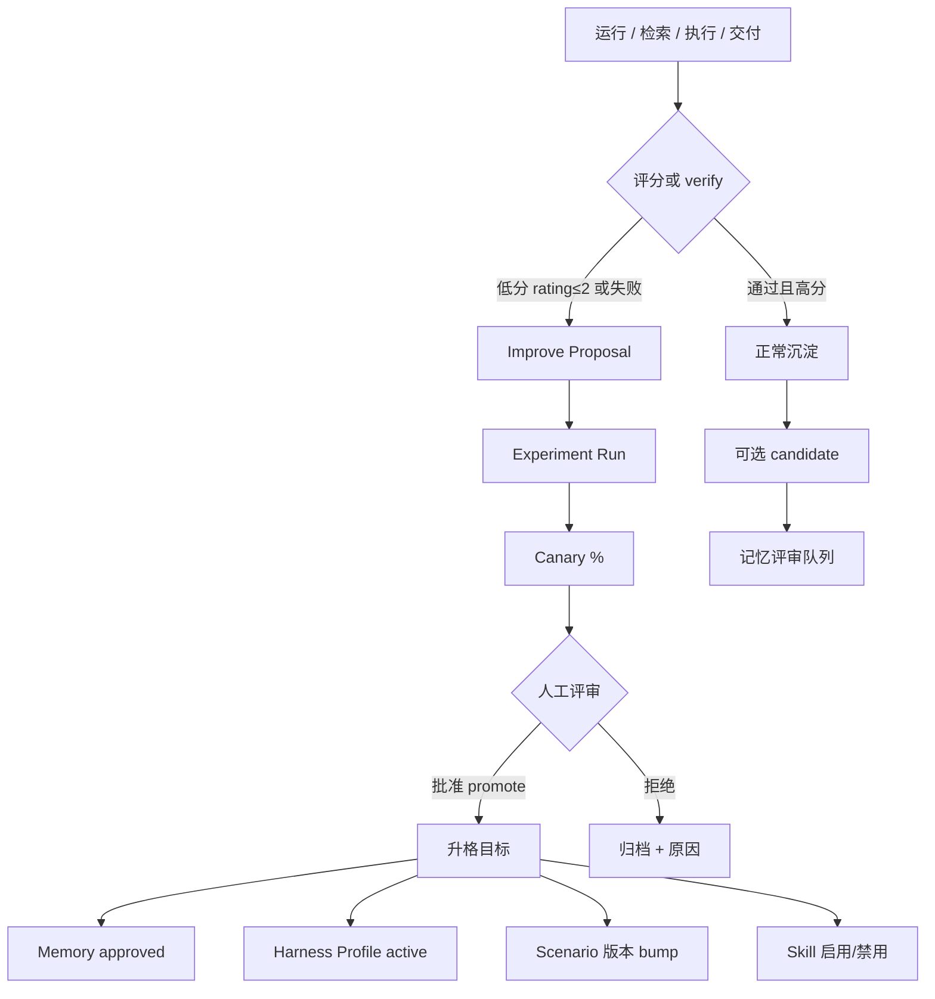
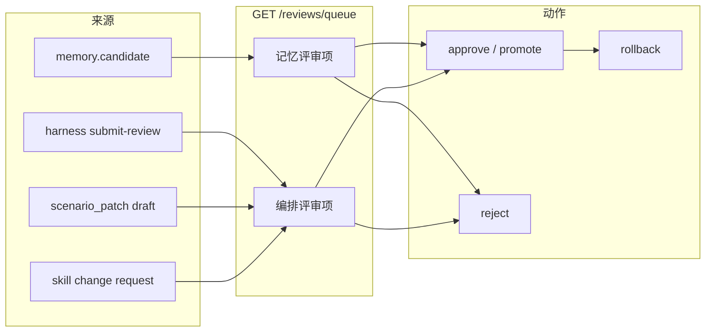
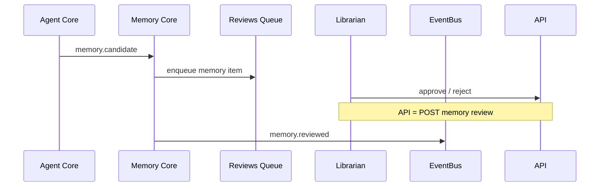
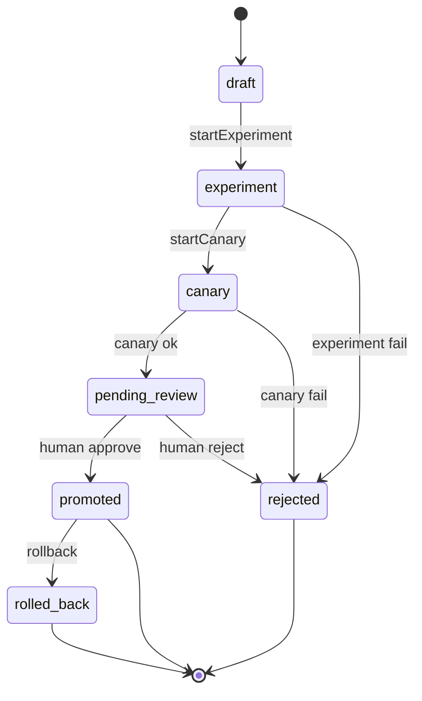
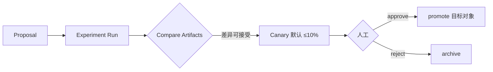
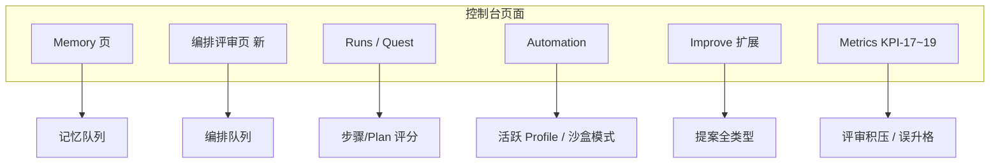

# 附录 K：演进平面（Evolution Plane）v2

> 状态：v2 规范草案（2026-08-28）  
> 归属：[`appendices/`](README.md) · 逻辑归属设计域  
> 计划：[`../plan/v2-dual-core-evolution-plan.md`](../plan/v2-dual-core-evolution-plan.md)  
> 关联：[`../design/HLD-双核心-v2.md`](../design/HLD-双核心-v2.md) · [`../design/HLD-Harness与沙盒.md`](../design/HLD-Harness与沙盒.md) · improve API（`internal/improve`）

## 1. 目的

定义 ASH v2 **演进平面**：对智能体核心与记忆体核心中所有影响交付质量的对象，统一支持：

1. **评分反馈（Feedback / Rating）**  
2. **评审队列（记忆评审 + 编排评审）**  
3. **自进化提案（Improve）→ 实验 → Canary → 人工批准**  
4. **人工干预**记忆与智能体编排配置（Harness Profile / Scenario patch / Skills）

**原则**：自进化 ≠ 自动上线；**人工批准**为升格唯一闸门。

---

## 2. 总体流程图



---

## 3. 可评价对象（targetType）

| targetType | 示例 | 反馈影响 | 评审队列 |
|------------|------|----------|----------|
| `memory` | L1 记录、Wiki 投影源 | confidence 衰减/升格 | 记忆 |
| `memory_hit` | 单次检索命中 | 排序权重 | 记忆（聚合） |
| `run` | 整次 Run | KPI-11；开 improve | — |
| `run_step` | 单步 | 步骤模板权重 | — |
| `plan` | Spec/步骤计划 | Goal 路由信号 | 编排（可选） |
| `artifact` | 四件套单项 | 场景修订提案 | 编排 |
| `skill` | SKILL.md | 启用/禁用提案 | 编排 |
| `harness_profile` | Profile 版本 | promote/rollback | **编排** |
| `scenario_patch` | DSL diff 草案 | 版本 bump | **编排** |

### 3.1 Feedback 请求（扩展）

```json
{
  "targetType": "harness_profile",
  "targetId": "hprof_xxx",
  "rating": 2,
  "comment": "沙盒超时过多",
  "runId": "run_xxx",
  "spaceId": "local",
  "actorId": "user_1"
}
```

**限流**：同一 `(runId, targetType, targetId)` 默认最多 1 条；低分聚合后再开 proposal。

---

## 4. 双评审队列

### 4.1 架构



### 4.2 队列项模型

| 字段 | 说明 |
|------|------|
| `id` | 评审项 ID |
| `queue` | `memory` \| `orchestration` |
| `targetType` / `targetId` | 见上表 |
| `title` / `summary` | 展示 |
| `diff` | Profile/Scenario 文本 diff（编排） |
| `status` | `pending` \| `approved` \| `rejected` |
| `slaDueAt` | Librarian / 编排 SLA |
| `spaceId` | 租户 |

### 4.3 编排评审时序（Harness promote）

```mermaid
sequenceDiagram
  participant A as Admin
  participant API as Worker API
  participant H as Harness Registry
  participant Q as Reviews Queue
  participant D as Doctor
  participant EV as EventBus

  A->>API: POST /harness/profiles (draft)
  A->>API: POST .../submit-review
  API->>Q: enqueue orchestration item
  A->>API: POST .../promote
  API->>D: validate vs active Scenario
  alt 冲突
    D-->>API: reject promote
  else 通过
    API->>H: set active; archive previous
    API->>EV: harness.profile.promoted
  end
```

### 4.4 记忆评审时序（保留 v1，纳入统一队列）



---

## 5. Improve 自进化

### 5.1 sourceType 扩展

| sourceType | 触发条件 |
|------------|----------|
| `run_fail` | Run failed |
| `verify_fail` | verify 步骤耗尽重试 |
| `low_rating` | rating≤2 聚合超阈值 |
| `harness_drift` | Profile 指标劣化（沙盒失败率） |
| `scenario_drift` | KPI-11 场景稳定率低于门槛 |
| `manual` | 人工创建（v1 已有） |

### 5.2 状态机



### 5.3 与 Canary 流程



**误升格防护**：

- promote 必须人工（不可配置为 auto）  
- 强合规 org-template：编排评审双人签  
- promote 后强制 Doctor 相关套件；失败自动 rollback 提案  

---

## 6. API 清单

| 方法 | 路径 | 说明 |
|------|------|------|
| POST | `/api/v1/feedback` | 扩展 targetType |
| GET | `/api/v1/feedback` | 列表过滤 |
| GET | `/api/v1/reviews/queue` | 双队列；`?queue=memory\|orchestration` |
| POST | `/api/v1/reviews/{id}/decide` | approve / reject + reason |
| POST | `/api/v1/improve/proposals` | 扩展 sourceType / targetType |
| POST | `/api/v1/improve/proposals/{id}/experiment` | 已有 |
| POST | `/api/v1/improve/proposals/{id}/canary` | 已有 |
| POST | `/api/v1/improve/proposals/{id}/promote` | 升格目标（扩展） |
| POST | `/api/v1/harness/profiles/{id}/promote` | 见 Harness HLD |
| POST | `/api/v1/harness/profiles/{id}/rollback` | 见 Harness HLD |

---

## 7. 控制台映射



---

## 8. 指标与 Doctor

| ID | 含义 | 目标 |
|----|------|------|
| KPI-17 | 编排评审积压 | < 50 / space，7 天清空 |
| KPI-18 | Improve 误升格回滚率 | < 2% |
| KPI-19 | danger 工具沙盒覆盖率 | 100% |

| Doctor | 探测 |
|--------|------|
| M4-EVO-01 | feedback targetType 枚举校验 |
| M4-EVO-02 | reviews.queue 聚合 memory+harness |
| M5-EVO-03 | promote 无人工签名拒绝 |
| M5-EVO-04 | canary 默认上限 ≤10% |

---

## 9. 安全与审计

- 所有 promote / rollback / review decide 写 `audit_log`  
- 跨 space 403（RLS + EnforceSpaceAccess）  
- Feedback 不含密钥；comment 走 RedactJSON  

---

## 10. 修订记录

| 日期 | 说明 |
|------|------|
| 2026-08-28 | 初稿：统一 Feedback、双评审、Improve 状态机与流程图 |
