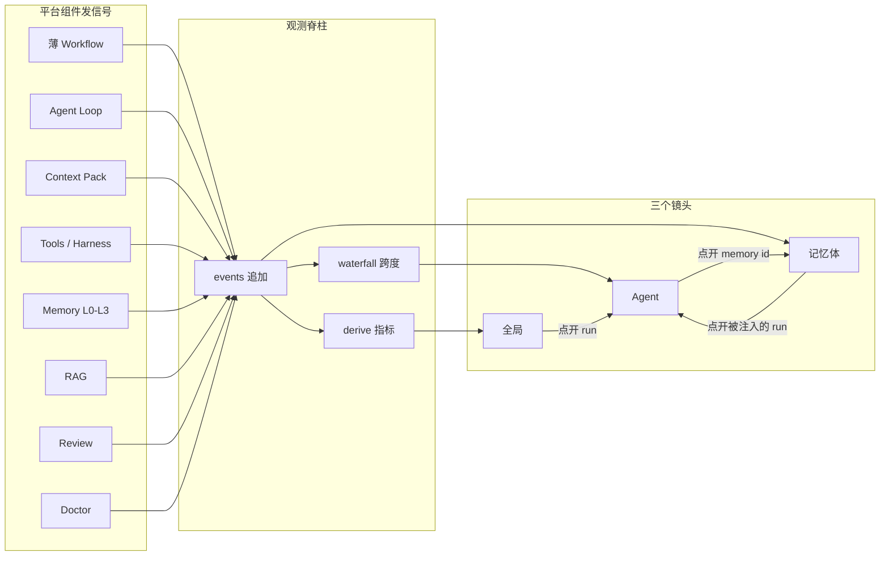
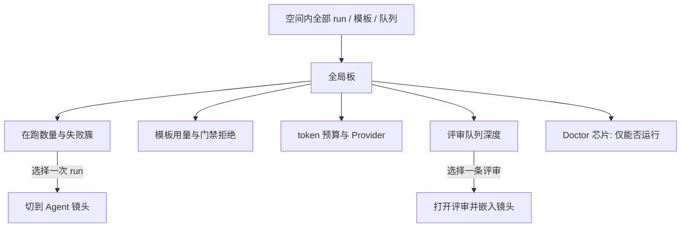
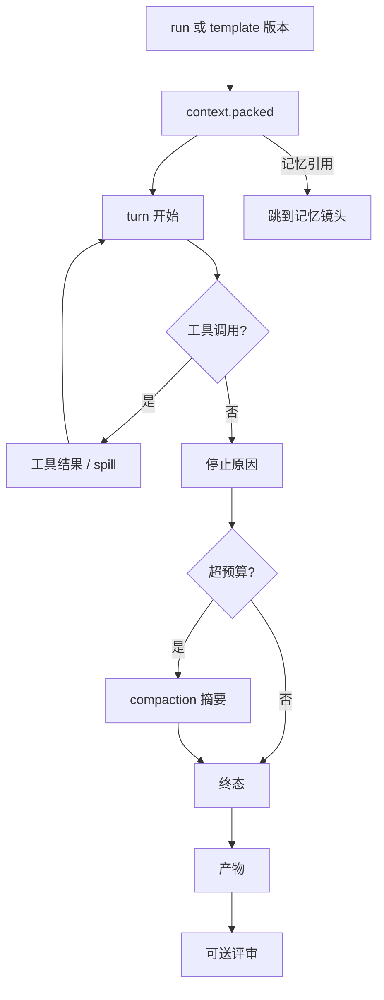
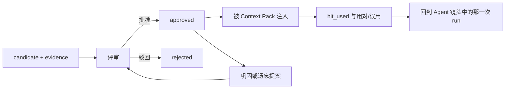

# ASH × Pi 组件重构 · 改动清单 / Change catalog

**状态 / Status**：v7 P0 至 P4 验收测试已绿（[`../plan/v7.4-release-scope.md`](../plan/v7.4-release-scope.md)）。本文件仍是全量改动总表；P5 及以后未改运行时。  
v7 P0 through P2 acceptance tests are green. This file remains the full change catalog. Later waves are not in the runtime yet.

**依据 / Basis**

- Pi `packages/agent` + `packages/ai` + `packages/coding-agent`（v0.85.1 平台扫描：`C:\Go_Work\src\pi\doc\platform\`）。吸收的是**组件合同**，不移植 TypeScript，不引入 TUI / 无权限哲学。  
  Absorb **component contracts**, not the TypeScript tree, TUI, or Pi’s “no permissions” stance.
- 与《深入理解 AI Agent》《Hello-Agents》对照后的缺口：上下文未进模型、压缩为 stub、记忆无巩固与三层评估、纠正不闭环、无 Pass^k、Doctor 与质量评审混在 TR 套件里。  
  Book gaps: context not packed into the model, compaction stub, no memory consolidate / three-level eval, no correction loop, no Pass^k, Doctor mixed with quality review.

**相对四产品对照的改口 / Decision change vs quad comparison**

| 旧决策 | 本重构 |
|--------|--------|
| P08 极简核心+扩展 = Observe | **Absorb**：Agent / Harness / Tool 按 Pi 组件插件装配 |
| P23 Doctor 整包 Keep | **Split**：Doctor 只做运行诊断；质量门禁迁到评审 |
| P24 Memory 治理 Keep | **Keep + Harden**：仍用 L0–L3，补巩固、敏感过滤、三层评估 |
| Scenario DSL 是 Agent 循环主人 | **做薄**：DSL 只绑定模板与门禁；循环在 Agent 组件内 |

---

## 目标形态 / Target shape

```
入口（Web / CLI / ACP / Session）
  → 薄 Workflow（可选）：有序绑定 Agent 模板 + human + review
  → Agent 模板（内置或插件）
        同一颗粒度的组件引用：
        Loop · Context(GSSC) · Tools · Skills · Compaction
        · Hooks · Steer · Provider · Harness 策略
        · Memory 组件（retrieve / inject / propose / …）
  → 外置执行器（ExecGo / ACP）仅作为 Tool/Runtime 插件，不再代替循环
记忆组件落在 L0–L3 存储之上；写入类组件只产候选，批准仍走评审
观测核（核心产品）：同一条事件脊柱，三个镜头
  全局 · Agent · 记忆体
评审核：打开条目时嵌进对应镜头，不另起一套指标
Doctor：进程、库、迁移、路由、沙箱后端是否在场 —— 不评判智能体好坏
```

English. The outer workflow only binds templates and gates. Agent and memory capabilities are components of the same grain: an agent manifest references memory component IDs the way it references tools. ExecGo/ACP stay runtime plugins. The L0–L3 store remains; write-class memory components only create candidates. Observability is one event spine and three lenses. Doctor answers “can ASH run?”. Review answers “is this agent, harness, memory, or artifact good enough?”.

---

## 内置 Agent 模板 / Built-in templates

全部用同一组件面拼装，差别在工具集、循环策略、是否允许写、停止条件，以及引用了哪些记忆组件。  
All templates share one component surface. They differ by tools, loop policy, write permission, stop rule, and which memory components they reference.

| ID | 模板 | 组件配方 | 记忆组件引用 |
|----|------|----------|----------------|
| `tpl.react` | 反应式执行 | Loop(maxTurns) + Tools(read/edit/bash/…) + ContextPack + Compaction + 失败再规划 | `mem.retrieve` + `mem.inject` |
| `tpl.plan-solve` | 先计划后执行 | 规划轮（无写工具）→ 冻结计划 → 执行轮 | 规划轮只 `mem.retrieve`；执行轮再 `mem.inject` |
| `tpl.reviewer` | 提议者–审核者的审核侧 | 只读工具 + 产物/测试证据 | 不引用写入类记忆组件 |
| `tpl.memory-curator` | 记忆整理 | 读轨迹与候选 | `mem.retrieve` + `mem.consolidate` + `mem.forget` |
| `tpl.research` | 检索加深 | RAG 工具可多轮再查 + 引用门禁 | `mem.retrieve` + `mem.inject` + `mem.feedback` |

薄 Workflow 例：`feature_delivery` = `plan-solve` → `react` → `reviewer` → human。无场景对话默认只跑 `tpl.react`（含检索与注入）。  
A thin workflow binds those templates in order. Chat with no scenario runs `tpl.react`, including retrieve and inject.

## 记忆基础组件 / Memory components

记忆能力与 Loop、Tools、Compaction 同一颗粒度：一个组件一份合同、一个 ID、可替换实现。Agent 构建时在 Manifest 里引用，而不是在运行时写死「总是注入 L1」。存储仍是 L0–L3；组件不另起一套认知类型库。  
Memory capabilities match Loop, Tools, and Compaction: one contract, one ID, a swappable implementation. An agent manifest references them. The store stays L0–L3.

| ID | 能力 | 合同要点 | 副作用 |
|----|------|----------|--------|
| `mem.retrieve` | 按空间、层、敏感级检索 | 无权限则结果为空，不报正文 | 只读 |
| `mem.inject` | 将命中写入 Context Pack | 只接受本模板已引用的 retrieve 结果 | 只改本次前缀 |
| `mem.propose` | 写候选 | 必须带 evidence；轨迹原文不能直接升格 | 只插入 candidate |
| `mem.consolidate` | 合并/去重提案 | 不改已批准正文 | 评审队列 |
| `mem.forget` | 遗忘提案 | TTL、低置信、长期无 hit_used | 评审队列 |
| `mem.feedback` | 使用审计 | 记下 hit_used、用对、错误更新 | 审计事件 |
| `mem.knowledge` | 知识投影只读 | 读 approved 记忆的 wiki 投影 | 只读 |

插拔规则与 Agent/Harness 相同。  
Plug-in rules match Agent and Harness.

- 进程内插件可注册上述任一 ID 的替换实现；未评审的实现不能被生产模板引用。  
  An in-process plugin may replace any ID. An unreviewed implementation cannot be referenced by a production template.
- Manifest 写 `memory: [mem.retrieve, mem.inject]`。引用了 `mem.inject` 却没有 `mem.retrieve`，加载失败。引用了 `mem.propose` 却没有证据门禁，加载失败。  
  A manifest lists `memory: [...]`. Inject without retrieve fails load. Propose without the evidence gate fails load.
- `tpl.reviewer` 一类模板可以零写入记忆组件。没有记忆引用的模板仍然合法。  
  A template may reference no write-class memory components. A template with an empty memory list is valid.
- Harness 的效果门拦住记忆写入的真正落库：组件自己不得批准。批准只在评审。  
  The harness effect-gate blocks a memory component from approving its own write. Approval stays in review.

---

## 改动总表 / Full change list

图例：`NEW` 新包或新合同 · `MOVE` 职责迁移 · `REWRITE` 行为替换 · `KEEP` 保留并收口 · `DROP` 退出主路径（兼容期后）。

### A. 内核组件（对齐 Pi `agent` / `ai`）

| ID | 类型 | 改动 | 落点 | 完成标准 |
|----|------|------|------|----------|
| A01 | NEW | **Agent Loop**：思考→工具→观察，`maxTurns`，停止原因（无工具 / 终稿 / 不可恢复 / 达上限 / 取消） | `internal/agentloop` | 单测覆盖四种停止；禁止无上限循环 |
| A02 | NEW | **Harness Drive**：重试、恢复、检查点、效果门（effect-gate）、工具放置 | `internal/harness/drive`（现 profile CRUD 保留） | 危险工具未审批不得执行 |
| A03 | REWRITE | **工具插件合同**：名称、描述、参数 schema、风险、执行函数。内置 `read/write/edit/bash` 适配现有 toolbus | `internal/toolbus` + `internal/agentloop/tools` | 模板只依赖合同，不依赖场景 YAML 里的工具链 |
| A04 | NEW | **Context Pack / GSSC**：Gather → Select → Structure → Compress；静态前缀在单次 run 内字节稳定；轨迹只追加 | `internal/contextpack` | `agent.called` 前必有 `context.packed`；pack 引用 ⊆ evidence |
| A05 | REWRITE | **真压缩**：按 token 阈值切分、摘要、分支摘要。删除 “lossy compaction stub” 作为成功路径 | `internal/harness` compaction；替换 `runs/spill.go` 的 `maybeCompact` | 超阈值生成可回放摘要事件，而非一条占位字符串 |
| A06 | NEW | **Steer / Follow-up 队列**：运行中转向 vs 完成后排队，写入会话协议 | `internal/session` | 事件区分 `steer` 与 `follow_up` |
| A07 | REWRITE | **Skills 渐进披露**：系统提示只放 name+description；正文按需读 | `internal/skills` | 前缀不含 SKILL 正文全文 |
| A08 | REWRITE | **Provider 端口**：统一 `modelrouter` / `llmchat` 为可替换 Provider（Pi `pi-ai` 角色） | `internal/modelrouter` | 模板不直连厂商 SDK |
| A09 | NEW | **组件清单 Manifest**：Agent 模板与 Harness 声明 loop、tools、compaction、sandbox、skills、hooks、maxTurns，以及 `memory: []` 组件引用 | `internal/agenttpl` | 非法组合（如 inject 无 retrieve）在加载时失败 |
| A10 | KEEP | Hooks（PreToolUse / PostToolUse / 审批）接到 Loop，而不是只接到场景 tool_chain | `internal/hooks` | agent 工具调用走同一钩子 |

### B. 模板、插件、自定义

| ID | 类型 | 改动 | 落点 | 完成标准 |
|----|------|------|------|----------|
| B01 | NEW | 内置五模板（上表）注册为版本化记录 | `internal/agenttpl` + store | API 可列出模板与组件配方 |
| B02 | NEW | **进程内插件宿主**：同一宿主注册 Tool / LoopPolicy / Compaction / Reviewer / MemoryComponent。不第二套产品 | `internal/plugins` | 示例插件可替换 `mem.retrieve` 或一个工具 |
| B03 | KEEP | 进程外 gRPC Plugin ABI（Indexer 等）仍走 `pluginabi`，与进程内组件插件区分命名 | `internal/pluginabi` | 文档写明两种插件 |
| B04 | NEW | 自定义 Agent：提交 manifest → 候选 → **评审通过后**才可被 Workflow 选用 | API + evolve | 未评审模板不能被生产 run 绑定 |
| B05 | REWRITE | 自定义 Harness：Profile 从松散 JSON 收成组件清单 + 沙箱/策略。变更走评审，不热补丁 | `internal/harness` | 活跃 Profile 必有已批准版本 |
| B06 | NEW | ExecGo / ACP 降为 **Runtime 插件**。Loop 在 ASH 内；外挂只执行被允许的工具批次 | `internal/agentexec` | `Request` 含 ContextPack；外挂不能绕过效果门 |

### C. 薄 Workflow

| ID | 类型 | 改动 | 落点 | 完成标准 |
|----|------|------|------|----------|
| C01 | REWRITE | Scenario 步骤种类收成：`agent`（templateId）· `human` · `review`。`llm` 模板产物、`tool_chain`、`verify` 退出主路径 | `internal/rules` | 新 schema 拒绝未知 kind |
| C02 | NEW | 兼容适配：旧 YAML 在一个主版本内映射到模板（`llm`→plan 文本，`tool_chain`→`tpl.react` 工具集，`verify`→`tpl.reviewer`） | `internal/rules` + `internal/runs` | 旧 `feature_delivery.yaml` 仍能启动并打出弃用事件 |
| C03 | REWRITE | `feature_delivery` 等场景改为薄绑定 | `scenarios/` | 步骤是模板 ID，不是角色散文 |
| C04 | REWRITE | 无场景的 Agent Chat **一尺路径**：单模板循环，不套交付 DSL | `internal/session` + runs | 对话 run 的 step 种类只有 agent |
| C05 | MOVE | 运行编排 `executeSteps` 变薄：准备 Context → 调用模板 Loop → 记录事件。循环细节移出 `runs` | `internal/runs/execute.go` | runs 不再实现模型“假 llm 步骤” |

### D. 记忆组件（与 Agent 组件同一颗粒度）

| ID | 类型 | 改动 | 落点 | 完成标准 |
|----|------|------|------|----------|
| D01 | REWRITE | `mem.retrieve`：检索强制 sensitivity；无权限则空结果 | `internal/memory` 组件实现 | 越权查询为空 |
| D02 | NEW | `mem.consolidate`：合并/去重只进评审队列 | 组件 + `tpl.memory-curator` 引用 | 无人工批准不改 approved 正文 |
| D03 | NEW | `mem.forget`：TTL、低置信、长期无 hit_used → deprecate 提案 | 同上 | 提案可驳回 |
| D04 | NEW | `mem.propose`：必须带 evidence；轨迹原文不能升格；冲突边必须人工 | CreateCandidate 收成组件 | 缺证据的引用在加载时失败 |
| D05 | REWRITE | `mem.inject`：唯一进入 Context Pack 的记忆通道；模板未引用则 Gather 跳过记忆 | `contextpack` | pack 中的 memory 引用 ⊆ 模板声明 |
| D06 | KEEP | L0–L3 存储、hit_used 事件、知识库投影。投影经 `mem.knowledge` 引用，不另建库 | `memory` / `knowledge` | 无平行认知类型库 |
| D07 | NEW | `mem.feedback`：hit_used、用对、错误更新只通过该组件写入 | `internal/memory` | 三层评估计数来自该组件事件 |
| D08 | NEW | 记忆组件登记表与 Agent 组件登记表同一插件宿主、同一评审门：候选实现批准后才可被 Manifest 引用 | `internal/plugins` + evolve | 未批准的 `mem.*` 绑定生产模板被拒绝 |

### E. 上下文与 RAG

| ID | 类型 | 改动 | 落点 | 完成标准 |
|----|------|------|------|----------|
| E01 | NEW | Agentic RAG 工具：模板可多轮 `rag.query`，而不是开跑前只查一次 | tool + `tpl.research` | 第二次查询事件可见 |
| E02 | KEEP | Hybrid RRF / 符号索引 | `internal/rag` | 不推倒索引 |
| E03 | REWRITE | `tokenBudgetProxy` 改为 Loop 真实扣减；超限先压缩再拒绝 | `spacepolicy` + agentloop | 配额用尽有明确错误码 |
| E04 | NEW | 引用门禁留在 review/agent 策略：无引用可要求 human，不放进 Doctor | 现 citation gate | Doctor 套件不再断言业务引用质量 |

### F. Doctor 与评审分离

| ID | 类型 | 改动 | 落点 | 完成标准 |
|----|------|------|------|----------|
| F01 | REWRITE | **Doctor 只保留运行诊断**：配置、数据库连通、schema 版本、路由挂载、沙箱后端可执行文件、Provider 配置是否存在、worker 存活 | `internal/doctor` | 套件名 `BOOT`（或保留 TR 中纯探针子集） |
| F02 | MOVE | 迁出 Doctor：交付闭环质量、agent task 成败、artifact 质量、证据绑定业务含义、记忆候选链的**对错**、评分 | → `internal/review` | Doctor 失败仅表示 ASH 跑不起来 |
| F03 | NEW | **评审对象**：`agent_template`、`harness_profile`、`memory_record`、`artifact`、`run_sample` | `internal/review`（可并入 evolve 门面） | 每种有队列、通过/驳回、原因 |
| F04 | NEW | **Pass^k 采样**：冻结场景或模板，独立跑 k 次；报告全成功与失败簇（格式 / 工具 / 引用）。与 Doctor 无关 | `internal/review/passk` | k 可配置；默认不进每次启动 |
| F05 | NEW | 记忆三层评估计数：`remembered`、`used_correctly`、`wrong_update` | review + memory 审计 | 不只 hit_rate |
| F06 | MOVE | `scoring`、Improve 草稿、质量门禁归评审。verify 失败可触发 **有上限的再规划**（Harness 纠正），提案仍经评审 | `scoring` `improve` `evolve` | `onFail: replan` 不超过 maxTurns |
| F07 | REWRITE | CLI：`ash doctor` ≠ `ash review`。OpenAPI 分路径 | `cmd/cli` `internal/api` | 旧 doctor 套件 ID 返回迁移说明 |
| F08 | REWRITE | 前端：运行诊断页 vs 评审工作台。Agent/Harness 版本的通过状态在评审台 | `frontend` | 诊断页无 Pass^k、无记忆对错 |

### G. 数据、API、控制台、文档

| ID | 类型 | 改动 | 落点 | 完成标准 |
|----|------|------|------|----------|
| G01 | NEW | 表：`agent_templates`、`agent_template_versions`、`review_items`（若不能复用 evolve 队列表） | store + SQL 修订 + RLS | `expectedVersion` 与带 `space_id` 的 RLS |
| G02 | NEW | HTTP：模板 CRUD（候选）、组件清单、评审决定、Pass^k 触发、Context pack 只读 | `internal/api` + swagger + `doc/api/openapi-ash-v1.yaml` | `make openapi-check` |
| G03 | REWRITE | 控制台信息架构：Agent 模板、Harness 组件、评审队列、运行诊断 分开 | `frontend/src` | 未批准模板不可选入运行 |
| G04 | REWRITE | 附录：Doctor 用例集缩小；新增评审用例附录。双语 | `doc/appendices` `doc/design` | 中英一致 |
| G05 | REWRITE | 四产品对照里 P08/P23 的决策段落改指向本文，避免两套说法 | `doc/plan/platform-quad-comparison.md` | 文内互链 |

### H. 测试与迁移

| ID | 类型 | 改动 | 落点 | 完成标准 |
|----|------|------|------|----------|
| H01 | NEW | Loop / GSSC / 压缩 / 敏感过滤 / 模板加载 的单元测试 | 对应包 | 新包有失败用例先行 |
| H02 | REWRITE | Doctor 套件计数（`TestTR0/TR3/ALL/M3`）按 F01 缩减；迁出的断言改挂 review 测试 | `internal/doctor` | 计数与卡片一致 |
| H03 | NEW | 兼容期：旧场景适配器测试 + 弃用事件 | `internal/rules` | 一个主版本后可删 |
| H04 | NEW | 黄金路径：薄 `feature_delivery` 从模板跑到 reviewer，Context pack 含一条记忆与一条 RAG | `internal/runs` 集成 | 外挂执行器可替换为 static |
| H05 | NEW | 评审路径：自定义模板未批准被拒绝；批准后可绑定 | API 测试 | 403/业务码明确 |
| H06 | NEW | 三镜头契约测试：同一 trace 在全局可点进 Agent，在 Agent 可点进记忆，评审页嵌的是同一瀑布 | `frontend` + API | 深链 id 一致 |

### I. 可观测（核心产品能力）

现有 `/observability` 是运维页（告警、Prometheus、OTel 开关、按 trace 查）。本项把它升为产品主路径：组件只发信号，镜头只做投影。  
Today’s `/observability` page is an ops console. This section promotes observation to a primary product path: components emit signals; lenses only project them.

**抽象 / Abstraction。** 不按页面拆三套库。平台组件对齐一条脊柱：`events`（真相）→ `observability/derive`（指标）→ `observability/waterfall`（跨度）→ OTel 导出（可选）。三个模式是同一脊柱上的滤镜。  
One spine, three filters. No third database.

| 镜头 | 看什么 | 主组件信号 | 不看什么 |
|------|--------|------------|----------|
| 全局 Global | 空间内运行是否健康、队列与预算 | Workflow、Provider、Harness 门禁、Review 队列深度、Doctor 只作为角落状态 | 单次思考原文、记忆正文 |
| Agent | 一次运行或一个模板版本如何决策 | Loop、Context Pack、Tools、Compaction、Steer、Reviewer | 其他空间的运行 |
| 记忆体 Memory | 一条记忆如何被写入、批准、注入、用对或提议遗忘 | Memory、Knowledge、Context Pack 中的 memory 引用 | 把对话轨迹当成记忆 |

Doctor 探针只出现在全局镜头的「运行诊断」芯片里，不进入 Agent/记忆瀑布。  
Doctor probes appear only as a global “runtime” chip.

#### 组件信号图 / Component signal map



#### 全局流 / Global flow



#### Agent 流 / Agent flow



#### 记忆体流 / Memory flow



#### 与前端、评审的集成 / Frontend and review

| 表面 | 行为 |
|------|------|
| 主导航 | **观测**与 Agent、记忆、评审并列，是核心能力，不是设置页 |
| 观测页 | 顶栏三模式切换。全局为默认。深链：`/observe?lens=agent&run=`、`lens=memory&id=` |
| Agent 对话壳 | 轨迹折叠进 Agent 镜头，不复制第二套时间线 |
| 记忆页 | 记录详情右侧是记忆镜头（谁注入、哪次 run 用过） |
| 评审台 | 左：通过/驳回与原因。右：嵌入镜头。模板/Harness/运行样本嵌 Agent 瀑布；记忆条目嵌记忆流；产物评审同时钉住产生它的 run |
| Doctor | 不占评审台。只在全局镜头以芯片展示，点进仍是诊断不是打分 |

English. Observation is a primary nav pillar. Review’s evidence pane is the lens, not a second metric product. Doctor stays a chip on the global lens.

| ID | 类型 | 改动 | 落点 | 完成标准 |
|----|------|------|------|----------|
| I01 | NEW | 信号目录：上表组件 → 事件类型 → 镜头（global/agent/memory） | `internal/observability/lenses` | 未登记事件不进产品镜头 |
| I02 | REWRITE | 全局投影：在跑、失败簇、模板用量、门禁拒绝、预算、评审深度、Doctor 芯片 | derive + API `GET /observe/global` | 数字可从事件重放，不由前端自算 |
| I03 | REWRITE | Agent 瀑布扩展：pack、turn、tool、compaction、停止原因、steer | `waterfall.go` | 缺 pack 的 run 在镜头里标为未接入 |
| I04 | NEW | 记忆谱系：候选→评审→批准→注入 run→hit_used→巩固提案 | `GET /observe/memory/:id` | 敏感正文默认打码 |
| I05 | REWRITE | 观测页改为三模式切换与深链，升为主导航 | `ObservabilityPage` `router.tsx` | `/observe?lens=` 可分享 |
| I06 | REWRITE | 评审台右侧嵌入镜头；决定写回 review，不写回 Doctor | `ReviewsPage` | 模板评审看到的瀑布与观测页同一 `runId` |
| I07 | REWRITE | Agent 对话壳与记忆详情复用同一镜头组件，不另画时间线 | `frontend/src/modules` | 组件只收 lens query |
| I08 | KEEP | OTel 导出与 Prometheus 仍从脊柱出去；全局页可展开导出健康，不单独成产品 | `observability/otel` | 导出失败不影响镜头读取站内事件 |
| I09 | NEW | 镜头黄金测试：一条记忆被注入后，三处深链互相跳转 | API + 前端测试 | H06 的契约在此落地 |

---

## 明确不做 / Out of scope

- 不把 Pi TUI、`~/.pi`、无沙箱信任模型搬进 ASH。  
  Do not import Pi’s TUI, `~/.pi` layout, or trust-without-sandbox model.
- 不把 ASH 改写成 Node 单体，也不把 `pi` 当子进程取代 Harness。  
  Do not rewrite ASH as Node, and do not shell out to `pi` as the harness.
- 不在本阶段做 Agentic RL / GRPO、A2A 协议、公网 Skill 市场。  
  No Agentic RL, A2A protocol, or public skill marketplace in this cut.
- 不用外置 mem0 替换 Memory Core。记忆组件是 L0–L3 上的插拔能力，不是另一套存储。  
  Do not replace Memory Core with an external memory product. Memory components plug onto L0–L3; they are not a second store.
- 不把 Doctor 再扩大成质量平台。  
  Do not grow Doctor back into a quality platform.
- 不为三个镜头各建一套事件库或指标库。  
  Do not build a separate store per lens.
- 不把对话全文称作记忆镜头。  
  Do not treat the chat transcript as the memory lens.

---

## 实施顺序 / Order

1. **A04 + B06 + D05**：Context Pack 进入 Agent（先补上「眼睛」）。  
2. **A01–A03 + A09 + B01 + D01/D05/D08**：Loop、内置模板，以及可被模板引用的 `mem.retrieve` / `mem.inject`。Workflow 仍可适配旧 YAML。  
3. **A05 + A07 + E03**：真压缩、技能披露、token 计量。  
4. **C01–C05**：切薄 Workflow，旧 DSL 只留适配器。  
5. **F01–F08 + D01–D03 + F04–F05**：Doctor 拆分、记忆巩固、Pass^k 与三层评估。  
6. **B02 + B04 + B05 + G\***：自定义插件与评审门禁、API 与控制台。  
7. **I01–I09**：三镜头观测接到主导航与评审台。信号从第 1 刀起就按 I01 登记，避免事后补事件名。

每一刀可独立合并。后一刀不开始，直到前一刀的完成标准有测试。  
Each slice merges alone. The next slice waits on tests for the previous one.
