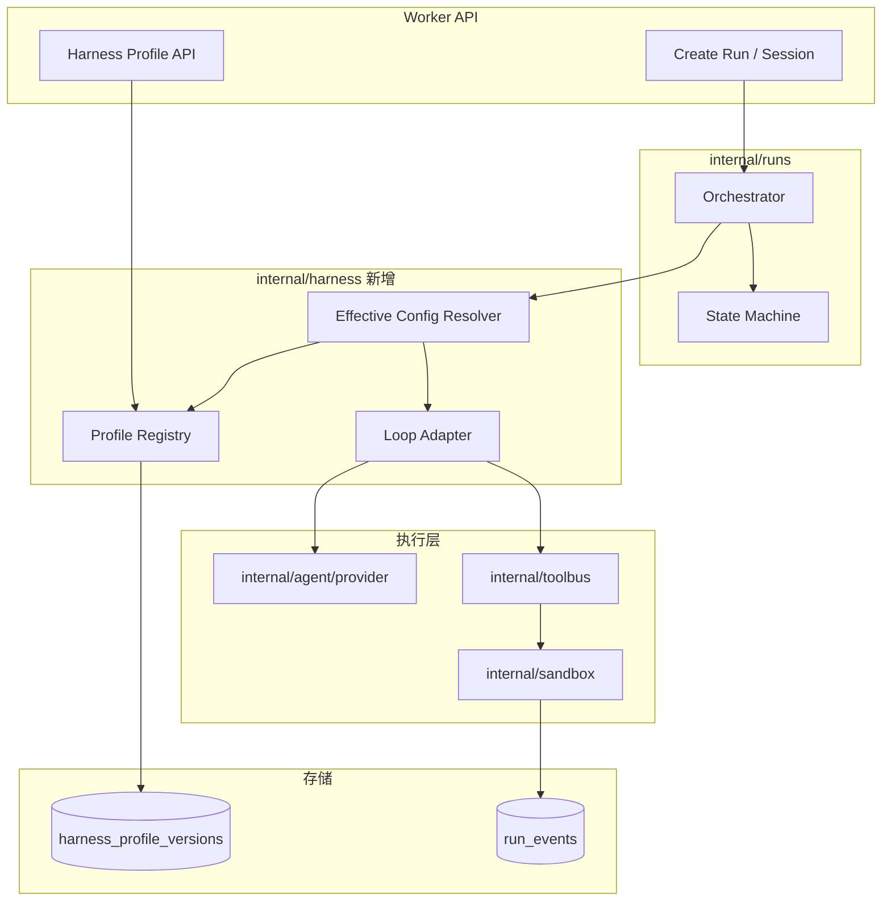
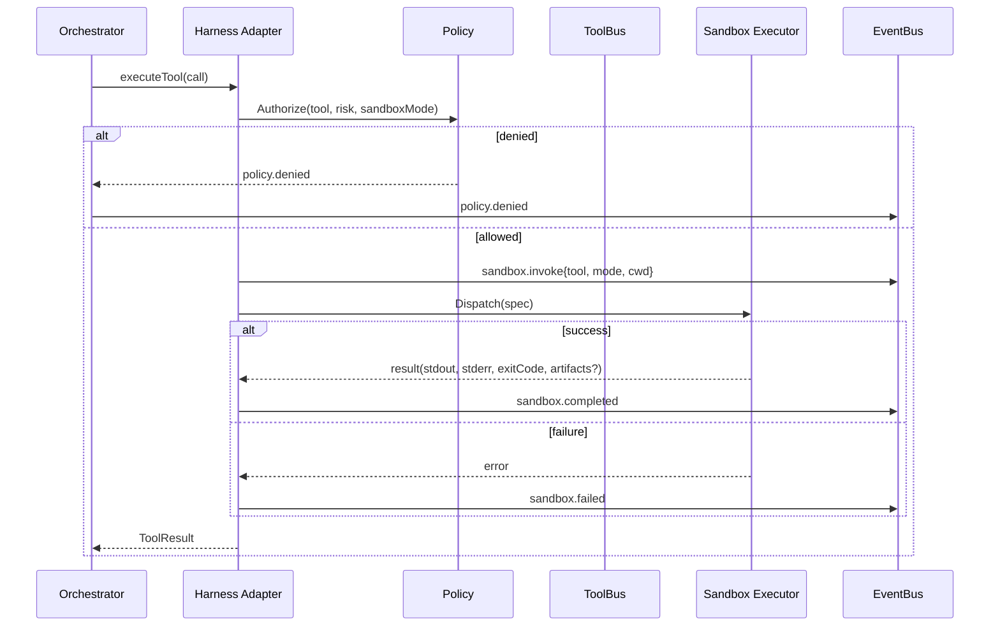

# HLD：内置 Harness 与安全沙盒（v2）

> 文档状态：v2 设计草案（2026-08-28）  
> 归属：[`design/`](README.md)  
> 对应 Sprint：**DH**（Harness 骨架）、**DX**（沙盒 POC）  
> 计划：[`../plan/v2-dual-core-evolution-plan.md`](../plan/v2-dual-core-evolution-plan.md)  
> 关联：[`HLD-总体设计.md`](HLD-总体设计.md) · [`ARCH-架构与技术选型.md`](ARCH-架构与技术选型.md) · 附录 [`B-RulesDSL规范与Schema.md`](../appendices/B-RulesDSL规范与Schema.md)

## 1. 设计目标

### 1.1 背景

v1（`v0.1.0-mvp`）智能体执行路径为 **Orchestrator → ToolBus → AgentExec（static/ExecGo）**，Policy 在进程内拦截危险工具，但**无隔离执行面**。对标 DSH/Pi 的 Harness 能力与沙盒需求，v2 在**不替换** Scenario DSL / Run 状态机的前提下，引入：

1. **内置 Harness**：可版本化、可评审的 Agent 运行时配置（Profile + Loop 接缝 + Provider 路由）  
2. **安全沙盒**：危险/写盘/命令类工具在可配置隔离环境中执行  
3. **与演进平面衔接**：Harness Profile 变更走编排评审，与 Memory 评审并列  

### 1.2 非目标（v2）

- 不实现 Cordis 式全插件树或 Pi 式纯 TUI 产品  
- 不在 v2 交付 Landlock/E2B 级强隔离（P3）  
- 不替代 Scenario DSL；Harness 服从 DSL 的 `policyProfile` 与步骤 `gates`  

### 1.3 设计约束

| 约束 | 说明 |
|------|------|
| 事件不变量 | 模型可见动作 ⟺ `run_events` 已记录（含 sandbox 生命周期） |
| 默认 deny | `tool_risk=danger` 工具必须 `sandboxMode≠off` 且常伴随 `human` 门禁 |
| 可回放 | 沙盒 stdout/stderr 摘要写入事件；大输出 spill 到 artifact 路径 |
| 多租户 | `harness_profile_versions` 带 `space_id`，走 RLS（与 M3 一致） |
| Windows | `isolated` 可降级为进程边界 + 路径 jail；Doctor 标注能力位 |

---

## 2. 逻辑架构



**Effective Config 解析顺序**（高优先级覆盖低）：

```
平台默认 HarnessProfile
  ← Space 默认 profile（settings）
  ← Run 创建时指定 harnessProfileId（可选）
  ← Scenario DSL policyProfile + 步骤级 sandbox 覆盖
```

冲突时：**DSL `policyProfile` / 步骤 gates 优先于 Harness Profile**；`promote` 时若与 active Scenario 冲突则拒绝。

---

## 3. Harness Profile 模型

### 3.1 资源定义

| 字段 | 类型 | 说明 |
|------|------|------|
| `id` | string | `hprof_*` |
| `spaceId` | string | 租户 |
| `name` | string | 空间内唯一 |
| `version` | int | 单调递增 |
| `status` | enum | `draft` \| `in_review` \| `active` \| `archived` |
| `spec` | JSON | 见 3.2 |
| `createdBy` | string | 审计 |
| `promotedAt` | timestamp? | 升格时间 |
| `parentVersion` | int? | 派生自 |

**约束**：每个 `(spaceId, name)` 最多一个 `active` 版本。

### 3.2 Spec Schema（`ash.harness/v1`）

```yaml
apiVersion: ash.harness/v1
kind: HarnessProfileSpec
spec:
  provider:
    kind: execgo          # static | execgo | acp_sdk（v2 实现 static+execgo）
    model: ""             # 可选覆盖
  sandbox:
    defaultMode: workspace-write   # off | read-only | workspace-write | isolated
    network: deny                  # deny | allow（security_patch + human 可单次 allow）
    spillMaxBytes: 65536
  tools:
    allowlist: [read, write, edit, bash, grep, find, ls]
    denylist: []
  policyProfile: default           # 与 DSL 对齐：default|strict|hotfix|security
  compaction:
    enabled: true
    triggerTokenRatio: 0.85
  subRun:
    maxDepth: 2
    inheritSandbox: true
  skills: []                       # skill id 列表，解析自 Memory Core
  integration:
    rpcEnabled: true
    jsonEventsEnabled: true
```

JSON Schema 文件目标路径：`doc/appendices/schemas/ash.harness.profile.v1.json`（DH Sprint 交付）。

### 3.3 Loop 接缝（Agent Loop Adapter）

Harness 不替换 `internal/runs/execute.go` 主循环，而是插入 **Loop Adapter**：

| 阶段 | 钩子 | 事件 |
|------|------|------|
| Turn 开始 | `OnTurnStart(ctx, run, messages)` | `harness.turn.started` |
| Step 开始 | `OnStepStart(ctx, step)` | `harness.step.started` |
| Provider 请求前 | `OnBeforeLLM(ctx, req)` | 可 redact 日志 |
| Tool 调用前 | `OnBeforeTool(ctx, call)` → Sandbox 路由决策 | `harness.tool.routed` |
| Tool 调用后 | `OnAfterTool(ctx, result)` → spill / 摘要 | `harness.tool.completed` |
| Step 结束 | `OnStepEnd(ctx, step)` | `harness.step.ended` |
| Turn 结束 | `OnTurnEnd(ctx)` | `harness.turn.ended` |

**不变量校验**（Doctor M4-HAR-02）：任一进入 LLM 上下文的 tool result，必须存在对应 `tool.called` 或 `harness.tool.completed` 事件。

### 3.4 Provider 门面

```
internal/agent/provider/
  registry.go      # 注册 static / execgo
  router.go        # 按 HarnessProfile.spec.provider 选择
  execgo.go        # 现有 agentexec 包装
  static.go
```

Run 级覆盖：`Run.harnessProfileId` 或 `Run.metadata.providerOverride`（仅 admin，审计）。

---

## 4. 安全沙盒设计

### 4.1 沙盒模式语义

| `sandboxMode` | FS | 网络 | 进程 | 适用 |
|---------------|-----|------|------|------|
| `off` | 宿主 | 宿主 | in-process | dev、Doctor TR0 |
| `read-only` | 只读挂载 repoRoot | deny | 子进程 | 定界、审计 |
| `workspace-write` | rw 限 repoRoot + tmp | deny | 子进程/Docker | feature_delivery |
| `isolated` | Docker 卷挂载 workspace | deny（默认） | 容器 | hotfix、security_patch |

### 4.2 执行时序



### 4.3 Docker 执行器（DX Sprint）

**包路径**：`internal/sandbox/docker/`

| 组件 | 职责 |
|------|------|
| `Executor` | 实现 `sandbox.Executor` 接口 |
| `spec.go` | 镜像、挂载、uid、超时、env 白名单 |
| `pool.go` | 可选容器池（v2 先每次 create--rm） |

**默认镜像**：`ash-sandbox-runner:dev`（Dockerfile 置于 `deploy/sandbox/`）

**挂载规则**：

- `workspace-write` / `isolated`：`repoRoot` → `/workspace`（rw）  
- 临时目录：`/tmp/ash-run-{runId}` → `/tmp`（rw）  
- 禁止挂载 `~/.ash`、Docker socket、宿主机 `/`  

**环境变量**：仅注入 `ASH_RUN_ID`、`ASH_STEP_ID`、`PATH`；**不**注入 API Key。

### 4.4 进程执行器（降级）

`internal/sandbox/process/`：无 Docker 时

- `chroot` 不可用则路径 jail（`repoRoot` 外拒绝）  
- `exec.CommandContext` + 超时 + 输出截断  
- Doctor 报告 `sandbox.capability=docker|process-only`  

### 4.5 与 tool_risk 映射

| `tool_risk` | 最低 `sandboxMode` | 额外门禁 |
|-------------|-------------------|----------|
| `safe` | `off` 允许 | — |
| `write` | `workspace-write` | citation（若步骤要求） |
| `danger` | `isolated` | human + 审计 |
| `network` | `isolated` + network allow 须 human | human |

现有 `GET /api/v1/tools/risk-catalog` 扩展字段：`minSandboxMode`。

---

## 5. API 设计（DH/DX）

### 5.1 Harness Profile

| 方法 | 路径 | 说明 |
|------|------|------|
| GET | `/api/v1/harness/profiles` | 列表（filter status/name） |
| POST | `/api/v1/harness/profiles` | 创建 `draft` |
| GET | `/api/v1/harness/profiles/{id}` | 详情含 spec |
| PUT | `/api/v1/harness/profiles/{id}` | 仅 `draft` 可改 |
| POST | `/api/v1/harness/profiles/{id}/submit-review` | → `in_review` |
| POST | `/api/v1/harness/profiles/{id}/promote` | 人工批准 → `active`，旧 active → `archived` |
| POST | `/api/v1/harness/profiles/{id}/rollback` | 回滚到上一 `archived` |

### 5.2 Run 集成

创建 Run 请求扩展：

```json
{
  "scenarioId": "feature_delivery",
  "inputs": {},
  "harnessProfileId": "hprof_optional",
  "sandboxModeOverride": null
}
```

响应 `RunView` 扩展：`harnessProfileId`、`effectiveSandboxMode`、`harnessProfileVersion`。

### 5.3 RPC 模式（DI Sprint，本文档预留）

- CLI：`ash harness rpc`  
- 协议：LF 分隔 JSON（与 Pi `--mode rpc` 对齐子集）  
- 首版消息：`session.start`、`turn.prompt`、`event`（转发 SSE 事件）  

---

## 6. 数据模型（Postgres/SQLite）

### 6.1 新表 `harness_profile_versions`

```sql
-- 迁移号由实现时分配（预计 000021+）
CREATE TABLE harness_profile_versions (
  id              TEXT PRIMARY KEY,
  space_id        TEXT NOT NULL,
  name            TEXT NOT NULL,
  version         INTEGER NOT NULL,
  status          TEXT NOT NULL,
  spec_json       TEXT NOT NULL,
  parent_version  INTEGER,
  created_by      TEXT,
  promoted_by     TEXT,
  created_at      TIMESTAMPTZ NOT NULL,
  promoted_at     TIMESTAMPTZ,
  UNIQUE (space_id, name, version)
);
CREATE INDEX idx_harness_profile_active ON harness_profile_versions (space_id, name, status);
```

**RLS**：纳入 `000013` 策略模式；`ash_app` 仅本 `space_id`。

### 6.2 Run 表扩展

- `harness_profile_id` TEXT NULL  
- `harness_profile_version` INT NULL  
- `effective_sandbox_mode` TEXT NULL  

### 6.3 事件类型扩展

| 事件 | payload 要点 |
|------|----------------|
| `harness.turn.started` | profileId, version |
| `harness.tool.routed` | tool, sandboxMode, executor |
| `sandbox.invoke` | image, mounts, timeoutMs |
| `sandbox.completed` | exitCode, stdoutSha256, spilledPath? |
| `sandbox.failed` | reason, retryable |

---

## 7. 与 ToolBus 集成

```go
// internal/sandbox/executor.go
type Executor interface {
    Capabilities(ctx context.Context) CapabilitySet
    Dispatch(ctx context.Context, req DispatchRequest) (*DispatchResult, error)
}

type DispatchRequest struct {
    RunID       string
    StepID      string
    Tool        string
    Args        map[string]any
    SandboxMode SandboxMode
    RepoRoot    string
    Timeout     time.Duration
}
```

`internal/toolbus/runtime.go` 修改点：

1. `Execute` 前调用 `harness.ResolveSandboxMode(tool, step, profile)`  
2. 若 `mode != off`，委托 `sandbox.DefaultExecutor.Dispatch`  
3. 否则走现有 in-process 路径  

**幂等**：同一 `toolCallId` 重试不得重复写盘（checkpoint 记录已执行 callId）。

---

## 8. 可观测与 Doctor

### 8.1 指标（Prometheus）

| 指标 | 说明 |
|------|------|
| `ash_sandbox_invoke_total` | 按 mode/tool 计数 |
| `ash_sandbox_duration_ms` | P95 执行耗时 |
| `ash_sandbox_fail_total` | 失败原因 label |
| `ash_harness_profile_active` | 每 space active 版本 gauge |

### 8.2 Doctor 探针（DH/DX）

| ID | 探测项 | Sprint |
|----|--------|--------|
| M4-HAR-01 | 默认 Profile schema 校验 | DH |
| M4-HAR-02 | 事件不变量：LLM 输入 ⊆ 事件日志 | DI |
| M4-HAR-03 | active Profile 存在且唯一 | DH |
| M4-SBX-01 | Docker 可用时 bash 沙盒冒烟 | DX |
| M4-SBX-02 | danger 工具在 `off` 下被 Policy 拒绝 | DX |
| M4-SBX-03 | workspace-write 写路径不出 repoRoot | DX |

### 8.3 门禁脚本

```bash
make sandbox-smoke    # DX：Docker 可选 ASH_SKIP_SANDBOX=1
make harness-smoke    # DH：Profile CRUD + schema 校验
```

---

## 9. 安全考量

| 威胁 | 缓解 |
|------|------|
| 容器逃逸 | 非 root、只读根 FS、无 privileged、无 docker.sock |
| 密钥泄漏进沙盒 | 环境变量白名单；Provider 密钥仅在宿主 |
| 路径穿越 | `repoRoot` 清洗；工具参数路径规范化 |
| 资源耗尽 | 超时、cgroup 内存上限（Docker `--memory`）、并发沙盒数限制 |
| 越权跨 space | Profile RLS；Run 创建校验 profile 归属 |

---

## 10. Sprint 交付清单

### 10.1 DH — Harness 骨架

| 交付物 | 路径/命令 |
|--------|-----------|
| Profile schema | `doc/appendices/schemas/ash.harness.profile.v1.json` |
| 包骨架 | `internal/harness/` |
| 迁移 | `000021_harness_profiles.up.sql` + RLS |
| API | `internal/api/harness.go` + Swagger |
| 探针 | Doctor M4-HAR-01/03 |
| 烟测 | `scripts/harness-smoke.sh` → `make harness-smoke` |

### 10.2 DX — 沙盒 POC

| 交付物 | 路径/命令 |
|--------|-----------|
| Executor 接口 | `internal/sandbox/executor.go` |
| Docker 实现 | `internal/sandbox/docker/` |
| 进程降级 | `internal/sandbox/process/` |
| ToolBus 接线 | `internal/toolbus/runtime.go` |
| 镜像 | `deploy/sandbox/Dockerfile` |
| 事件 | payload schema + derive 更新 |
| 探针 | Doctor M4-SBX-01~03 |
| 烟测 | `scripts/sandbox-smoke.sh` → `make sandbox-smoke` |

### 10.3 验收标准（DH+DX 退出）

- [ ] Space 可创建 draft Profile 并 `promote`（双人签可配置为 DI 后）  
- [ ] Create Run 绑定 Profile；`run_events` 含 `harness.turn.started`  
- [ ] `bash` 在 `workspace-write` Docker 沙盒内执行成功  
- [ ] `tool_risk=danger` 在 `sandboxMode=off` 时被拒绝  
- [ ] `make harness-smoke` + `make sandbox-smoke` 纳入 `regression-short`（沙盒可 skip）  
- [ ] OpenAPI + `make openapi-check` 绿  

---

## 11. 开放问题

| ID | 问题 | 默认决策 |
|----|------|----------|
| HLD-01 | 沙盒镜像是否入库构建？ | CI 构建 `ash-sandbox-runner`；本地 `make sandbox-image` |
| HLD-02 | ExecGo 是否在沙盒内？ | v2：ExecGo 在宿主，仅 **builtin tools** 进沙盒 |
| HLD-03 | Windows isolated 策略 | DX 仅 process jail；文档标注限制 |

---

## 12. 修订记录

| 日期 | 说明 |
|------|------|
| 2026-08-28 | 初稿：v2 Harness + 沙盒 HLD，对应 DH/DX Sprint |
