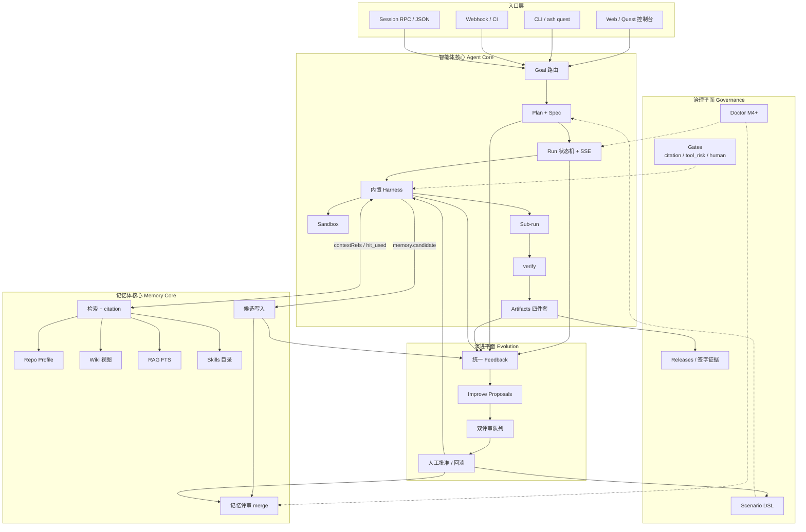
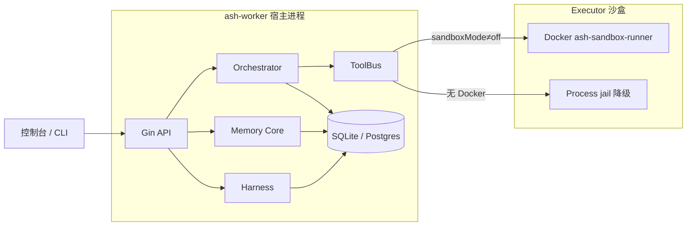
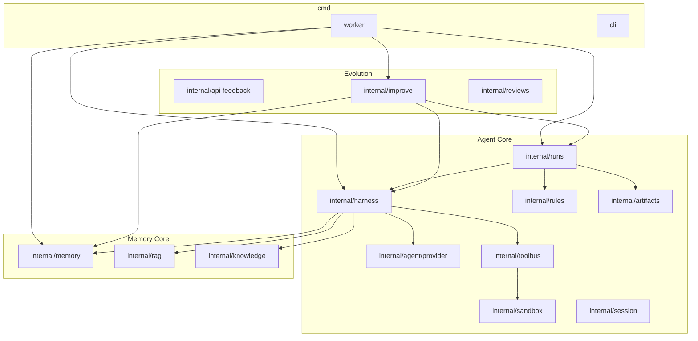
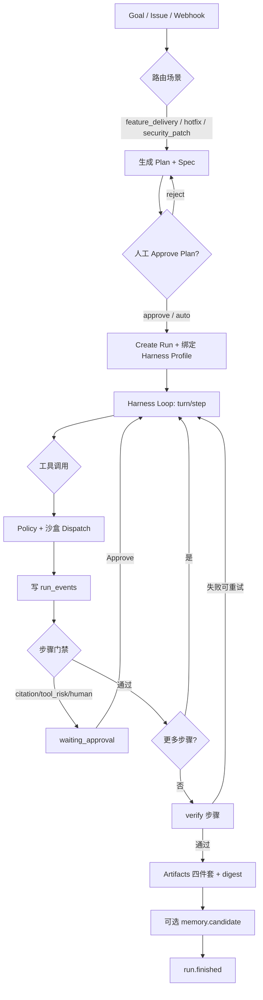
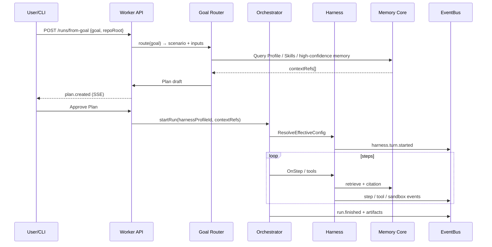
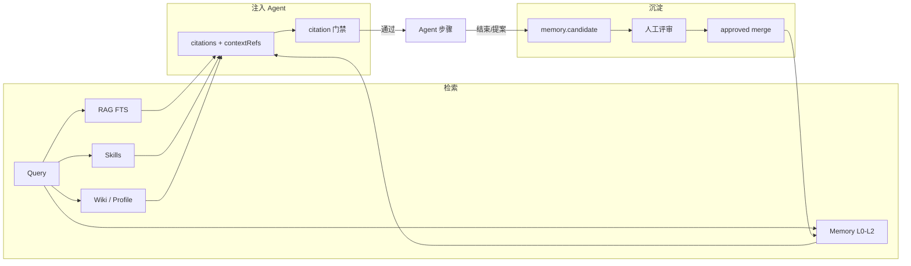
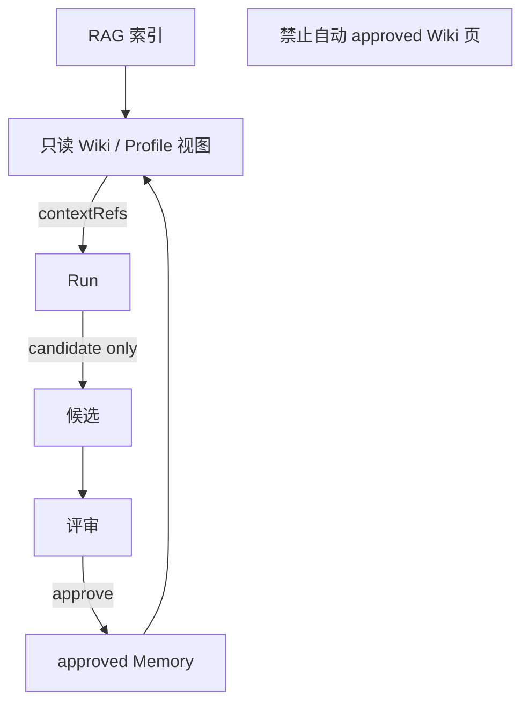
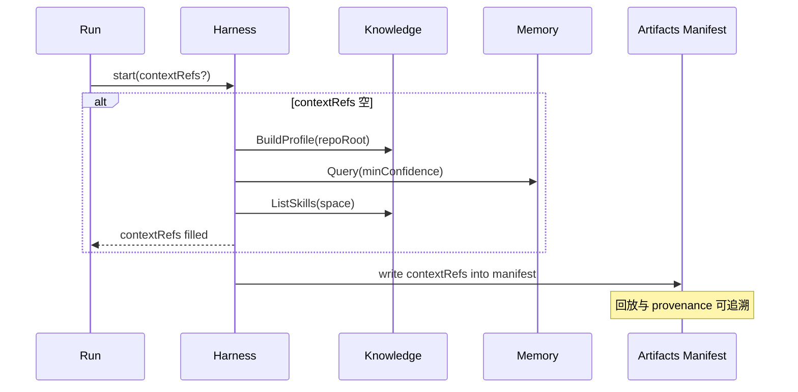
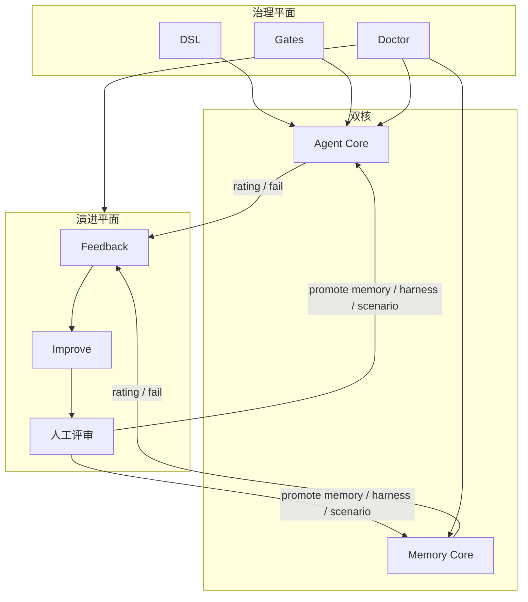

# HLD：记忆体 × 智能体双核心（v2）

> 文档状态：v2 设计草案（2026-08-28）  
> 归属：[`design/`](README.md)  
> 计划：[`../plan/v2-dual-core-evolution-plan.md`](../plan/v2-dual-core-evolution-plan.md)  
> 关联：[`HLD-总体设计.md`](HLD-总体设计.md) · [`HLD-Harness与沙盒.md`](HLD-Harness与沙盒.md) · [`../appendices/K-演进平面-v2.md`](../appendices/K-演进平面-v2.md)

## 1. 设计目标

### 1.1 一句话

> **ASH v2 将交付执行（智能体核心）与知识治理（记忆体核心）升格为并列、契约化协作的双核**；二者由治理平面（DSL / 门禁 / Doctor）约束，由演进平面（评分 / 评审 / 自进化）闭环改进。

### 1.2 相对 v1 的变化

| 维度 | v1 | v2 |
|------|----|----|
| 记忆 | Memory Service 作为 Orchestrator 下游 | **Memory Core** 一等核心 + Wiki/Skills/Profile |
| 执行 | Orchestrator + ToolBus + AgentExec | **Agent Core** = Orchestrator + **Harness** + Sandbox |
| 协作 | 隐式调用 | **contextRefs / citation / candidate** 显式契约 |
| 演进 | improve 偏 Run | 双核统一 Feedback + 编排/记忆双评审 |

### 1.3 非目标

- 不将 Memory Core 拆为独立微服务（仍可同进程包边界；Stage 2 再评估）  
- 不以自然语言替代 Scenario DSL 作为真相源  
- 不引入向量库主路径（P3）

---

## 2. 总体架构图

### 2.1 逻辑视图（双核 + 双平面）

### 2.2 部署视图（v2 Stage 1：单体 + 沙盒外置）

### 2.3 包边界（Go）

---

## 3. 智能体核心（Agent Core）

### 3.1 职责

在可审计 Run 内完成：**委派 → 规划 → 执行（沙盒）→ 验证 → 交付**。

| 模块 | 职责 | 主要包 |
|------|------|--------|
| Goal | NL/Issue → 场景路由 + 填槽 | `internal/runs` + harness |
| Plan | Spec/步骤计划可见；可 Approve | runs + rules |
| Run | 状态机、SSE、checkpoint | runs / events |
| Harness | Profile、Loop、Provider | harness / agent/provider |
| Sandbox | 隔离执行 | sandbox |
| Sub-run | 子 Run 树、白名单 | runs |
| verify | DSL verify 步骤 + 重试 | rules + doctor |
| Artifacts | 四件套 + digest + contextRefs | artifacts |

### 3.2 Goal → Artifacts 主流程

### 3.3 Quest / Session 入口时序

---

## 4. 记忆体核心（Memory Core）

### 4.1 职责

为 Agent 提供**可引用、可评审、可过期**的知识；Run 结束后沉淀回流。

| 模块 | 职责 | 主要包 |
|------|------|--------|
| RAG | FTS 检索、降级 | rag |
| Repo Profile | 语言/模块/测试命令扫描 | knowledge |
| Wiki | RAG+Memory 结构化投影 | knowledge |
| Skills | `SKILL.md` 索引 | knowledge |
| Records | L0–L2、证据、TTL | memory |
| Review | candidate→approve/reject | memory |
| hit_used | 命中审计 | memory |

### 4.2 检索 → 引用 → 候选闭环

### 4.3 Wiki / Profile 原则

---

## 5. 双核协作契约

### 5.1 契约表

| ID | 交互 | 方向 | 契约 |
|----|------|------|------|
| C-01 | 检索 | Memory → Agent | `Query(space, repo, layers, minConfidence)` → citations[] |
| C-02 | 引用门禁 | 治理 → Agent | 步骤 `requiresCitation`；失败 → waiting_approval |
| C-03 | 命中审计 | Agent → Memory | `hit_used` 绑定 runId/stepId/memoryId |
| C-04 | 候选沉淀 | Agent → Memory | 仅 `memory.candidate`；禁止直写 approved |
| C-05 | 上下文绑定 | 双向 | Run.`contextRefs[]`：profile、wiki、skills、memory ids |
| C-06 | Sub-run | Agent 内部 | 子 Run 继承 space；Memory 受 RLS；工具白名单收缩 |
| C-07 | 沙盒 | Harness → Sandbox | 每 tool call 带 `sandboxMode` + `repoRoot` |
| C-08 | 演进升格 | Evolution → 双核 | 仅人工批准后更新 active Profile / merged memory |

### 5.2 contextRefs 数据流

### 5.3 失败与降级

| 失败 | 降级 |
|------|------|
| RAG 不可用 | `retrievalMode=empty`；citation 门禁按场景 observe/enforce |
| Memory 查询超时 | 跳过注入；记 `memory.query_failed` |
| Sandbox 不可用 | Doctor 标注；dev 可 `sandboxMode=off`；生产 danger 阻断 |
| Profile 缺失 | 使用平台默认 HarnessProfile |

---

## 6. 与演进平面、治理平面的交界

演进平面细节见 [`../appendices/K-演进平面-v2.md`](../appendices/K-演进平面-v2.md)。  
Harness / 沙盒细节见 [`HLD-Harness与沙盒.md`](HLD-Harness与沙盒.md)。

---

## 7. API 面（双核相关）

| 域 | 端点（草案） | 核心 |
|----|--------------|------|
| Goal | `POST /api/v1/runs/from-goal` | Agent |
| Plan | SSE `plan.*`；Approve | Agent |
| Harness | `/api/v1/harness/profiles*` | Agent |
| Session | `POST /api/v1/agents/sessions` | Agent |
| Profile | `GET /api/v1/repos/{id}/profile` | Memory |
| Wiki | `GET /api/v1/wiki/...` | Memory |
| Skills | `GET /api/v1/skills` | Memory |
| Reviews | `GET /api/v1/reviews/queue` | Evolution |
| Feedback | `POST /api/v1/feedback`（扩展 targetType） | Evolution |

---

## 8. Doctor / 验收（双核）

| ID | 探测 | Sprint |
|----|------|--------|
| M4-TC-01 | Agent/Memory 包边界可独立构建探测 | DH |
| M4-TC-02 | contextRefs 写入 manifest | DK |
| M4-TC-03 | candidate 不可直写 approved | DY |
| M4-TC-04 | Goal 三场景填槽成功率探针 | DJ |
| M5-TC-05 | Sub-run 不继承 danger 工具 | DO |
| M5-TC-06 | verify 失败触发 improve | DP |

---

## 9. 修订记录

| 日期 | 说明 |
|------|------|
| 2026-08-28 | 初稿：双核架构图、主流程、契约、与 Harness/演进交界 |
