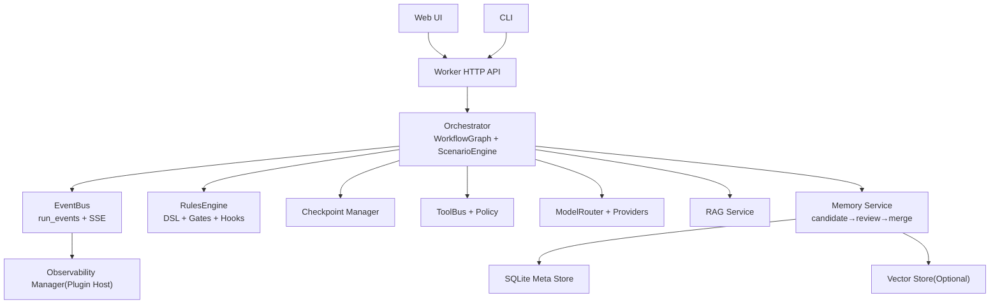
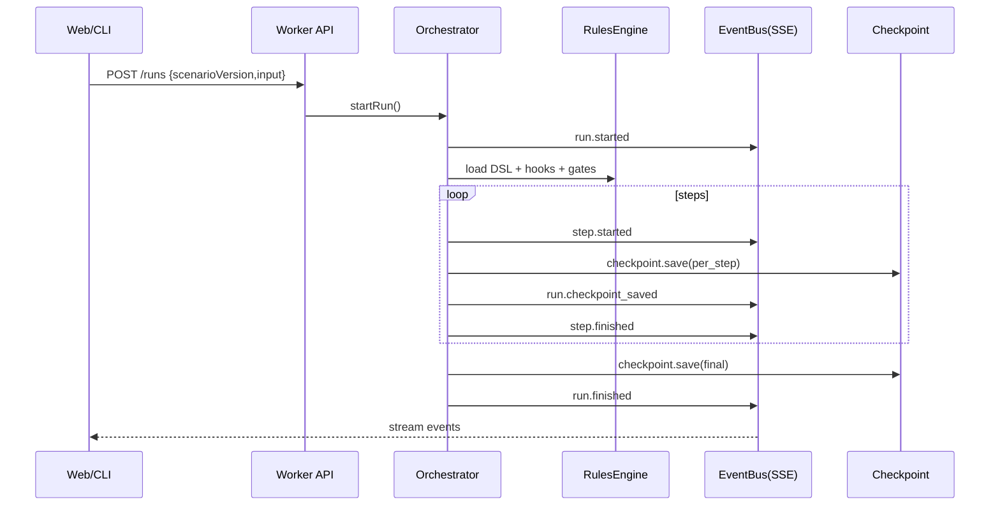
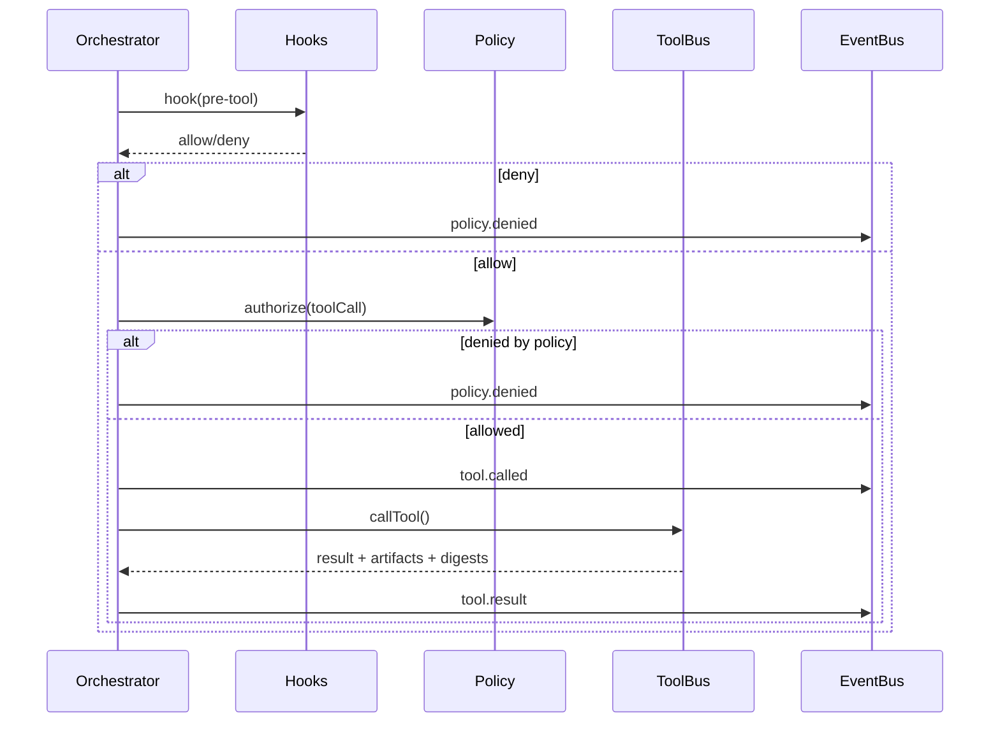
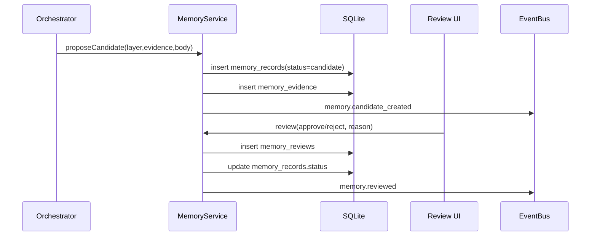

# ASH HLD（总体设计）v0.1

> 文档状态：v0.2（对照 MVP 实现，2026-08-08）。本设计以“事件可回放 + 交付闭环 + 记忆可治理”为核心约束。进度见 [`../plan/PLAN-进度与里程碑.md`](../plan/PLAN-进度与里程碑.md)。  
> 归属：[`design/`](README.md)

## 1. 设计目标与约束
- **交付闭环**：每个 Run 形成可验证 Artifacts（diff/test_report/release_notes/rollback_plan）。
- **可回放**：run_events 持久化 + artifacts digest + memory 版本锚定。
- **可审计**：工具调用与记忆写入全链路审计；危险操作默认 deny。
- **可插拔**：LLM provider / MCP / skills / RAG / 向量库 / 可观测性均插件化。

## 2. 总体架构概览
（详见 [`ARCH-架构与技术选型.md`](ARCH-架构与技术选型.md) 的选型解释。）

## 3. 关键流程（时序）
### 3.1 Run 执行主流程（start→steps→finish）

### 3.2 工具调用（ToolBus）与门禁（Policy/Gates）

### 3.3 记忆写入与评审（candidate→review→merge）

## 4. 模块划分与职责
- **Worker API（Gin）**：Run/Task/Memory/Rules 的 HTTP 面；SSE 输出；Swagger 暴露与调试友好。
- **Orchestrator**：按 scenario 驱动 WorkflowGraph；协调 model/rag/tool/memory；写 checkpoint；发事件。
- **RulesEngine**：解释 DSL，执行 gates/hooks，输出阻断与 remediation。
- **ToolBus + Policy**：统一工具 schema/超时/审计/脱敏；危险工具 deny。
- **ModelRouter**：多 provider 路由、降级、预算；产出 usage/cost 事件。
- **RAG Service**：代码/文档/记忆/交付证据检索；强制引用输出。
- **Memory Service**：分层记忆与评审；schemaVersion 与迁移；hit_used 记录。
- **EventBus**：run_events 持久化；SSE 续传；回放数据源。
- **Observability Manager**：事件→metrics/spans/logs 的派生器；插件化输出。

## 5. 关键接口（契约冻结点）
本节只列“必须冻结”的接口集合（详见后续附录或代码仓 `packages/*`）。
- `ModelProvider` / `ModelRouter`
- `ToolBus` / `ToolPolicy`
- `WorkflowGraph` / `WorkflowNode`
- `MemoryStore` / `MemoryRecord`
- `EventEnvelope`（事件协议）
- `Rules DSL v0.1`（schema + 语义）

## 6. 数据与存储
- **run_events**：事件序列（真相来源）；SSE 续传与回放依赖。
- **checkpoint**：per_step 快照 + retain；用于 resume 与回放。
- **artifacts**：diff/test_report/release_notes/rollback_plan 等（引用+digest，见 [`../appendices/F-Artifacts规范与Digest.md`](../appendices/F-Artifacts规范与Digest.md)）。
- **memory_records/evidence/reviews/edges/migrations**：分层记忆治理。
- **audit_log**：审计索引（生产建议 append-only/WORM 外置）。

### 6.1 持久化实现建议（Go + GORM）
- M0 默认：SQLite（run_events、memory、audit、checkpoint 元信息）
- P2 演进：Postgres（高并发/多租户）

**已实现**：`golang-migrate` 嵌入 SQL（`internal/store/sqlmigrations`）、`ash migrate schema`、`ASH_SCHEMA_MODE=sql`、Doctor M3-03/08；Memory catalog v1→v2（`internal/memory/migrate.go`）。详见 [`../appendices/I-GORM-模型映射与迁移策略.md`](../appendices/I-GORM-模型映射与迁移策略.md) / [`M3-多租户与Postgres演进.md`](M3-多租户与Postgres演进.md)。

## 11. API 契约与接口生成（Swagger + Proto）
### 11.1 Swagger / OpenAPI（对外 HTTP）
- 用途：Web UI 调试、第三方集成、运维与诊断（health/metrics/docs）
- 建议：Gin + `swaggo/swag` 自动生成 OpenAPI（M0）；或 P1 统一维护 `openapi.yaml`（单一真相）

### 11.2 Proto / gRPC（对内与插件 ABI）
- 用途：进程外插件（observability/rag/indexer/enterprise tools）、高吞吐内部接口
- 建议：
  - `buf` 管理 proto（lint + breaking check）
  - gRPC 服务提供：插件注册/事件订阅/指标导出（P1+）

Artifacts 的存储、digest、保留与导出规范见 [`../appendices/F-Artifacts规范与Digest.md`](../appendices/F-Artifacts规范与Digest.md)。

## 7. 错误处理与降级策略
- provider 不可用：路由到备用 provider 或降级为非工具模式。
- 向量库不可用：退回 FTS/BM25（P1+）。
- MCP 工具超时：熔断该工具，run 继续并提示 human。
- CI 不可用：退回本地测试或阻断 pre-ship gate（按 policyProfile）。

## 8. 安全设计（概览）
- 工具最小权限；danger 默认 deny；human step 提升权限。
- redaction 默认开启；敏感字段不外发可观测性插件。
- 注入防护：引用强制、信任分级（P1 强化）。

## 9. 可观测性（概览）
- 所有观测从 `run_events` 派生；Prometheus/OTel 为可选插件输出。
- run 观测：step/tool/model/rag/gate/recovery。
- memory 观测：candidate/review/sla/hit_used/ttl/deprecate/migrate。

## 10. 兼容与版本策略
- **scenarioVersion**：模板不可变；变更通过新版本灰度。
- **schemaVersion（Memory）**：读兼容、写新规；迁移记录可审计。
- **事件协议版本**：事件类型新增可向后兼容；字段废弃需保留过渡期。

