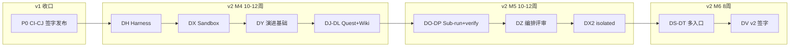
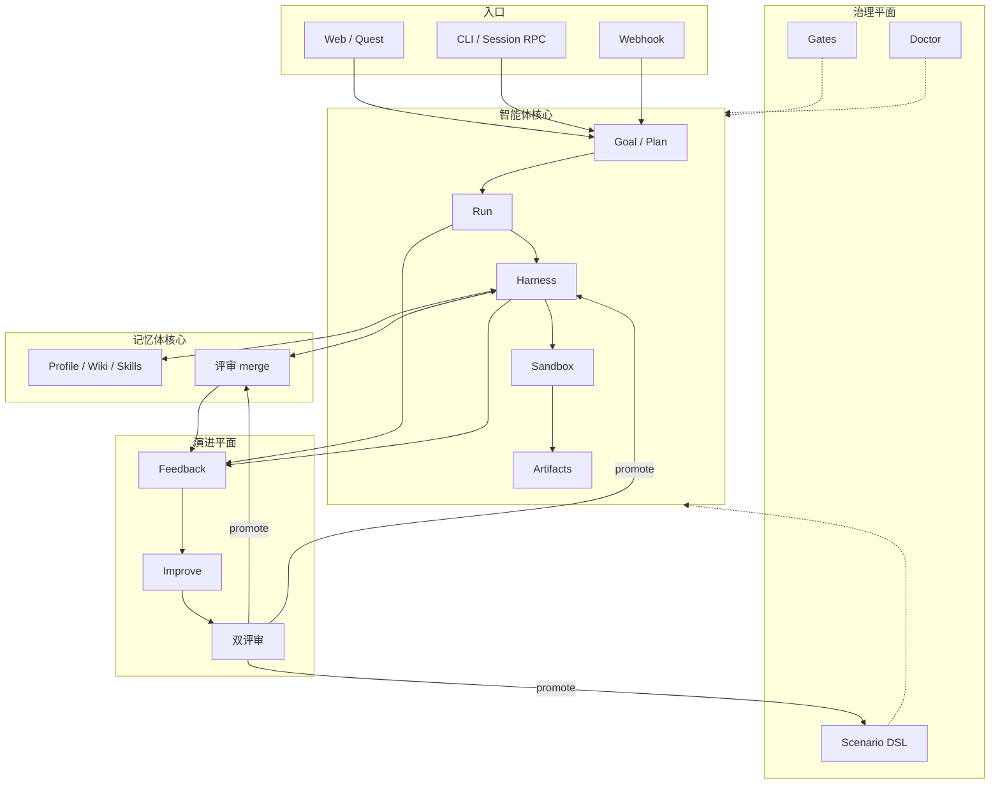

# ASH v2 演进方向：记忆体 × 智能体双核心 + 内置 Harness

> 状态：现行 v2 规划（2026-08-28）  
> 归属：[`plan/`](README.md)  
> **当前版本**：v1（`v0.1.0-mvp` / `v1.0.0`）  
> **目标版本**：**v2.0.0**  
> 设计：[`HLD-Harness与沙盒.md`](../design/HLD-Harness与沙盒.md)  
> 关联：[`PLAN-进度与里程碑.md`](PLAN-进度与里程碑.md) · [`mvp-release-scope.md`](mvp-release-scope.md)

## 0. 版本路线图（v1 → v2）

| 版本 | Git 锚点 | 里程碑 | 核心能力 | 状态 |
|------|----------|--------|----------|------|
| **v1** | `v0.1.0-mvp` → `v1.0.0` | M0–M3 + PRD MVP | Run/DSL/Artifacts/Memory 评审/Doctor/RLS | **当前**；P0 签字进行中 |
| **v2** | `v2.0.0`（目标） | M4–M6 | 双核心 + Harness + 沙盒 + 演进平面 + Quest | **规划** |

### 0.1 v1 → v2 阶段划分



| 阶段 | 时间（估） | 交付版本 | 可发布性 |
|------|------------|----------|----------|
| **v1.0** | 即时 + P0 2 周 | `v1.0.0` | 生产 MVP + 云 RDS |
| **v2.0-alpha** | M4 结束 | `v2.0.0-alpha` | 内测：Harness + 沙盒 POC |
| **v2.0-beta** | M5 结束 | `v2.0.0-beta` | 预发：Sub-run + 编排评审 |
| **v2.0** | M6 结束 | `v2.0.0` | GA + v2 签字 |

**M4 启动条件**：v1 P0 完成 **或** `postgres-local-rds-e2e` + `mvp-signoff` 稳定绿。

---

## 1. v2 产品定位

> **ASH v2 = 双核 + Harness 交付 Agentic 平台**：智能体核心通过**内置 Harness** 在**沙盒**中执行 Goal→Plan→Run→Verify；记忆体核心完成检索→引用→候选→评审→沉淀；**演进平面**对 Run/Plan/Memory/Skill/Harness 统一评分与自进化，**人工评审**为升格闸门。

### 1.1 v2 范围

| 包含 | 不包含（P3） |
|------|--------------|
| 内置 Harness、Docker/进程沙盒 | Cordis 全插件、IDE 补全 |
| 双核统一 Feedback + Improve | 向量库主路径、Skill 市场 |
| 编排评审 + Memory 评审 | Landlock/E2B（v2.1+ 可选） |
| Goal/Quest、Wiki、Sub-run、Session RPC | 计费、多区域 |

---

## 2. 架构总览



**设计文档索引（已齐）**

| 文档 | Sprint | 内容 |
|------|--------|------|
| [`HLD-双核心-v2.md`](../design/HLD-双核心-v2.md) | DH+ | 双核架构、主流程、协作契约 |
| [`HLD-Harness与沙盒.md`](../design/HLD-Harness与沙盒.md) | DH, DX | Profile、Loop、Sandbox、API、DDL |
| [`K-演进平面-v2.md`](../appendices/K-演进平面-v2.md) | DY, DZ | Feedback、双评审、Improve 状态机 |
| [`HLD-总体设计.md`](../design/HLD-总体设计.md) | — | v1/v2 总图对照 |
| [`ARCH-架构与技术选型.md`](../design/ARCH-架构与技术选型.md) §12.2 | — | Stage 1 = v2 主路径 |

---

## 3. v1 → v2 能力迁移表

| 能力域 | v1（已有） | v2（新增/增强） |
|--------|------------|-----------------|
| 执行 | ToolBus + static/ExecGo in-process | **Harness Profile** + **Sandbox 调度** |
| 配置 | Scenario YAML only | + Harness 版本化 + 编排评审 |
| 记忆 | 评审 merge、TTL、decay | + Wiki 视图、Skills、统一 feedback |
| 委派 | 场景 inputs | + Goal API、Quest 工作台 |
| 集成 | OpenAPI + SSE | + RPC/JSON Session |
| 自进化 | improve/canary（Run） | + Harness/Scenario/Skill 提案 |
| 安全 | policy.denied、tool_risk | + **沙盒隔离**、danger→isolated |
| 门禁 | Doctor 43 | + M4/M5 Harness/SBX 套件 |

**兼容承诺**：v1 Scenario YAML、Run API、Memory schema v2 **保持向后兼容**；v2 字段均为可选扩展。

---

## 4. 内置 Harness（摘要）

完整设计 → [`HLD-Harness与沙盒.md`](../design/HLD-Harness与沙盒.md) §3–§5。

- **Harness Profile**：`draft → in_review → active`；`promote` 需人工批准  
- **Loop 接缝**：`harness.turn/step/tool.*` 事件；`model-visible ⟺ logged`  
- **Provider**：static / ExecGo（v2）；ACP 预留  
- **包**：`internal/harness/`、`internal/agent/provider/`  

---

## 5. 安全沙盒（摘要）

完整设计 → [`HLD-Harness与沙盒.md`](../design/HLD-Harness与沙盒.md) §4。

| 模式 | v2 阶段 |
|------|---------|
| `workspace-write` | M4 DX：Docker POC |
| `isolated` | M5 DX2：hotfix/security 强制 |
| `off` | 仅 dev/Doctor |

- **包**：`internal/sandbox/docker/`、`internal/sandbox/process/`  
- **门禁**：`make sandbox-smoke`  

---

## 6. 演进平面（摘要）

- **可评分类型**：memory、run、plan、harness_profile、scenario_patch、skill…  
- **双评审队列**：记忆评审 + **编排评审**  
- **闭环**：feedback → improve → experiment → canary → **人工 promote**  
- **Sprint**：DY（API）、DZ（UI + promote）  

---

## 7. v2 开发计划（Sprint DH–DV）

### 7.1 总览

| 周次（累计） | Sprint | 版本增量 | 主题 | 交付物 |
|--------------|--------|----------|------|--------|
| 0–2 | **CI–CJ** | v1.0.0 | P0 发布 | 云 RDS、签字 |
| 3–4 | **DH** | v2 开发启动 | Harness 骨架 | ✅ Schema + 000021 + API + `harness-smoke` |
| 5–6 | **DI** | — | Loop 接缝 + RPC 草案 | ✅ Adapter + harness 事件 + sandbox stub（RPC 仍预留） |
| 7–8 | **DX** | v2.0.0-alpha.1 | **沙盒 POC** | ✅ process/Docker + `sandbox-smoke` + danger/`off` 拒绝 |
| 9–10 | **DJ** | — | Goal→Run + Plan | ✅ from-goal + Plan 闸门 + `ash quest` + Runs Quest UI |
| 11–12 | **DK** | — | Quest 工作台 v1 | ✅ 看板 + 深 Diff 批注 + 步骤评分 + contextRefs |
| 13–14 | **DY** | — | 演进平面基础 | ✅ feedback 全类型 + `/reviews/queue` + decide |
| 15–16 | **DL** | — | Repo Profile + Wiki | ✅ 即时 Profile/Wiki + 知识 Tab + contextRefs（无新表） |
| 17–18 | **DM** | — | Space Rules + 路由 | ✅ DB + `.ash/rules.yaml` 双向同步 + from-goal |
| 19–20 | **DN** | v2.0.0-alpha | Skills 目录 | ✅ SKILL.md 扫描 + 场景绑定 + `skill:` contextRefs |
| 21–22 | **DO** | — | Sub-run | ✅ spawn + 深度/白名单 + 事件树 + Quest 树 |
| 23–24 | **DP** | — | verify 步骤 | ✅ DSL verify + 重试 + improve 草稿 |
| 25–26 | **DZ** | v2.0.0-beta.1 | **编排评审** | ✅ Reviews UI + promote 闸门 + scenario patch + rollback |
| 27–28 | **DQ** | — | Provider + ExecGo live | ✅ kind→agent + fallback + `/providers/agent`（H-06 环境⏸） |
| 29–30 | **DX2** | v2.0.0-beta.2 | isolated 强制 | ✅ hotfix/security + minMode + KPI-19 |
| 31–32 | **DR** | — | compaction + Doctor M4/M5 | ✅ spill + compaction + M4/M5；ALL 53 |
| 33–34 | **DS** | — | Webhook 触发 | ✅ HMAC + diagnose + autoRun hotfix |
| 35–36 | **DT** | — | Session RPC/JSON | `/agents/sessions` |
| 37–38 | **DU** | — | 演进 KPI + 移动审阅 | KPI-17~19 看板 |
| 39–40 | **DV** | **v2.0.0** | scope 冻结 + 签字 | `v2-release-scope.md`、`v2.0.0` tag |

**总工期**：约 **40 周**（含 P0 2 周 + v2 功能 38 周）；DH/DX 可并行 DK 需前端产能。

### 7.2 DH + DX Sprint 详细（设计已就绪）

#### DH — Harness 骨架（第 3–4 周）

| 类别 | 项 |
|------|-----|
| 设计 | ✅ [`HLD-Harness与沙盒.md`](../design/HLD-Harness与沙盒.md) |
| Schema | `doc/appendices/schemas/ash.harness.profile.v1.json` |
| 后端 | `internal/harness/`、`internal/api/harness.go` |
| DDL | `000021_harness_profiles` + RLS |
| Doctor | M4-HAR-01、M4-HAR-03 |
| 脚本 | `make harness-smoke` |
| 前端 | Automation 页：Profile 列表（draft） |

**退出标准**：CRUD draft Profile；`LoadActive(space)`；openapi-check 绿。

#### DX — 沙盒 POC（第 7–8 周）

| 类别 | 项 |
|------|-----|
| 设计 | ✅ HLD §4、§7 |
| 后端 | `internal/sandbox/`、ToolBus 接线 |
| 镜像 | `deploy/sandbox/Dockerfile` |
| 事件 | `sandbox.invoke/completed/failed` |
| Doctor | M4-SBX-01~03 |
| 脚本 | `make sandbox-smoke` |
| 前端 | Run 详情：沙盒时间线（只读） |

**退出标准**：`bash` 在 `workspace-write` 沙盒成功；danger+off 被拒绝。

### 7.3 每 Sprint 门禁

```bash
make regression-short && make web-gate
make openapi-check
make harness-smoke      # DH 起
make sandbox-smoke      # DX 起（ASH_SKIP_SANDBOX=1 可跳过）
go test ./internal/doctor/... -run 'Test(M4|M5|Harness)' -count=1
```

### 7.4 v2 发布门禁（DV）

```bash
make mvp-signoff          # 适配 v2 清单
make release-window-gate
make signoff-gate         # v2 四人签字
```

---

## 8. v2 成功指标

| ID | 指标 | 目标 |
|----|------|------|
| KPI-12 | Goal→Run 一次成功率 | ≥ 90% |
| KPI-13 | Plan 采纳率 | ≥ 70% |
| KPI-14 | Memory citation 通过率 | ≥ 95% |
| KPI-15 | Sub-run / 沙盒越权 | 0 |
| KPI-16 | Time-to-Artifacts P95 | −20% |
| KPI-17 | 编排评审积压 | < 50 / space，7 天清空 |
| KPI-18 | Improve 误升格回滚率 | < 2% |
| KPI-19 | danger 工具沙盒覆盖率 | 100% |

---

## 9. 风险与评审决议

| 维度 | 结论 |
|------|------|
| v1→v2 兼容性 | ✅ 扩展式演进，不破坏 v1 API |
| Harness + 沙盒 | ✅ 设计文档已交付（HLD） |
| 工期 40 周 | ⚠️ 可按 Sprint 裁剪 M6 移动审阅 |
| **总体** | **批准 v2 路线**；立即执行 P0，并行评审 v2-alpha 环境 |

---

## 10. 修订记录

| 日期 | 说明 |
|------|------|
| 2026-08-27 | 初稿（v0.2 命名） |
| 2026-08-28 | Harness/沙盒/演进平面 |
| 2026-08-28 | **版本号升至 v2**；v1→v2 路线图；HLD 交付；Sprint 周次表 |
| 2026-08-28 | 补全设计：双核 HLD、演进平面附录 K、总图/流程图；索引对齐 |
