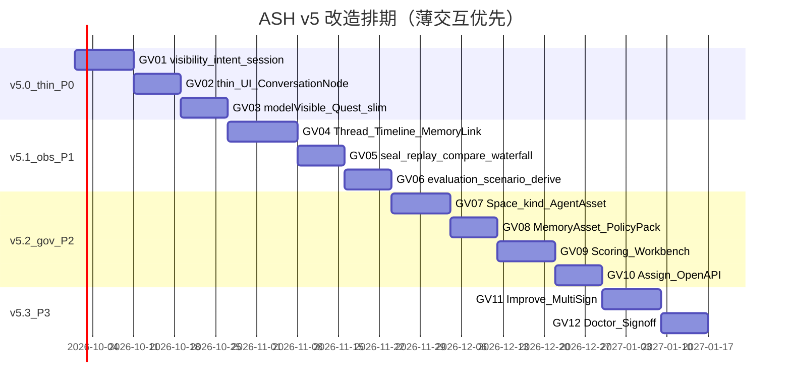
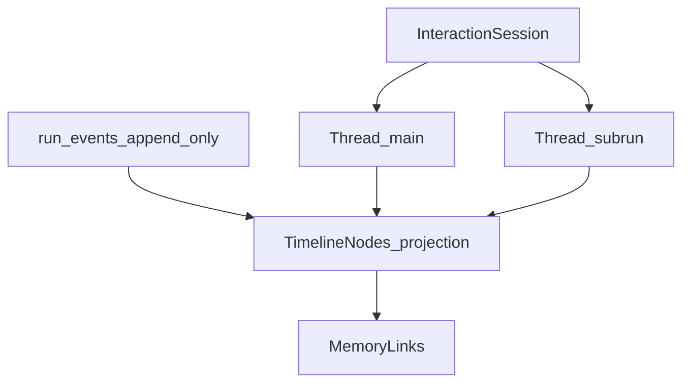
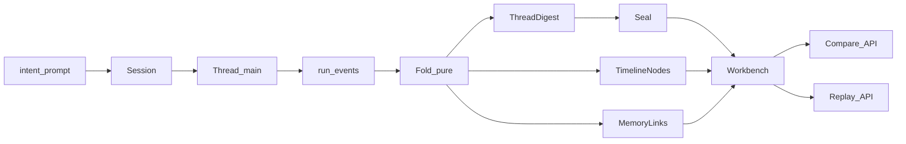

# ASH v5 双核管控 — 全量改造排期与技术实现方案

> **For agentic workers:** REQUIRED SUB-SKILL: Use `superpowers:subagent-driven-development` (recommended) or `superpowers:executing-plans` to implement task-by-task. Steps use checkbox (`- [ ]`) syntax for tracking.  
> **Spec:** [`docs/superpowers/specs/2026-09-13-v5-dual-core-governance-design.md`](../specs/2026-09-13-v5-dual-core-governance-design.md)  
> **Program:** [`doc/plan/v5-governance-program.md`](../../../doc/plan/v5-governance-program.md)  
> **Date:** 2026-09-13

**Goal:** 在现行 v5 架构上分期落地双核管控、厚评审与可观测闭环。**已确认开工优先级：先做现行智能体体系的薄交互**（基于已有 `agents/sessions`），再做 Session/Thread 可观测与记忆关联，其后才是 Registry/评分 Workbench 与治理硬化。

**Architecture:** 继续 Go Worker 单体；`run_events` 为运行真相；薄交互只发意图、只渲染投影；Interaction Session/Thread 承载评审三性；评分与空间测评由 derive 计算。扩展 `internal/session` + 新建 `interaction`；其后扩展 `registry` / `scoring` / `evolve`。

**Tech Stack:** Go 1.26 · Gin · GORM · Postgres RLS / SQLite · React 18 · TanStack Query/Router · SSE · Prometheus/derive · 现有 Doctor

## Global Constraints

- **不做**：Agent 一键打包迁移（暂缓）；Cordis / dsh web；自动升格  
- **优先级决议（2026-09-13 确认）**：**P0 = 现行智能体薄交互**；P1 = Session/Thread 可观测+记忆关联；P2 = 管控登记+厚评审评分；P3 = 多签/Doctor/Improve  
- **新表**：仅规格 §4.3 E5 清单；一律带 `space_id` + RLS（Postgres）  
- **评分真相**：禁止前端私算；UI 只展示 API/derive 结果  
- **人工闸门**：promote / memory approve 必须人审  
- **Sprint 编号**：`GV01+`（与 v4 `DX*` 隔离）  
- **默认开工**：从 **GV01 薄交互**启动；与 v4.0 并行时勿改 Auth 冻结面  
- Commit 说明中文；仅在用户要求时提交  

---

## 0. 功能点总表 × 排期（已按薄交互优先重排）

| # | 功能点 | 阶段 | Sprint | 估时 | 依赖 |
|---|--------|------|--------|------|------|
| F15 | 事件 `visibility` + 写入兼容 | **v5.0-thin** | **GV01** | 5d | events |
| F16a | Agent Session 意图收口（prompt/approve/cancel） | **v5.0-thin** | **GV01** | 3d | `internal/session` |
| F16b | Session→Thread 最小绑定（Ensure main thread） | **v5.0-thin** | **GV01–02** | 3d | F16a |
| F16c | 薄控制台：ConversationNode + 意图条 | **v5.0-thin** | **GV02** | 5d | F16a |
| F17 | Quest/Agent UI 去厚（去本地策略/评分主路径） | **v5.0-thin** | **GV02–03** | 3d | F16c |
| F16d | `DeriveModelVisible` 供执行面 | **v5.0-thin** | **GV03** | 3d | F15 |
| F9 | Interaction Timeline（按 Thread） | v5.1-obs | GV04 | 5d | F16b |
| F10 | MemoryLink 展示 | v5.1-obs | GV04–05 | 6d | F9 |
| F10b | Thread seal / replay / compare | v5.1-obs | GV05 | 4d | F9 |
| F11 | Waterfall / Observability 对接 | v5.1-obs | GV05 | 4d | F9–F10 |
| F12 | 空间测评 evaluation | v5.1-obs | GV06 | 5d | derive |
| F13 | 场景编排测评 | v5.1-obs | GV06 | 4d | F12 |
| F14 | Derive/KPI 扩展 + parity | v5.1-obs | GV06 | 3d | F9–F13 |
| F1 | Space `kind=user\|team` | v5.2-gov | GV07 | 3d | — |
| F2 | AgentAsset 登记 | v5.2-gov | GV07–08 | 5d | F1 |
| F3 | MemoryAsset 登记 | v5.2-gov | GV08 | 4d | F1 |
| F4 | SpacePolicyPack | v5.2-gov | GV08 | 4d | F1 |
| F5 | Rubric + score_events | v5.2-gov | GV09 | 5d | — |
| F6 | Reviews Workbench MVP | v5.2-gov | GV09–10 | 6d | F5, F9 |
| F7 | 队列 assignment | v5.2-gov | GV10 | 3d | F6 |
| F8 | 权限 / OpenAPI 收口 | v5.2-gov | GV10 | 3d | F2–F7 |
| F18 | 评分驱动 Improve | v5.3 | GV11 | 4d | F5 |
| F19 | team 多签 + SLA | v5.3 | GV11 | 5d | F7 |
| F20 | Doctor 探针 | v5.3 | GV12 | 4d | F9–F14 |
| F21 | 文档 + signoff | v5.3 | GV12 | 3d | all |

**合计**：仍约 **12 Sprint / 16–20 周**；**前 3 个 Sprint（GV01–03）专供薄交互**。



> 日期示意；以开工日为 `T0`。

### 0.0 已确认：P0 薄交互范围（现行智能体）

基于现有 `internal/session` + `POST/GET /agents/sessions*` + Run SSE：

| 做 | 不做（本 P0） |
|----|----------------|
| 意图：`prompt` / `approve` / `cancel` 收口 | Registry / PolicyPack |
| 事件 `visibility` + model-visible fold | 完整 seal/compare（放 P1） |
| Session 绑定 main Thread（最小） | 厚 Workbench 评分 |
| 前端只渲染投影节点 + 意图条 | Cordis / 新聊天真相表 |
| Quest/Agent 页去掉本地策略/评分主路径 | 一键打包迁移 |

**P0 完成定义（DoD）**
1. 用户经薄 UI 创建/续写 Agent Session，只发意图  
2. 界面仅由 session/run 事件投影渲染  
3. `DeriveModelVisible` 可供执行面使用（单测绿）  
4. 无前端私算分数/拼系统 prompt  

**P0 后端要点（GV01–03）**：BE-36–41 提前；Session→Thread Ensure 最小切片  
**P0 前端要点（GV01–03）**：FE-34–39 提前；Agent Session / Quest 薄化  

---

## 0.1 全量功能点：后端 / 前端拆分

约定：
- **BE** = Go Worker（`internal/*`、SQL、OpenAPI/Swagger、Doctor CLI）
- **FE** = Vite React 控制台（`frontend/src/**`）
- 估时为人日；同一 Sprint 内 BE/FE 可并行（FE 依赖对应 API 契约 stub）
- **暂缓**：Agent 一键打包迁移（无 BE/FE 条目）

### 0.1.1 后端改造功能点（全量）

| ID | 功能点 | 阶段 | Sprint | 估时 | 主要落点 |
|----|--------|------|--------|------|----------|
| BE-01 | `spaces.kind` 列迁移 + 默认值兼容 | v5.0 | GV01 | 1.5d | `store/models.go` · SQL rev · RLS 无破坏 |
| BE-02 | Org 模板创建默认 1×user + N×team | v5.0 | GV01 | 1d | `orgtemplates/` |
| BE-03 | Space API 返回/筛选 `kind` | v5.0 | GV01 | 0.5d | `api/platform.go` · OpenAPI |
| BE-04 | `agent_assets` 表 + RLS | v5.0 | GV01 | 1.5d | SQL migrations |
| BE-05 | `internal/registry` AgentAsset CRUD/启停 | v5.0 | GV01–02 | 2d | `registry/` |
| BE-06 | `GET/POST/PATCH /agents/assets` + 权限 `agents:manage` | v5.0 | GV02 | 1.5d | `api/` · `authz/` |
| BE-07 | `memory_assets` 表 + RLS | v5.0 | GV02 | 1.5d | SQL |
| BE-08 | MemoryAsset 服务（包住 records 登记层） | v5.0 | GV02 | 2d | `registry/` |
| BE-09 | `GET/POST/PATCH /memory/assets` | v5.0 | GV02 | 1d | `api/` |
| BE-10 | `space_policy_packs` 表 + RLS | v5.0 | GV02 | 1d | SQL |
| BE-11 | Policy 合并引擎（更严者优先） | v5.0 | GV02 | 2d | `spacerules/` 或 `spacepolicy/` |
| BE-12 | `GET/PUT /spaces/{id}/policy` + `spaces:policy` | v5.0 | GV02 | 1d | `api/` · `authz/` |
| BE-13 | 默认 Rubric 配置（四维） | v5.0 | GV03 | 1d | `scoring/rubric.go` · YAML/DB |
| BE-14 | `score_events` 表 + RLS | v5.0 | GV03 | 1d | SQL |
| BE-15 | Scoring Service（校验/合成分/写入） | v5.0 | GV03 | 2d | `scoring/` |
| BE-16 | `GET /scores/rubrics` · `POST /scores` + `scores:*` | v5.0 | GV03 | 1d | `api/` |
| BE-17 | evolve `Decide` 扩展 rubric + reason | v5.0 | GV03 | 1.5d | `evolve/service.go` |
| BE-18 | 队列模型扩展（assignment / score_appeal / improve 类型） | v5.0 | GV04 | 2d | `evolve/` · store |
| BE-19 | `POST /reviews/{id}/assign` | v5.0 | GV04 | 1d | `api/reviews.go` |
| BE-20 | 权限矩阵扩展全量同步 | v5.0 | GV04 | 1d | `authz/{permissions,roles,matrix}` |
| BE-21 | Swagger 注解 + `openapi-ash-v1.yaml` + `openapi-check` | v5.0 | GV04 | 1.5d | `api/` · `doc/api/` |
| BE-22 | Doctor 计数占位/套件声明（v5.0 不增探针逻辑） | v5.0 | GV04 | 0.5d | `doctor/` |
| BE-23 | InteractionSession/Thread 模型 + EnsureThread + 事件索引 | v5.1 | GV05 | 2.5d | `interaction/` · SQL |
| BE-24 | MemoryLink 抽取（挂 sessionId+threadId） | v5.1 | GV05 | 2d | `interaction/` |
| BE-25 | `FoldThread` + digest；`GET .../threads/{id}` | v5.1 | GV05 | 2d | `interaction/fold.go` · api |
| BE-26 | `GET .../threads/{id}/memory-links` + `by-run` 兼容 | v5.1 | GV05 | 1d | `api/interactions.go` |
| BE-26b | `POST .../seal` · `replay` · `compare` | v5.1 | GV05–06 | 2.5d | `interaction/` · api |
| BE-27 | （可选）nodes/links 物化加速 | v5.1 | GV05 | 1.5d | SQL · fold 旁路 |
| BE-28 | Waterfall 扩展 session/thread + memory attributes | v5.1 | GV06 | 2d | `observability/waterfall.go` |
| BE-29 | memoryId → 最近 hit_used Threads/Runs 反查 | v5.1 | GV06 | 1.5d | `interaction/` 或 `memory/` |
| BE-30 | `GET /spaces/{id}/evaluation` 四维+关联健康度 | v5.1 | GV06–07 | 2.5d | `scoring/evaluation.go` |
| BE-31 | ScenarioEvalProfile（三场景加权量纲） | v5.1 | GV07 | 2d | configs / `scoring/` |
| BE-32 | Run 结束自动选用场景量纲打分钩子 | v5.1 | GV07 | 1.5d | `runs/` · `scoring/` |
| BE-33 | derive catalog：score/review/interaction/memory_link | v5.1 | GV07 | 2d | `observability/derive/` |
| BE-34 | derive parity fixtures 与测试 | v5.1 | GV07 | 1d | `derive/*_test.go` |
| BE-35 | 附录 D 指标口径文档同步 | v5.1 | GV07 | 0.5d | `doc/appendices/D-*` |
| BE-36 | events payload `visibility` 字段 + schema | v5.2 | GV08 | 2d | `events/payloadschema` |
| BE-37 | 历史事件默认 visibility 兼容 | v5.2 | GV08 | 1d | fold / migrate 逻辑 |
| BE-38 | `DeriveModelVisible(runId)` | v5.2 | GV08 | 2d | `events/` |
| BE-39 | Harness/LLM 路径改用 model-visible fold | v5.2 | GV08 | 1.5d | `harness/` · agentexec |
| BE-40 | 意图 API 收口（prompt/approve/cancel 语义） | v5.2 | GV08–09 | 2d | `api/quest.go` · session |
| BE-41 | Quest/Session 服务端去掉「厚」副作用接口（若有） | v5.2 | GV09 | 1d | `api/` |
| BE-42 | 低分聚合 → Improve draft 自动开单 | v5.3 | GV10 | 2d | `scoring/` · `improve/` |
| BE-43 | Improve 与 score_events 关联字段 | v5.3 | GV10 | 1d | store · improve |
| BE-44 | team 多签状态机 `pending_second` | v5.3 | GV10–11 | 2.5d | `evolve/` |
| BE-45 | SLA breach 检测（waker 或定时） | v5.3 | GV11 | 2d | `waker/` · evolve |
| BE-46 | Doctor：Registry/Policy/评分一致性探针 | v5.3 | GV11 | 1.5d | `doctor/` |
| BE-47 | Doctor：Interaction/MemoryLink 一致性探针 | v5.3 | GV11 | 1.5d | `doctor/` |
| BE-48 | Doctor 套件计数更新（TR/M/ALL） | v5.3 | GV11 | 0.5d | `doctor/*_test` |
| BE-49 | HLD / 附录 K 后端相关修订 | v5.3 | GV12 | 1d | `doc/design/` · appendices |
| BE-50 | v5 signoff 脚本/清单后端门禁项 | v5.3 | GV12 | 1d | `scripts/` · `checklists/` |

**后端小计**：约 **75–80 人日**（含可选 BE-27）。

### 0.1.2 前端改造功能点（全量）

| ID | 功能点 | 阶段 | Sprint | 估时 | 主要落点 |
|----|--------|------|--------|------|----------|
| FE-01 | Space 类型徽章 `user/team` | v5.0 | GV01 | 0.5d | `SpacePage.tsx` |
| FE-02 | Space 列表/创建表单 kind 选择 | v5.0 | GV01 | 1d | `SpacePage` · `platform.api.ts` |
| FE-03 | Agent 资产列表页/面板 | v5.0 | GV02 | 2d | 新 `AgentsPage` 或 Space 子页 |
| FE-04 | Agent 启停/版本展示交互 | v5.0 | GV02 | 1d | agents UI · api module |
| FE-05 | Memory 资产登记列表（层/范围/TTL） | v5.0 | GV02 | 2d | `MemoryPage.tsx` 扩展 |
| FE-06 | Memory 资产筛选与状态展示 | v5.0 | GV02 | 1d | MemoryPage |
| FE-07 | SpacePolicyPack 编辑表单 | v5.0 | GV02 | 2d | SpacePage |
| FE-08 | EffectivePolicy 只读摘要（合并结果） | v5.0 | GV02 | 1d | SpacePage |
| FE-09 | Rubric 打分表单组件（四维） | v5.0 | GV03 | 1.5d | `modules/scores/` |
| FE-10 | scores/rubrics API client | v5.0 | GV03 | 0.5d | `modules/scores/api` |
| FE-11 | Reviews → Workbench 三栏布局骨架 | v5.0 | GV03 | 2d | `ReviewsPage` / `ReviewWorkbenchPage` |
| FE-12 | Workbench 右栏：决定 + rubric + reason | v5.0 | GV03–04 | 2d | Reviews |
| FE-13 | Workbench 左栏：队列过滤（kind/type） | v5.0 | GV04 | 1.5d | Reviews |
| FE-14 | 评审人分配 UI（assign） | v5.0 | GV04 | 1.5d | Reviews |
| FE-15 | 权限缺失态/按钮禁用（新 permission） | v5.0 | GV04 | 1d | authz 前端矩阵消费 |
| FE-16 | Mobile Reviews 同步 rubric 字段 | v5.0 | GV04 | 1d | `MobileReviewsPage.tsx` |
| FE-17 | Workbench/路由 vitest | v5.0 | GV04 | 1d | `*.test.tsx` |
| FE-18 | `interactions.api.ts`（session/thread/replay/compare） | v5.1 | GV05 | 1d | `modules/interactions/api` |
| FE-19 | `InteractionTimeline` 按 Thread 渲染 | v5.1 | GV05 | 2.5d | `modules/interactions/` |
| FE-19b | Session 顶栏 Thread 切换 + seal 徽章 | v5.1 | GV05 | 1d | Workbench |
| FE-20 | Timeline 节点类型渲染器注册表 | v5.1 | GV05 | 1.5d | interactions |
| FE-21 | `MemoryLinkPanel`（按 thread 过滤） | v5.1 | GV05–06 | 2.5d | interactions |
| FE-22 | Timeline ↔ Link 联动高亮 | v5.1 | GV06 | 1d | interactions |
| FE-22b | 双 Thread 比对视图（compare） | v5.1 | GV06 | 2d | Workbench / Observability |
| FE-23 | Workbench 中栏接入 Thread Timeline | v5.1 | GV05–06 | 1.5d | Reviews Workbench |
| FE-23b | 「复现校验」按钮 + digest 红绿态 | v5.1 | GV06 | 1d | Workbench |
| FE-24 | Workbench 底/侧接入 MemoryLinkPanel | v5.1 | GV06 | 1d | Reviews |
| FE-25 | Observability「Run 探查」接入 Timeline+Links | v5.1 | GV06 | 2d | `ObservabilityPage.tsx` |
| FE-26 | Waterfall 展示 memory attributes（只读） | v5.1 | GV06 | 1.5d | Observability / 既有 waterfall UI |
| FE-27 | Quest Diff：contextRefs → MemoryLink 精简面板 | v5.1 | GV06 | 1.5d | `QuestPage.tsx` |
| FE-28 | MemoryPage：反查关联 Runs 列表 | v5.1 | GV06 | 1.5d | `MemoryPage.tsx` |
| FE-29 | evaluation API client | v5.1 | GV06 | 0.5d | metrics/platform api |
| FE-30 | Metrics 页：空间四维测评卡片 | v5.1 | GV06–07 | 2d | `MetricsPage.tsx` |
| FE-31 | Metrics/Space：场景分组排行 | v5.1 | GV07 | 1.5d | Metrics / Space |
| FE-32 | Observability 质量信号卡（citation/link） | v5.1 | GV07 | 1d | ObservabilityPage |
| FE-33 | interactions/observability vitest | v5.1 | GV07 | 1.5d | frontend tests |
| FE-34 | 事件渲染尊重 `visibility`（ui_only/audit 提示） | v5.2 | GV08 | 1.5d | Timeline / Quest |
| FE-35 | ConversationNode 注册表（薄会话） | v5.2 | GV08–09 | 2d | quest/session modules |
| FE-36 | 意图条：prompt / approve / cancel | v5.2 | GV09 | 2d | Quest/Session UI |
| FE-37 | QuestPage 移除本地策略/评分主路径 | v5.2 | GV09 | 2d | `QuestPage.tsx` |
| FE-38 | Session/Quest 空态与错误（fail-closed 审批） | v5.2 | GV09 | 1d | Quest |
| FE-39 | 薄交互 vitest / 冒烟 | v5.2 | GV09 | 1d | tests |
| FE-40 | Improve 面板展示「由低分触发」来源 | v5.3 | GV10 | 1d | `ImproveProposalsPane` |
| FE-41 | Workbench 第二签 UI（pending_second） | v5.3 | GV10–11 | 2d | Reviews |
| FE-42 | SLA 超时标记与筛选 | v5.3 | GV11 | 1d | Reviews 队列 |
| FE-43 | Doctor 页展示新探针结果（若控制台有入口） | v5.3 | GV11 | 1d | `DoctorPage.tsx` |
| FE-44 | 文案/空态/权限提示收口 | v5.3 | GV12 | 1d | 多页 |
| FE-45 | `make web-build` 全量回归与签收截图 | v5.3 | GV12 | 1d | CI 本地 |

**前端小计**：约 **62–68 人日**。

### 0.1.3 按 Sprint 的 BE/FE 对照（薄交互优先后）

| Sprint | 后端（BE） | 前端（FE） | 说明 |
|--------|------------|------------|------|
| **GV01** | BE-36–37, 意图收口, Thread Ensure 最小 | FE-34 stub / Session API client；**顶栏 Agent使用⇄评审管控切换** | **P0 薄交互** |
| **GV02** | BE-40, Thread 绑定完善 | FE-35–37 ConversationNode + 去厚 | **P0** |
| **GV03** | BE-38–39,41 DeriveModelVisible | FE-36–39 意图条 + 测试 | **P0 DoD** |
| **GV04** | BE-23–26 Timeline/MemoryLink | FE-18–21,23 | P1 可观测 |
| **GV05** | BE-26b,28 seal/replay/compare | FE-22–24,22b,23b | P1 |
| **GV06** | BE-29–35 evaluation/derive | FE-25–33 | P1 |
| **GV07** | BE-01–06 Space/AgentAsset | FE-01–04 | P2 管控 |
| **GV08** | BE-07–12 Memory/Policy | FE-05–08 | P2 |
| **GV09** | BE-13–17 Scoring | FE-09–12 Workbench | P2 |
| **GV10** | BE-18–22 Assign/OpenAPI | FE-13–17 | P2 |
| **GV11** | BE-42–45 Improve/多签 | FE-40–42 | P3 |
| **GV12** | BE-46–50 Doctor/签收 | FE-43–45 | P3 |

> §0.1.1 / §0.1.2 中的 Sprint 列若与上表冲突，**以本表（薄交互优先）为准**。

### 0.1.4 人日汇总

| 轨 | 人日（约） | 占全量 |
|----|------------|--------|
| 后端 | **78** | ~54% |
| 前端 | **65** | ~46% |
| **合计** | **~143** | 100% |

按 1 后端 + 1 前端并行 ≈ **12 Sprint / 16–20 周**；若双后端或 FE 提前用 mock，GV05–07 可压缩约 2–3 周。

### 0.1.5 与产品功能 F1–F21 映射

| 产品 F# | 后端 | 前端 |
|---------|------|------|
| F1 Space kind | BE-01–03 | FE-01–02 |
| F2 AgentAsset | BE-04–06 | FE-03–04 |
| F3 MemoryAsset | BE-07–09 | FE-05–06 |
| F4 PolicyPack | BE-10–12 | FE-07–08 |
| F5 Scoring | BE-13–16 | FE-09–10 |
| F6 Workbench MVP | BE-17 | FE-11–12, FE-17 |
| F7 Assignment | BE-18–19 | FE-13–14, FE-16 |
| F8 权限/OpenAPI/Doctor 占位 | BE-20–22 | FE-15 |
| F9 Interaction Timeline | BE-23,25,27 | FE-18–20, FE-19b, FE-23 |
| F10 MemoryLink | BE-24,26,29 | FE-21–22, FE-24, FE-27–28 |
| F10b Session/Thread 可复现比对 | BE-26b | FE-22b, FE-23b |
| F11 Observability/Waterfall | BE-28 | FE-25–26, FE-32 |
| F12 evaluation | BE-30 | FE-29–30 |
| F13 场景测评 | BE-31–32 | FE-31 |
| F14 Derive | BE-33–35 | （FE 消费 KPI，见 FE-30/32） |
| F15 visibility | BE-36–39 | FE-34 |
| F16 薄 Quest | BE-40 | FE-35–36, FE-38 |
| F17 Quest 去厚 | BE-41 | FE-37, FE-39 |
| F18 Improve 低分 | BE-42–43 | FE-40 |
| F19 多签+SLA | BE-44–45 | FE-41–42 |
| F20 Doctor 探针 | BE-46–48 | FE-43 |
| F21 收口签收 | BE-49–50 | FE-44–45 |

---

## 1. 文件与包边界（实现地图）

| 包/目录 | 职责 | 首现阶段 |
|---------|------|----------|
| `internal/registry/` | AgentAsset / MemoryAsset | v5.0 |
| `internal/scoring/` | Rubric、score_events、合成分 | v5.0 |
| `internal/interaction/` | Timeline 投影、记忆关联边 | **v5.1（重点）** |
| `internal/evolve/` | 队列扩展、assign、decide+rubric | v5.0 / v5.3 |
| `internal/spacerules/` 或 policy | SpacePolicyPack 合并 | v5.0 |
| `internal/events/` | visibility、DeriveModelVisible | v5.2 |
| `internal/observability/` | Waterfall 扩展、关联 spans | **v5.1** |
| `internal/observability/derive/` | score/review/interaction/memory_link 规则 | v5.1 |
| `internal/api/` | 新路由 + Swagger | 各阶段 |
| `internal/store/` + SQL rev | 新表/列 + RLS | v5.0+ |
| `frontend/.../ReviewsPage` → Workbench | 厚评审 | v5.0 |
| `frontend/.../ObservabilityPage` + 新面板 | **运行可观测 + 记忆关联** | **v5.1** |
| `frontend/.../MemoryPage` / Quest | 关联入口、薄交互 | v5.1–5.2 |

**明确不做（本计划）**：`agent_bundle` 导出/导入、跨 Org 一键迁移 API。

---

## 2. 重点方案：可观测运行系统 + 记忆关联展示（Session / Thread 数据化）

### 2.1 问题与目标

**现状**
- 运行侧：`run_events` + SSE + `BuildWaterfall` + Observability KPI；已有薄 Agent Session（`internal/session`，含 turns，可挂 `runId`）  
- 记忆侧：candidate、`hit_used`、Diff 打印 `contextRefs` 文本  
- **缺口**：交互未按 **会话（Session）/ 线程（Thread）** 一等公民落库与投影；评审无法在稳定身份下 **观测 · 比对 · 复现**「做了什么 + 依据哪条记忆」

**目标（评审三性）**

| 性 | 含义 | 机制 |
|----|------|------|
| **可观测** | 打开任意 Session/Thread 看到完整交互轴与记忆边 | 稳定 ID + Timeline/MemoryLink API + Workbench |
| **可比对** | 两次执行 / 两线程并排 diff | canonical digest + 节点/链接集合对比 |
| **可复现** | 同一事件日志 → 同一投影 | append-only 真相 + **纯函数 Fold**；禁止 UI 私算 |

### 2.2 层级：Session → Thread → Node（事件投影）

对齐并扩展现有 `POST /agents/sessions`（不另造平行聊天真相）：

```text
InteractionSession (会话)
  id, spaceId, status: active|closed
  goal?, scenarioRef?, agentAssetId?
  primaryRunId?, traceId?
  threadIds[]
  digest?                  // 会话级 canonical hash（关闭时冻结）
  createdBy, createdAt, updatedAt

InteractionThread (线程)
  id, sessionId, spaceId
  kind: main | subrun | review_replay
  runId?                   // 主执行绑定；sub-run 可多 thread
  parentThreadId?          // 分叉/子代理
  status: open | sealed
  headSeq                  // 已纳入投影的最大 event seq
  digest                   // 线程 canonical hash（sealed 后不变）
  createdAt, sealedAt?

TimelineNode (投影节点，可不落库 / 可物化)
  sessionId, threadId
  nodeId                   // 稳定：hash(threadId, eventSeq, type) 或 event 主键
  eventSeq                 // 指向 run_events.seq（可复现锚点）
  type: turn|step|tool|approval|score|memory|*
  ts, summary
  visibility: model_visible|ui_only|audit
  runId?, stepId?, toolCallId?
  memoryLinkIds[]          // 挂到本节点的关联边

MemoryLink (见下，强制带 sessionId+threadId)
```

**关系不变式**
1. 一条 **Thread** 对应一段有序交互；默认每个 Run 至少 1 条 `kind=main` Thread。  
2. **Session** 可含多 Thread（多轮 Turn、Sub-run、评审回放线程）。  
3. **真相仍是** `run_events`（及 session 审计事件）；Session/Thread 是索引与评审边界，**不是**第二套聊天表。  
4. `Fold(sessionId|threadId)` 为纯函数：相同事件前缀 ⇒ 相同 nodes / links / digest。



### 2.3 可复现：digest 与封印（seal）

| 对象 | digest 输入（canonical JSON） | 何时冻结 |
|------|-------------------------------|----------|
| Thread | 有序 `(eventSeq, type, payloadDigest, memoryLinkDigests[])` | `status=sealed`（Run finished / 人工封印） |
| Session | 子 Thread digests 排序拼接 | Session `closed` |
| MemoryLink | `(linkType, memoryId, eventSeq, stepId?)` | 随 Thread seal |

**复现 API**：`POST /interactions/threads/{id}/replay`（只读重 fold）→ 返回 nodes；若与存档 digest 不一致 → `REPLAY_DIGEST_MISMATCH`（Doctor/评审红灯）。

**比对 API**：`POST /interactions/compare` body `{ left: threadId|digest, right: threadId|digest }` → 节点增删改 + 记忆边 diff（供 A/B、Improve 实验对照）。

### 2.4 MemoryLink（挂在 Thread 上）

```text
MemoryLink {
  id, spaceId, sessionId, threadId
  runId, eventSeq
  stepId?, toolCallId?
  memoryId | assetId
  linkType: context_ref | hit_used | citation | candidate_out
  layer?, confidence?, citationOk?
  ts
  digest
}
```

| linkType | 来源 |
|----------|------|
| `context_ref` | Run/`artifacts` `contextRefs[]` |
| `hit_used` | `memory.hit_used` |
| `citation` | citation 门禁结果 |
| `candidate_out` | `memory.candidate` |

### 2.5 API（Session/Thread 一等）

| Method | Path | 说明 |
|--------|------|------|
| `GET` | `/api/v1/interactions/sessions/{sessionId}` | 会话文档 + thread 摘要 + digest |
| `GET` | `/api/v1/interactions/sessions/{sessionId}/threads` | 线程列表 |
| `GET` | `/api/v1/interactions/threads/{threadId}` | Timeline nodes + headSeq + digest |
| `GET` | `/api/v1/interactions/threads/{threadId}/memory-links` | 本线程记忆边 |
| `POST` | `/api/v1/interactions/threads/{threadId}/seal` | 封印并写 digest（权限：reviews/ops） |
| `POST` | `/api/v1/interactions/threads/{threadId}/replay` | 只读复现 fold + digest 校验 |
| `POST` | `/api/v1/interactions/compare` | 两线程/两 digest 比对 |
| `GET` | `/api/v1/interactions/by-run/{runId}` | Run → session/thread 解析（兼容旧入口） |
| `GET` | `/api/v1/runs/{runId}/waterfall` | spans 挂 sessionId/threadId + memory attrs |
| `GET` | `/api/v1/spaces/{id}/evaluation` | 含 thread seal 率、replay 失败率 |

兼容：保留 `GET /interactions/{runId}` 为 `by-run` 别名（文档标记 deprecated）。

与现有 Agent Session：`internal/session.View` **升级/映射**为 InteractionSession（同 id 或 `meta.interactionSessionId`）；Turns 映射为 Thread 上的 `turn` 节点，不双写提示词真相。

### 2.6 后端实现要点

1. **`internal/interaction`**  
   - `EnsureThread(runId|sessionId)`：Run 启动/绑定时创建 main thread  
   - `FoldThread(threadId)` → nodes + links + digest  
   - `Seal` / `Replay` / `Compare`  
2. **事件写入**：append `run_events` 时带上 `sessionId`/`threadId`（payload 或旁路索引表 `interaction_event_index(thread_id, seq)`）  
3. **Waterfall**：span.attributes 增加 `sessionId`, `threadId`, memory 字段  
4. **Derive**：`ash_interaction_thread_sealed_total`、`ash_interaction_replay_mismatch_total`、`ash_memory_link_total{type}`  
5. **Doctor**：抽样 sealed thread → replay → digest 一致  

### 2.7 前端：评审可观测 / 比对 / 复现

| 能力 | UI |
|------|-----|
| 可观测 | Workbench 中栏按 **Thread** 渲染 Timeline；顶栏 Session 切换 Thread |
| 记忆关联 | MemoryLinkPanel 按当前 Thread 过滤；节点联动高亮 |
| 可比对 | 「对比」模式：左右两 Thread（或 Improve 实验前后）；节点/记忆边 diff 着色 |
| 可复现 | 「复现校验」按钮 → replay；digest 绿/红；失败展示首个分叉 `eventSeq` |

挂载：Reviews Workbench · Observability Run 探查 · Quest Diff（精简）· Session 薄页。

### 2.8 数据流



### 2.9 相对原 §2 的增量清单（排期计入 GV05–06）

| 增量 | BE | FE |
|------|----|----|
| Session/Thread 模型与索引表 | BE-23a Ensure/映射 session | FE-19 按 Thread 渲染 |
| Thread digest + seal | BE-23b Seal | FE-19b 封印状态徽章 |
| Replay + digest 校验 | BE-25b replay API | FE-23b 复现校验按钮 |
| Compare 两线程 | BE-26b compare API | FE-22b 双栏比对 |
| 事件携带 session/thread | BE-23c 写入路径 | — |
| Doctor replay 探针 | 并入 BE-47 | FE-43 |

---

## 3. 场景编排测评（挂在使用流程上）

在现有三场景（`feature_delivery` / `hotfix` / `security_patch`）上增加 **ScenarioEvalProfile**（配置，首期 YAML 或 DB `score_rubrics.scenario`）：

| 场景 | 加重量纲 | 额外门禁信号 |
|------|----------|--------------|
| feature_delivery | correctness, citable, efficiency | 四件套齐套率 |
| hotfix | safety, efficiency, correctness | 人审发布等待时长 |
| security_patch | safety, citable | 公告/回滚计划完整性 |

**流程嵌入**
1. Run 绑定 `scenario.name+version`（已有）  
2. Scoring 选用对应 ScenarioEvalProfile  
3. Workbench / evaluation 按场景分组排行  
4. Doctor：抽样 Run 校验「场景量纲已应用」

（打包迁移仍不做。）

---

## 4. 分阶段技术实现

### 4.1 v5.0 — 管控基础 + 评分 Workbench（GV01–04）

**库表**
- `spaces.kind` TEXT NOT NULL DEFAULT `'team'`（兼容：已有 space 视为 team）  
- `agent_assets`, `memory_assets`, `space_policy_packs`, `score_events`  
- Postgres：跟进 RLS 策略（仿 `000013`）  

**服务**
- `registry.Service`：CRUD、status 流转 draft→active  
- `scoring.Service`：默认四维 rubric；`POST /scores`；合成分  
- `evolve.Decide`：接收 `rubric`；写 score_events + review_decided  

**前端**
- ReviewsPage → 三栏 Workbench 骨架（中栏可先放事件列表，GV05 换 Timeline）  
- SpacePage：kind 徽章、Policy 编辑、资产列表入口  

**验证**
```bash
go test ./internal/registry/... ./internal/scoring/... ./internal/evolve/... -count=1
make openapi-check
make web-build
```

---

### 4.2 v5.1 — Session/Thread 可观测 + 记忆关联 + 测评（GV05–07）**【本轮优先深度】**

见 §2、§3。交付标准：

- [ ] InteractionSession / InteractionThread 落库；Run 绑定 main thread  
- [ ] `FoldThread` 纯函数；`seal` 冻结 digest  
- [ ] `replay` 一致 / 篡改 → mismatch  
- [ ] `compare` 可出节点与 MemoryLink diff  
- [ ] Workbench 按 Thread 回放 + 复现校验 + 比对模式  
- [ ] MemoryLink 挂 sessionId+threadId；三页可展示  
- [ ] evaluation 含 seal 率 / replay 失败 / citation·link 指标  
- [ ] derive parity 绿  

**验证**
```bash
go test ./internal/interaction/... ./internal/observability/... -count=1
go test ./internal/observability/derive/... -count=1
cd frontend && npm test -- --run src/modules/interactions src/pages/ObservabilityPage.test.tsx
```

---

### 4.3 v5.2 — 薄交互（GV08–09）

- events payload 增加 `visibility`  
- `DeriveModelVisible(runId)` 供 Harness/LLM  
- Quest/Session：意图 `prompt|approve|cancel`；ConversationNode 注册表渲染 Timeline 节点  
- 删除 Quest 内本地评分/策略编辑主路径  

---

### 4.4 v5.3 — 硬化（GV10–12）

- 低分聚合 → Improve draft  
- team `pending_second` 多签  
- Doctor：Registry/Policy/评分/关联一致性  
- 文档与 `make v5.x-signoff`（若增加）  

---

## 5. 可执行任务分解

> **执行顺序（已确认）**：先做下方 **Task P0-***（GV01–03），再 Task 6–9（可观测），再 Task 1–5（管控/评分），最后 Task 11。

### Task P0-1: 事件 visibility（GV01）**【薄交互 · 先做】**

**Files:**
- Modify: `internal/events/payloadschema.go` + JSON schemas
- Modify: append 路径为事件打默认 `visibility`
- Test: `internal/events/*_test.go`

**Produces:** 新事件带 `model_visible|ui_only|audit`；旧事件兼容默认

- [x] **Step 1:** schema 与单测（缺字段默认）  
- [x] **Step 2:** 写入路径打标  
- [x] **Step 3:** `go test ./internal/events/...`  

---

### Task P0-2: Agent Session 意图收口 + Thread Ensure 最小（GV01–02）

**Files:**
- Modify: `internal/session/service.go`, `internal/api/session.go`（或 agents session handlers）
- Create: `internal/interaction` 最小 `EnsureThread(sessionId|runId)`
- Test: `internal/session/service_test.go`

**Produces:** prompt/approve/cancel 语义清晰；Session 绑定 main Thread id

- [x] **Step 1:** 梳理现有 create/turn/events API 与文档  
- [x] **Step 2:** 意图收口（无应答 approve → fail-closed）  
- [x] **Step 3:** EnsureThread 最小实现 + 单测  
- [x] **Step 4:** OpenAPI 更新 agents/sessions  

---

### Task P0-3: 薄控制台 ConversationNode + 意图条（GV02）

**Files:**
- Create: `frontend/src/modules/agent-session/**`（或扩展现有 session UI）
- Modify: Quest / Agent Session 相关 page
- Test: vitest

**Produces:** UI 只渲染事件投影；底部意图条

- [x] **Step 1:** 事件→节点渲染注册表  
- [x] **Step 2:** 意图条 prompt/approve/cancel  
- [x] **Step 3:** 去掉本页本地策略/评分入口  
- [x] **Step 4:** vitest  

---

### Task P0-4: DeriveModelVisible + Quest 去厚收口（GV03）

**Files:**
- Create/Modify: `internal/events` 或 `interaction` 的 `DeriveModelVisible`
- Modify: harness / agentexec 调用点（若已接上下文组装）
- Modify: `QuestPage.tsx` 去厚
- Test: unit + frontend

**Produces:** P0 DoD 全部满足

- [x] **Step 1:** DeriveModelVisible 单测  
- [x] **Step 2:** 执行面改用 fold（或明确后续接线点）  
- [x] **Step 3:** Quest 去厚 + 回归  
- [ ] **Step 4:** 记录 P0 完成证据（可选 smoke）  

---

### Task 1: Space kind + 迁移（**GV07**，P2）

**Files:**
- Modify: `internal/store/models.go`（Space.Kind）
- Create: `internal/store/sqlmigrations/migrations/postgres/0000XX_space_kind.up.sql` (+ down)
- Modify: `internal/orgtemplates/templates.go`
- Modify: `internal/api/platform.go`（create/list space 返回 kind）
- Test: `internal/api/platform_test.go`

**Produces:** `Space.Kind` ∈ {`user`,`team`}；默认兼容

- [x] **Step 1:** 写迁移与模型字段测试（缺 kind 列则失败）  
- [x] **Step 2:** 实现默认值与模板挂载 1×user + N×team  
- [x] **Step 3:** `go test` 相关包通过  
- [x] **Step 4:** 更新 OpenAPI Space schema  

---

### Task 2: Registry AgentAsset / MemoryAsset（GV01–02）

**Files:**
- Create: `internal/registry/{types,service,service_test}.go`
- Create: SQL `agent_assets` / `memory_assets` + RLS
- Create: `internal/api/registry.go` + routes
- Modify: `internal/authz/permissions.go`（`agents:manage` 等）
- Frontend: Space/资产列表薄页或嵌入 SpacePage

**Produces:** `GET/POST /api/v1/agents/assets`, `/memory/assets`

- [x] **Step 1:** 表 + Service Create/List/Patch status  
- [x] **Step 2:** API + 权限 + 单测  
- [x] **Step 3:** 前端列表只读 + 启停  
- [x] **Step 4:** `make swagger && make openapi-check`  

---

### Task 3: SpacePolicyPack（GV02）

**Files:**
- Create/extend: policy merge in `internal/spacerules` or new `internal/spacepolicy`
- SQL: `space_policy_packs`
- API: `GET/PUT /api/v1/spaces/{id}/policy`
- Docs: 合并顺序写进附录短文或规格引用

**Produces:** 更严者优先的 EffectivePolicy

- [x] **Step 1:** 单测覆盖 kind 默认 < pack < ResourceScope  
- [x] **Step 2:** API + Space UI 摘要  

---

### Task 4: Scoring + evolve decide rubric（GV03）

**Files:**
- Create: `internal/scoring/{rubric,service,service_test}.go`
- SQL: `score_events`
- Modify: `internal/evolve/service.go` Decide payload
- Modify: `internal/api/reviews.go`, feedback 旁路可选双写

**Produces:** 四维分入库；decide 必填 reason+rubric（可配置）

- [x] **Step 1:** Rubric 校验与合成分  
- [x] **Step 2:** Decide 写 score_events  
- [x] **Step 3:** API 测试  

---

### Task 5: Workbench MVP UI（GV03–04）

**Files:**
- Modify: `frontend/src/pages/ReviewsPage.tsx`（或拆 `ReviewWorkbenchPage.tsx`）
- Modify: `frontend/src/modules/reviews/api/reviews.api.ts`
- Test: `ReviewsPage.test.tsx`

**Produces:** 左队列 / 中占位事件 / 右打分决定

- [x] **Step 1:** 布局三栏  
- [x] **Step 2:** decide 提交 rubric  
- [x] **Step 3:** vitest  

---

### Task 6: Session/Thread + Fold/Seal/Replay/Compare（GV05）**【可观测核心】**

**Files:**
- Create: `internal/interaction/{types,fold,digest,service,service_test}.go`
- Create: SQL `interaction_sessions` / `interaction_threads` / optional `interaction_event_index`
- Create: `internal/api/interactions.go`
- Modify: `internal/session` 映射或 Ensure 钩子；`runs` 绑 main thread
- Fixture: `internal/interaction/testdata/thread_with_memory_hits.json`

**Interfaces:**
- Produces: `EnsureThread`, `FoldThread(threadID) → (nodes, links, digest)`, `Seal`, `Replay`, `Compare`
- Consumes: `events.List`, run/step/tool, existing agent session

- [x] **Step 1:** 模型 + EnsureThread（Run 绑定 main thread）单测  
- [x] **Step 2:** FoldThread + MemoryLink + digest 单测（含 hit_used）  
- [x] **Step 3:** Seal / Replay（mismatch 错误码） *(GV05)*  
- [x] **Step 4:** Compare 两线程 diff *(GV05)*  
- [x] **Step 5:** HTTP APIs + 权限 + `by-run` 兼容 *(GV04 + GV05 seal/replay/compare)*  
- [x] **Step 6:** `go test ./internal/interaction/...`  

---

### Task 7: Waterfall / derive 扩展（GV05–06）

**Files:**
- Modify: `internal/observability/waterfall.go`
- Modify: `internal/observability/derive/catalog.go`
- Modify: `internal/observability/derive/parity_test.go`
- Modify: `doc/appendices/D-Observability-指标与告警.md`

- [x] **Step 1:** span attributes 挂 `sessionId`/`threadId`/memoryIds  
- [x] **Step 2:** derive：seal / replay_mismatch / memory_link 计数 + parity  
- [x] **Step 3:** Doctor 对齐 waterfall/replay 指标 *(TR3-11)*  

---

### Task 8: Workbench Session/Thread UI + 比对/复现（GV05–06）**【展示核心】**

**Files:**
- Create: `frontend/src/modules/interactions/**`
- Modify: `ReviewsPage` / Workbench（Thread 切换、Timeline、Links、replay、compare）  
- Modify: `ObservabilityPage.tsx`  
- Modify: `QuestPage.tsx`（Diff → MemoryLink 精简）  
- Test: vitest

- [x] **Step 1:** API client（session/thread/seal/replay/compare）  
- [x] **Step 2:** Timeline 按 Thread + seal 徽章  
- [x] **Step 3:** MemoryLinkPanel + 联动高亮 *(Quest Timeline ↔ MemoryLink 按 seq)*  
- [x] **Step 4:** 复现校验按钮（digest 红绿）  
- [x] **Step 5:** 双 Thread 比对视图  
- [x] **Step 6:** 挂 Observability + Quest Diff  
- [x] **Step 7:** `npm test -- --run` 相关用例 *(MemoryLinkPanel + Quest + Timeline/Compare/Obs)*  

---

### Task 9: Space evaluation + 场景测评（GV06–07）

**Files:**
- Create: `internal/scoring/evaluation.go`（或 `internal/metrics` 扩展）
- API: `GET /api/v1/spaces/{id}/evaluation`
- Config: scenario rubric weights（YAML under `configs/` or DB）
- Frontend: MetricsPage 卡片

- [x] **Step 1:** 四维 + citation/link 指标聚合（服务端）  
- [x] **Step 2:** 按 scenario 分组  
- [x] **Step 3:** UI 卡片  

---

### Task 10: 薄交互 visibility（**已前移为 Task P0-1…P0-4 / GV01–03**）

保留本条作为索引：详见 **Task P0-1～P0-4**。勿在 GV08 重复开工。

---

### Task 11: Improve / 多签 / Doctor / Signoff（GV10–12）

**Files:** `internal/improve`, `internal/evolve`, `internal/doctor`, checklists

- [x] **Step 1:** 低分 → proposal  
- [x] **Step 2:** pending_second  
- [x] **Step 3:** Doctor 探针与计数  
- [x] **Step 4:** 文档与签字清单  

---

## 6. 风险与缓解

| 风险 | 缓解 |
|------|------|
| fold 性能（大 Run） | 首期限制事件窗口；可选物化 projection |
| digest 不稳定（JSON 键序） | canonical 序列化（排序键 + 固定浮点格式）单测锁死 |
| contextRefs 字符串解析脆弱 | 约定前缀 `memory:`/`skill:`；解析失败记 audit 不计分 |
| Session 与 agent session 双 id | 优先同 id 映射；文档禁止平行真相 |
| 与 v4 排期冲突 | GV 编号隔离；代码等 v4.0 签字 |
| Workbench 一次做太厚 | GV03 只打分；GV05 Session/Thread Timeline |

---

## 7. 验收清单（相对用户关注点）

**可观测运行系统（Session/Thread）**
- [ ] Run 自动绑定 main Thread；Session 可列出多 Thread  
  （证据：`EnsureThread` / by-run 已落地；Session 多 Thread 列表 API 尚未暴露）
- [x] 按 Thread 打开 Interaction Timeline（turn/step/tool/approval/score）  
  （`ThreadTimeline` + Quest Diff）
- [x] Waterfall attributes 含 sessionId/threadId + memory  
  （`attachInteractionAttrs` + waterfall_test）
- [x] derive/KPI 含 seal、replay_mismatch、memory_link  
  （derive catalog + parity_test + Metrics evaluation）

**可比对 / 可复现**
- [x] Thread seal 后 digest 稳定  
- [x] replay 与存档 digest 一致；人为改事件则 `REPLAY_DIGEST_MISMATCH`  
- [x] compare 两 Thread 能标出节点/记忆边差异  
- [x] Workbench 有复现校验与双栏比对入口  
  （复现：`MemoryLinkPanel`；双栏：`ThreadComparePanel` on Reviews）

**记忆关联展示**
- [x] MemoryLink 带 sessionId+threadId；类型齐全  
- [x] Workbench / Observability / Quest Diff 可看关联  
  （Quest Diff + Reviews 中栏 Timeline/MemoryLink + Obs derive 摘要）
- [x] 空关联有明确空态  
  （`memory-link-empty`）

**排期**
- [x] F1–F21 + Session/Thread 增量进 GV 板  
  （本计划 §0.1 / §4 Sprint 表）
- [x] 打包迁移不在板内  
  （规格与本计划明确暂缓）

---

## 8. 计划自检

| Check | Result |
|-------|--------|
| 范围 | 已排除一键打包迁移 |
| 重点 | §2 专章可观测 + 记忆关联 |
| 可执行 | Task 1–11 含文件与验证命令 |
| 与规格一致 | 对齐 v5 spec §11；阶段同 11.3 |
