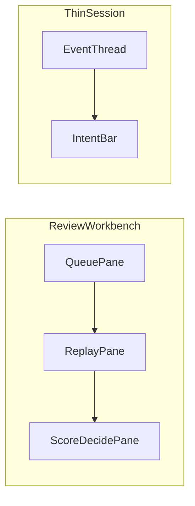

# ASH v5：双核管控 × 厚评审 × 薄交互 — 设计规格

> Status: **draft for review** (2026-09-13)  
> Program: [`doc/plan/v5-governance-program.md`](../../../doc/plan/v5-governance-program.md)  
> Diagrams: [`doc/diagrams/archify/`](../../../doc/diagrams/archify/)（`ash-v5-*`）  
> Prior art: [`HLD-双核心-v2`](../../../doc/design/HLD-双核心-v2.md) · [`附录 K`](../../../doc/appendices/K-演进平面-v2.md) · [`DSH 比对`](../../../doc/plan/deepseek-harness-ash-comparison.md)  
> Note: 本规格中的 A/B/C/D **≠** v4.x Auth/Agentic/Stage-1/生态轨

## 1. Intent

在保留 ASH **Agent × Memory 双核心**与 Go Worker 边界的前提下：

1. **A 总架构**：薄交互入口 + 双核数据化资产 + 厚评审治理台  
2. **B 厚评审**：交互监控、量纲评分、可视化工作台、Improve 闭环  
3. **C 管控数据化**：用户/团队 Space 下智能体与记忆体可登记、可策略、可测评  
4. **D 薄交互**：借鉴 DSH 事件溯源与投影模式；UI 只发意图、只渲染投影  

一句话：

> **ASH v5 = 薄交互入口 + 双核数据化资产 + 厚评审治理台。**

## 2. Decisions (locked)

| ID | Decision |
|----|----------|
| D1 | 程序名 **v5 双核管控与厚评审**；设计先行，**业务代码默认等 v4.0 签字后再开 v5.0 Sprint** |
| D2 | DSH **只借模式**（append-only 事件、`derive` 投影、UI 意图化）；**不引入 Cordis、不替换为 dsh web** |
| D3 | 执行面继续 Go Worker + ExecGo/ACP/Sandbox；交互做薄，评审/管控/评分做厚 |
| D4 | Space 扩展 `kind = user \| team`；**不新建 Team 表**；Memory `scopeTeam` 对齐 team Space |
| D5 | 厚评审在现有 `internal/evolve` **扩展**，不拆独立评审微服务 |
| D6 | 评分与测评由 **事件 derive** 计算；禁止前端私算真相分 |
| D7 | 人工批准仍为升格唯一闸门（不可配置 auto-promote） |

## 3. Non-goals

- Cordis 全插件运行时 / DSH Web 替换控制台  
- 公网 Marketplace / Active-Active  
- 自动升格记忆或 Harness Profile  
- 将 Tool 执行或 Prompt 组装搬入 React  

## 4. Architecture (Track A)

### 4.1 Logical view

见 Archify：[`ash-v5-governance.html`](../../../doc/diagrams/archify/ash-v5-governance.html)。

相对 v2 双核增量：

| 层 | v2 | v5 |
|----|----|----|
| 入口 | Console / Quest / CLI | **薄意图面**（prompt / approve / cancel） |
| Agent Core | Goal · Run · Harness | + **AgentRegistry** |
| Memory Core | RAG · Candidate · L0–L2 | + **MemoryRegistry** |
| 演进 | Feedback · Improve · 双队列 | **InteractionMonitor · ScoringEngine · ReviewViz · 扩展队列** |
| 治理 | DSL · Gate · Doctor | + **SpacePolicyPack** |

### 4.2 Package boundaries (Go)

| Package | Role |
|---------|------|
| `internal/registry` (**new**) | AgentAsset / MemoryAsset CRUD、版本、status |
| `internal/interaction` (**new**) | InteractionMonitor 投影、回放 API |
| `internal/scoring` (**new**) | Rubric、score_events、空间聚合 |
| `internal/evolve` (extend) | 队列类型、分配、多签、挂 score |
| `internal/spacerules` / policy (extend) | SpacePolicyPack 解析与合并 |
| `internal/events` (extend) | `visibility` + `DeriveModelVisible` |
| `internal/observability/derive` (extend) | score / review / interaction 规则 |
| `frontend` | Reviews → Workbench；Quest 变薄；Space evaluation |

### 4.3 Storage E5 exceptions (v5)

相对 v4「尽量无新表」纪律，v5 显式允许：

| Table | Purpose | RLS |
|-------|---------|-----|
| `spaces.kind` (column) | user \| team | n/a (spaces 已有) |
| `agent_assets` | 智能体登记 | `space_id` |
| `memory_assets` | 记忆体登记（可与 records 投影，首期独立表） | `space_id` |
| `space_policy_packs` | 空间策略包 | `space_id` |
| `score_events` | 量纲评分事件 | `space_id` |
| `score_rubrics` | 量纲定义（或 YAML 配置首期） | global 或 `org_id` |
| `interaction_sessions` | 评审会话边界（可映射 agent session） | `space_id` |
| `interaction_threads` | 线程 + digest/seal | `space_id` |
| `interaction_event_index` | thread↔event seq 索引（可选） | via thread |
| `interaction_projections` | 可选物化 nodes；默认可按需 fold | via thread |

## 5. Space control & evaluation (Track C)

### 5.1 Space kind

| kind | Meaning | Default policy posture |
|------|---------|------------------------|
| `user` | 个人工作空间 | 宽松配额；单审；个人资产 |
| `team` | 团队共享空间 | 共享资产；可启用双人签；更严 citation / SLA |

Org 模板（`small_team` 等）创建时默认：1×user + N×team。RLS 仍按 `space_id`。

### 5.2 AgentAsset

```text
AgentAsset {
  id, spaceId
  kind: harness_profile | scenario_binding | skill_pack | subagent_provider
  refId          // 指向既有实体 id
  version, status: draft | active | deprecated
  policyRef
  scoreSnapshot  // 派生只读摘要
  metricsRef
  createdAt, updatedAt
}
```

### 5.3 MemoryAsset

```text
MemoryAsset {
  id, spaceId
  memoryId | layer aggregate key
  layer: L0 | L1 | L2
  scope: user | team | repo
  confidence, ttl
  citationStats, reviewState
  scoreSnapshot
}
```

首期策略：**登记层**包住现有 `memory_records`；不要求立刻迁移全部字段。

### 5.4 SpacePolicyPack

| Field | Purpose |
|-------|---------|
| quotas | 并发 Run、token 代理上限占位 |
| toolRiskTier | 默认工具风险档 |
| reviewSlaHours | 评审 SLA |
| rubricIds | 启用量纲集 |
| citationMode | observe \| enforce |
| multiSign | team 空间是否要求双签 |

合并顺序：`platform defaults` → `org template` → `space kind defaults` → `space_policy_packs` → `ResourceScope`（场景/工具覆盖）。冲突时 **更严者优先**（fail-closed）。

### 5.5 Space evaluation dimensions

| Dimension | Agent signals | Memory signals |
|-----------|---------------|----------------|
| Quality | success rate, verify pass, rollback | review pass, low-score decay, TTL health |
| Safety | danger tool ratio, sandbox fail, unapproved exec | citation block rate |
| Efficiency | steps / latency / token proxy | hit rate, hit_used conversion |
| Governance | orchestration backlog, improve rollback | candidate backlog, SLA breach |

API：`GET /api/v1/spaces/{id}/evaluation` → Metrics / Observability 卡片消费。

## 6. Thick review plane (Track B)

### 6.1 Capability delta

| Capability | Today | v5 |
|------------|-------|-----|
| Queue | memory + orchestration approve/reject | + assignment / score_appeal / improve；reviewer 分配；SLA；team 多签 |
| Scoring | Feedback 1–5 | Rubric dimensions → `score_events` |
| Interaction | Run SSE / waterfall | Interaction timeline + live quality score |
| Viz | KPI cards | Review Workbench（回放轴 · 雷达 · 基线） |
| Loop | low-score → alert / decay | aggregate → Improve draft → experiment → human promote |

### 6.2 Rubric (default set)

| Dimension id | Label | Scale |
|--------------|-------|-------|
| `correctness` | 正确性 | 1–5 |
| `safety` | 安全性 | 1–5 |
| `citable` | 可引用性 | 1–5 |
| `efficiency` | 效率 | 1–5 |

合成分：加权平均（默认等权）；`<= 2` 任一维度或合成分触发 Improve 候选阈值（可配置）。

### 6.3 Review decide payload (extension)

```json
{
  "decision": "approve | reject",
  "reason": "required",
  "rubric": {
    "correctness": 4,
    "safety": 5,
    "citable": 3,
    "efficiency": 4
  },
  "assigneeId": "optional"
}
```

### 6.4 Sequence

见 [`ash-v5-review-thick.html`](../../../doc/diagrams/archify/ash-v5-review-thick.html)。

主路径：intent → append events → InteractionMonitor → ScoringEngine →（低分/需人审）enqueue → Reviewer 回放+量纲决定 → score/review events → 可选 Improve。

### 6.5 Data flow

见 [`ash-v5-score-monitor.html`](../../../doc/diagrams/archify/ash-v5-score-monitor.html)。

Sources：`run_events` · memory events · feedback · approval → Surface fold → Monitor → Rubric → Queue / Viz / Derive KPI / Improve。

### 6.6 Review item lifecycle

见 [`ash-v5-review-lifecycle.html`](../../../doc/diagrams/archify/ash-v5-review-lifecycle.html)。

`pending → assigned → in_review → approved|rejected`；team 多签：`in_review → pending_second → approved`；超时 → `sla_breach`（可恢复，非终态失败）。

## 7. Thin interaction (Track D)

### 7.1 DSH patterns → ASH

| DSH | ASH |
|-----|-----|
| SessionEvent 唯一真相 | 强化 `run_events`；禁止并行聊天表作真相 |
| deriveMessages / surface | `visibility` + `DeriveModelVisible(runId)` |
| UI 只渲染 | ConversationNode 按 event type 注册；意图 API |
| approval seam | `waiting_approval` + evolve decide；无应答 → fail-closed |
| telemetry 旁路 | derive/OTEL 同日志投影；不进 model context |

### 7.2 Event visibility

| Value | Meaning |
|-------|---------|
| `model_visible` | 可进入 LLM 上下文 fold |
| `ui_only` | 仅控制台渲染 |
| `audit` | 仅审计/合规/评分旁路 |

Invariant：**凡 model_visible 必须已落库**（model-visible ⟺ logged）。

### 7.3 Intent API (thin)

| Intent | Effect |
|--------|--------|
| `prompt` / goal | 创建或续 Run；仅追加 user surface 事件 |
| `approve` / `reject` | 审批门禁或评审决定 |
| `cancel` | 取消 Run |

前端 **不得**：拼系统 prompt、执行工具、本地算测评分、改 SpacePolicy。

会话意图收口 API：`POST /api/v1/agents/sessions/{sessionId}/actions`（`prompt|approve|cancel|reject`；无可批门禁时 fail-closed）。

### 7.4 Agent 页面对齐 DSH web（模式借鉴）+ 使用/管控切换

DSH web **不替换** ASH 控制台（决议 D2 / G1），但 Agent 主交互应对齐其模式：

| DSH web 模式 | ASH 落点 |
|--------------|----------|
| 会话中心 + 底部 composer（只发意图） | Quest / Agent Session：投影节点 + `prompt/approve/cancel` |
| Composer takeover（审批/计划门禁） | 同页门禁面板，不跳全局「管理模式」 |
| Chat ↔ Trajectory 页内 Tab | Run 详情页内 `Work \| Timeline \| Events \| Diff`（GV02+） |
| 无全局 Cordis 壳 | 继续 `/ui` 路由控制台 |

**Agent 使用 ↔ 评审管控 切换**

ASH 需要显式双入口（DSH 无跨切面治理队列，ASH 有 `/reviews`）：

| 模式 | 路由 | 职责 |
|------|------|------|
| **Agent 使用** | `/ui/quest`（后续可挂 Agent Session 薄页） | 发起/续写会话、看板、门禁意图、Diff 审查（薄） |
| **评审管控** | `/ui/reviews`（Workbench 厚化） | 队列、量纲打分、分配、Improve；跨 Run/Memory/Scenario |

实现约定：
1. 顶栏提供 **分段切换**（`Agent 使用` \| `评审管控`），一键切路由；不隐藏整站导航。  
2. 会话内门禁仍用 **页内 takeover**，不因 approve 强制跳到评审模式。  
3. 跨切面项（Memory/Harness/Scenario）从 Quest 深链到 `/reviews`；Run 门禁留在 Agent 使用面。  
4. Mobile：`/ui/m/reviews` 仍为轻量批准，不进厚 Workbench。

## 7b. Interaction Session / Thread（评审可观测·可比对·可复现）

交互时间线按 **Session → Thread → TimelineNode** 数据化（详见实现计划 §2）：

- **真相**：仍为 append-only `run_events`；Session/Thread 是评审边界与索引，不是第二套聊天表。  
- **可观测**：Workbench 按 Thread 回放；MemoryLink 挂 `sessionId+threadId`。  
- **可比对**：`POST /interactions/compare` 对两 Thread/digest做节点与记忆边 diff。  
- **可复现**：Thread `seal` 冻结 canonical digest；`replay` 纯函数 Fold，不一致则红灯。  
- 与现有 `internal/session` Agent Session **映射复用**，Turns → thread 上的 `turn` 节点。

---

## 8. UI prototypes (information architecture)

### 8.1 Review Workbench (thick)

```text
┌──────────────┬────────────────────────────┬──────────────────┐
│ Queue        │ Interaction Replay         │ Rubric + Decide  │
│ kind/type/SLA│ turn/step/tool/approval    │ 4 dimensions     │
│ filters      │ (read-only projection)     │ reason (required)│
├──────────────┴────────────────────────────┴──────────────────┤
│ Score trend · space baseline compare · Improve link          │
└──────────────────────────────────────────────────────────────┘
```

路由：现有 `/reviews` 升级为 Workbench（保留 Mobile 薄批准页）。

### 8.2 Thin Quest / Session（对齐 DSH composer）

```text
┌─ 顶栏：[ Agent 使用 | 评审管控 ] 切换 ──────────────────┐
│ Thread / ConversationNode（仅事件投影）                 │
│ ... projection nodes ...                                │
├─────────────────────────────────────────────────────────┤
│ composer takeover（waiting_approval 时替换输入条）      │
│ [prompt]  或  [approve] [reject] [cancel]               │
└─────────────────────────────────────────────────────────┘
```

无：本地策略面板、本地评分表、本地 Prompt 编辑器（高级运维页另开，不在会话主路径）。
页内可另设 Timeline/Events Tab（对齐 DSH Trajectory），不跳转评审模式。

### 8.3 Space control

Space 页增量：`kind` 徽章 · PolicyPack 摘要 · Evaluation 四维卡片 · Agent/Memory 资产列表入口。

### 8.4 Wireframe (mermaid)



## 9. APIs (design list)

| Method | Path | Notes |
|--------|------|-------|
| GET/POST | `/api/v1/agents/assets` | AgentAsset |
| GET/PATCH | `/api/v1/agents/assets/{id}` | version / status |
| GET/POST | `/api/v1/memory/assets` | MemoryAsset |
| GET/PUT | `/api/v1/spaces/{id}/policy` | SpacePolicyPack |
| GET | `/api/v1/spaces/{id}/evaluation` | 四维测评 |
| GET | `/api/v1/interactions/sessions/{sessionId}` | 会话 + threads + digest |
| GET | `/api/v1/interactions/sessions/{sessionId}/threads` | 线程列表 |
| GET | `/api/v1/interactions/threads/{threadId}` | Timeline nodes + digest |
| GET | `/api/v1/interactions/threads/{threadId}/memory-links` | 线程记忆边 |
| POST | `/api/v1/interactions/threads/{threadId}/seal` | 封印 digest |
| POST | `/api/v1/interactions/threads/{threadId}/replay` | 复现 fold + 校验 |
| POST | `/api/v1/interactions/compare` | 两线程/digest 比对 |
| GET | `/api/v1/interactions/by-run/{runId}` | Run→session/thread |
| GET | `/api/v1/interactions/{runId}` | 兼容别名（deprecated） |
| GET | `/api/v1/scores/rubrics` | 量纲定义 |
| POST | `/api/v1/scores` | 人工/系统打分 |
| GET | `/api/v1/reviews/queue` | 扩展 queue 类型与 assignment |
| POST | `/api/v1/reviews/{id}/decide` | + rubric |
| POST | `/api/v1/reviews/{id}/assign` | reviewer 分配 |

### Permissions (add)

| Permission | Purpose |
|------------|---------|
| `agents:manage` | Agent 资产登记/启停 |
| `memory:assets` | Memory 资产登记视图（可并入现有 memory:*） |
| `scores:write` | 写入量纲分 |
| `scores:read` | 读评分与测评 |
| `reviews:assign` | 分配评审人 |
| `spaces:policy` | 写 SpacePolicyPack |

## 10. Space control workflow

见 [`ash-v5-space-control.html`](../../../doc/diagrams/archify/ash-v5-space-control.html)。

Register assets → bind PolicyPack → run under thin intent → emit events → score/monitor → review → evaluation aggregate → optional Improve。

## 11. Change inventory (for review)

### 11.1 Product features

1. Space `kind=user|team` 与模板默认策略  
2. Agent 资产登记与版本/启用  
3. Memory 资产登记与层/范围/TTL 可视化  
4. SpacePolicyPack（配额、门禁、评审 SLA、量纲集）  
5. 空间测评仪表盘（四维 + 排行）  
6. 交互监控时间线（**Session/Thread 数据化**；按线程可观测）  
7. 量纲评分体系 + 人工打分 UI  
8. 厚评审工作台（回放+打分+决定；**线程比对/复现校验**）  
9. 队列扩展（assignment、多签、新 queue 类型）  
10. 评分驱动 Improve 提案  
10b. **Thread digest seal / replay / compare**（评审可复现可比对）  
11. 薄 Quest/Session（意图 API + 投影渲染）  
12. 事件 visibility 与 model-visible fold  
13. Derive/KPI 扩展（score/review/interaction）  
14. Doctor 探针：管控与评分一致性  
15. OpenAPI / 权限矩阵扩展  

### 11.2 Engineering work items

1. `spaces.kind` 迁移 + 兼容默认  
2. `agent_assets` / `memory_assets` 表与 `internal/registry`  
3. `space_policy_packs` 与 `ResourceScope` 合并规则  
4. `score_events` + rubrics  
5. interaction 投影（按需 fold；物化为可选）  
6. evolve 队列模型与权限扩展  
7. events payload schema + `visibility`  
8. derive catalog + parity tests  
9. `ReviewsPage` → Workbench  
10. `QuestPage` 去厚  
11. Metrics/Observability 对接 evaluation  
12. Swagger + `openapi-ash-v1.yaml` + `make openapi-check`  
13. 前端权限与 Space 切换  
14. 单测 + Doctor 计数更新  
15. HLD / 附录 K / 本程序文档同步  

### 11.3 Phasing

| Phase | Scope | Outcome |
|-------|-------|---------|
| **v5.0-design** | 本规格 + 图集 | 设计签字 |
| **v5.0** | C 基础 + B 评分/队列 | Registry + rubric + Workbench MVP |
| **v5.1** | B 交互监控 + 空间测评 | Interaction 时间线 + evaluation API |
| **v5.2** | D 薄交互收口 | visibility/fold + Quest 变薄 |
| **v5.3** | 治理硬化 | 多签、Doctor、Improve 分数门禁 |

## 12. Verification (when implementing)

| Area | Command / check |
|------|-----------------|
| Unit | `go test ./internal/{registry,interaction,scoring,evolve}/...` |
| Derive | derive parity tests |
| API | `make swagger` · `make openapi-check` |
| Doctor | 更新 TR/M 套件计数 |
| UI | `make web-build`；Reviews/Quest/Space 冒烟 |
| Diagrams | archify `deliver` + `visual-check` 对 `ash-v5-*` |

## 13. Spec self-review

| Check | Result |
|-------|--------|
| Placeholders | None intentional；分期细节留给 writing-plans |
| Consistency | A/B/C/D 与包/API/表一致；DSH 仅为模式 |
| Scope | 单程序规格；实现按 11.3 分期 |
| Ambiguity | MemoryAsset 首期「登记层包住 records」已写明；Policy 合并「更严者优先」已写明 |

## 14. Review gate

实现排期：[`../plans/2026-09-13-v5-governance-implementation.md`](../plans/2026-09-13-v5-governance-implementation.md)。

**已确认（2026-09-13）**
- [x] 开发计划整体有效  
- [x] **优先实现现行智能体薄交互（P0 / GV01–03）**  
- [x] Agent 一键打包迁移继续暂缓  
- [x] Session/Thread 可观测与记忆关联为 P1  
- [x] Registry / 厚评分 Workbench 为 P2  

下一步：按 GV01 开工薄交互（`visibility` + Agent Session 意图收口 + 薄 UI）；顶栏落地 **Agent 使用 / 评审管控** 切换。
